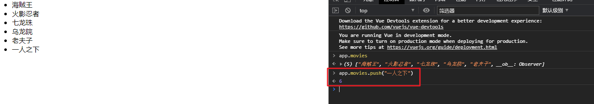

## Vue列表展示

```vue
<!DOCTYPE html>
<html lang="en">
<head>
    <meta charset="UTF-8">
    <title>Title</title>
</head>
<body>

<div id="app">
<!--  使用下标的方式进行便利输出数据-->
<!--  <ul>-->
<!--    <li>{{movies[0]}}</li>-->
<!--    <li>{{movies[1]}}</li>-->
<!--    <li>{{movies[2]}}</li>-->
<!--    <li>{{movies[3]}}</li>-->
<!--  </ul>-->

<!--使用v-for进行遍历-->
  <ul>
    <li v-for="item in movies">{{item}}</li>
  </ul>
</div>

<script src="../vue.js"></script>
<script>
  const app = new Vue({
    el:"#app",
    data:{
      message:"hello vue",
      movies:["海贼王","火影忍者","七龙珠","乌龙院","老夫子"],
    }
  })

</script>
</body>
</html>
```

- 现在，我们来展示一个更加复杂的数据：**数据列表**。

  - 比如我们现在从服务器请求过来一个列表
  - 希望展示到HTML中。

- HTML代码中，使用v-for指令

  - ```html
    <li v-for="item in movies">{{item}}</li>
    ```

  - 该指令我们后面会详细讲解，这里先学会使用。

- 是不是变得So Easy，我们再也不需要在JavaScript代码中完成DOM的拼接相关操作了

- 而且，更重要的是，它还是响应式的。

  - 也就是说，当我们数组中的数据发生改变时，界面会自动改变。
  - 依然让我们打开开发者模式的console，来试一下
  - 