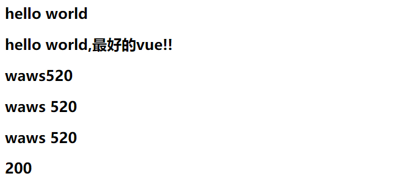

## Mustache(大胡子)语法

```html
<!DOCTYPE html>
<html lang="en">
<head>
    <meta charset="UTF-8">
    <title>Title</title>
</head>
<body>

<div id="app">
  <h2>{{message}}</h2>
  <h2>{{message}},最好的vue!!</h2>
  <!--变量转化成基本的表达式-->
  <h2>{{lastname + firstname}}</h2>
  <h2>{{lastname + " " + firstname}}</h2>
  <h2>{{lastname}}  {{firstname}}</h2>
  <h2>{{counter * 2}}</h2>

</div>

<script src="../vue.js"></script>

<script>
  const app = new Vue({
    el:"#app",
    data:{
      message:"hello world",
        lastname:"waws",
        firstname:"520",
        counter:100
    }
  })
</script>

</body>
</html>
```

- 如何将data中的文本数据，插入到HTML中呢？
  - 我们已经学习过了，可以通过Mustache语法(也就是**双大括号**)。
  - Mustache: 胡子/胡须.
- 我们可以像下面这样来使用，并且数据是响应式的
  - 效果展示
  - 