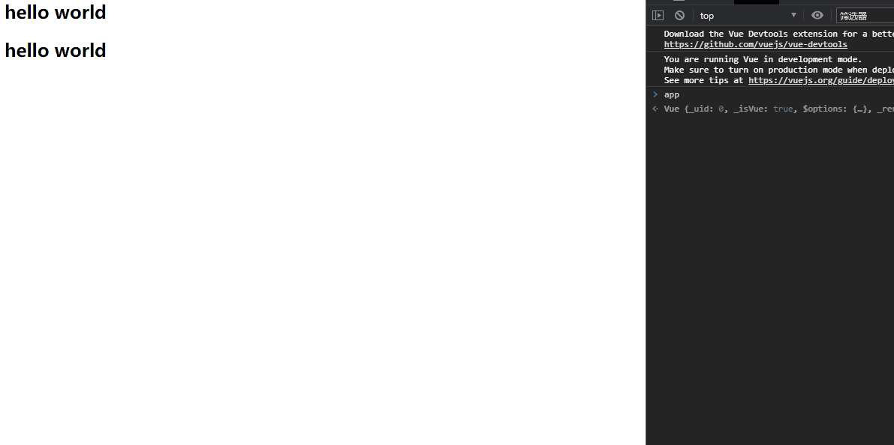

## v-once

- 但是，在某些情况下，我们可能不希望界面随意的跟随改变
  - 这个时候，我们就可以使用一个Vue的指令

### v-once: 

- **该指令后面不需要跟任何表达式**(比如之前的v-for后面是由跟表达式的)
- **该指令表示元素和组件(组件后面才会学习)只渲染一次，不会随着数据的改变而改变**。
- 代码如下：

```html
<!--这个主要是v-once的使用-->
<!--1.响应式数据仅仅改变一次-->


<!DOCTYPE html>
<html lang="en">
<head>
  <meta charset="UTF-8">
  <title>Title</title>
</head>
<body>
<div id="app">
  <h2>{{message}}</h2>
  <h2 v-once>{{message}}</h2>
</div>

<script src="../vue.js"></script>

<script>
  const app = new Vue({
    el:"#app",
    data:{
      message:"hello world"
    }
  })
</script>
</body>
</html>
```

效果如下：




