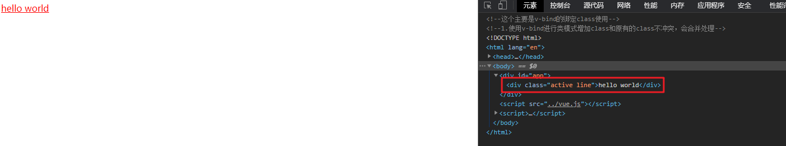

## v-bind绑定class（一）

- 很多时候，我们希望动态的来切换class，比如：
  - 当数据为某个状态时，字体显示红色。
  - 当数据另一个状态时，字体显示黑色。
- 绑定class有两种方式：
  - **对象语法**
  - 数组语法

**简单实用：**

```html
<!DOCTYPE html>
<html lang="en">
<head>
  <meta charset="UTF-8">
  <title>Title</title>
  <style>
    .active{
        color:red
    }
  </style>
</head>
<body>
<div id="app">
  <div class="active">{{message}}</div>
  <div :class="active">{{message}}</div>
</div>

<script src="../vue.js"></script>

<script>
  const app = new Vue({
    el:"#app",
    data:{
      message:"hello world",
      active:"active",
    }
  })
</script>
</body>
</html>
```


**实战代码：对象的方式进行添加**

```html
<!--这个主要是v-bind的绑定class使用-->
<!--1.使用v-bind进行简单修改class属性-->

<!DOCTYPE html>
<html lang="en">
<head>
  <meta charset="UTF-8">
  <title>Title</title>
  <style>
      .active{
          color:red
      }
      .line{
          text-decoration: underline;
      }
  </style>
</head>
<body>
<div id="app">
  <!--类的语法 {key1:value1,key2:value2}-->
  <!--<h2 v-bind:class="{类名1:true,类名2:false}"></h2>-->
  <!--<div v-bind:class="{active:true,line:true}">{{message}}</div>-->
  <div v-bind:class="{active:isactive,line:isline}">{{message}}</div>
</div>

<script src="../vue.js"></script>

<script>
  const app = new Vue({
    el:"#app",
    data:{
      message:"hello world",
      isactive:true,
      isline:true,
    }
  })
</script>
</body>
</html>
```

效果如下：


**v-bind改变颜色小案例**

```html
<!--这个主要是v-bind的绑定class使用-->
<!--1.使用v-bind进行类模式修改class属性的小案例-->

<!DOCTYPE html>
<html lang="en">
<head>
  <meta charset="UTF-8">
  <title>Title</title>
  <style>
      .active{
          color:red
      }
      .line{
          text-decoration: underline;
      }
  </style>
</head>
<body>
<div id="app">
  <div v-bind:class="{active:isactive,line:isline}">{{message}}</div>
  <button v-on:click="changecolor">change color</button>
</div>

<script src="../vue.js"></script>

<script>
  const app = new Vue({
    el:"#app",
    data:{
      message:"hello world",
      isactive:true,
      isline:true,
    },
    methods:{
      changecolor:function (){
        this.isactive = !this.isactive
      }
    }
  })
</script>
</body>
</html>
```


- 绑定方式：**对象语法**
  - 对象语法的含义是:class后面跟的是一个对象。
- 对象语法有下面这些用法：

```html
用法一：直接通过{}绑定一个类
<h2 :class="{'active': isActive}">Hello World</h2>

用法二：也可以通过判断，传入多个值
<h2 :class="{'active': isActive, 'line': isLine}">Hello World</h2>

用法三：和普通的类同时存在，并不冲突
注：如果isActive和isLine都为true，那么会有title/active/line三个类
<h2 class="title" :class="{'active': isActive, 'line': isLine}">Hello World</h2>

用法四：如果过于复杂，可以放在一个methods或者computed中
注：classes是一个计算属性
<h2 class="title" :class="classes">Hello World</h2>
```

```html
<!--这个主要是v-bind的绑定class使用-->
<!--1.使用v-bind进行类模式增加class和原有的class不冲突，会合并处理-->

<!DOCTYPE html>
<html lang="en">
<head>
  <meta charset="UTF-8">
  <title>Title</title>
  <style>
      .active{
          color:red
      }
      .line{
          text-decoration: underline;
      }
  </style>
</head>
<body>
<div id="app">
  <div class="line" v-bind:class="{active:isactive}">{{message}}</div>
  <button v-on:click="changecolor">change color</button>
</div>

<script src="../vue.js"></script>

<script>
  const app = new Vue({
    el:"#app",
    data:{
      message:"hello world",
      isactive:true,
      isline:true,
    },
    methods:{
      changecolor:function (){
        this.isactive = !this.isactive
      }
    }
  })
</script>
</body>
</html>
```


**使用methods中的方法加载属性**

```html
<!--这个主要是v-bind的绑定class使用-->
<!--1.使用v-bind进行使用methods中的方法加载属性-->

<!DOCTYPE html>
<html lang="en">
<head>
  <meta charset="UTF-8">
  <title>Title</title>
  <style>
      .active{
          color:red
      }
      .line{
          text-decoration: underline;
      }
  </style>
</head>
<body>
<div id="app">
  <!--注意这个地方使用methods中构造的方法对class进行加载，注意方法使用小括号-->
  <div v-bind:class="getallclass()">{{message}}</div>
</div>

<script src="../vue.js"></script>

<script>
  const app = new Vue({
    el:"#app",
    data:{
      message:"hello world",
      isactive:true,
      isline:true,
    },
    methods:{
      changecolor:function (){
        this.isactive = !this.isactive
      },
      getallclass:function (){
        return {active:this.isactive,line:this.isline}
      }
    }
  })
</script>
</body>
</html>
```



