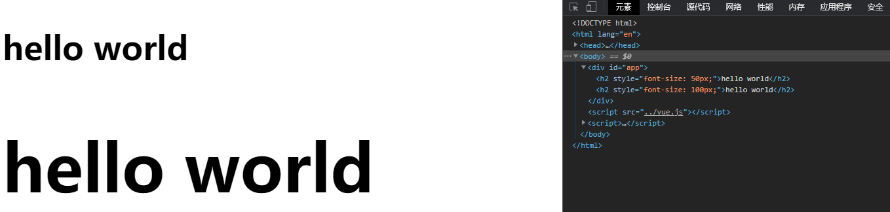
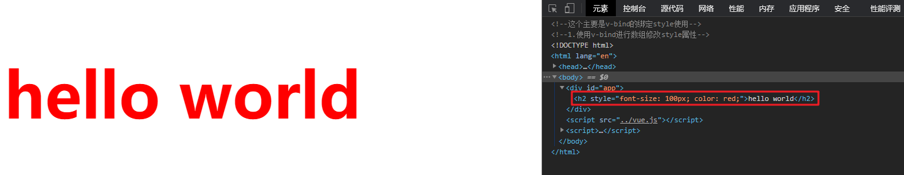

## v-bind绑定style（一）

- 我们可以利用v-bind:style来绑定一些CSS内联样式。
- 在写CSS属性名的时候，比如font-size
  - 我们可以使用**驼峰式** (camelCase)  fontSize 
  - 或**短横线分隔** (kebab-case，记得用单引号括起来) ‘font-size’
- 绑定class有两种方式：
  - 对象语法
  - 数组语法

## v-bind绑定style（二）

绑定方式一：对象语法

```html
:style="{color: currentColor, fontSize: fontSize + 'px'}"
style后面跟的是一个对象类型
	对象的key是CSS属性名称
	对象的value是具体赋的值，值可以来自于data中的属性
```

绑定方式二：数组语法

```html
<div v-bind:style="[baseStyles, overridingStyles]"></div>
style后面跟的是一个数组类型
	多个值以，分割即可
```


**实战语法：**

```html
<!--这个主要是v-bind的绑定style使用-->
<!--1.使用v-bind进行类模式修改style属性-->

<!DOCTYPE html>
<html lang="en">
<head>
  <meta charset="UTF-8">
  <title>Title</title>
</head>
<body>
<div id="app">
  <!--<h2 :style="{key(属性名):value(属性值),key(属性名):value(属性值)}"></h2>-->
  <!--直接使用"值"的方式进行style的赋值-->
  <h2 :style="{fontSize:'50px'}">{{message}}</h2>
  <!--直接使用变量的方式进行style的赋值-->
  <h2 :style="{fontSize:fontsize}">{{message}}</h2>
</div>

<script src="../vue.js"></script>

<script>
  const app = new Vue({
    el:"#app",
    data:{
      message:"hello world",
      fontsize:"100px"
    }
  })
</script>
</body>
</html>
```



```html
<!--这个主要是v-bind的绑定style使用-->
<!--1.使用v-bind进行数组修改style属性-->

<!DOCTYPE html>
<html lang="en">
<head>
  <meta charset="UTF-8">
  <title>Title</title>
</head>
<body>
<div id="app">
  <!--<h2 :style="["AAA","BBB"]"></h2>-->
  <!--直接使用数组的方式进行style的赋值-->
  <h2 :style="[baseStyles, overridingStyles]">{{message}}</h2>
</div>

<script src="../vue.js"></script>

<script>
  const app = new Vue({
    el:"#app",
    data:{
      message:"hello world",
      baseStyles:{fontSize:"100px"},
      overridingStyles:{color:"red"}
    }
  })
</script>
</body>
</html>
```

