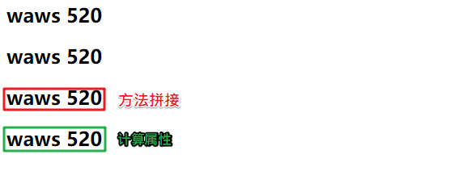
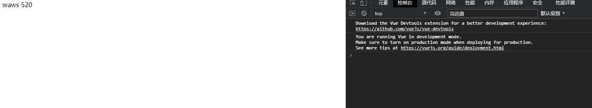
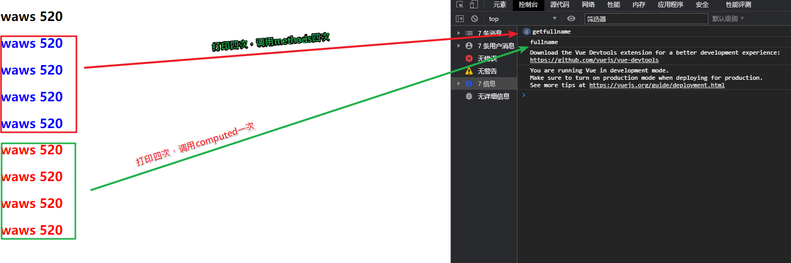

## 计算属性

为了解决的问题就是多次调用值计算的时候比较繁琐，我们定义计算属性，和methods一样的方式，在computed中定义方法，可以像属性一样调用该方法，有点像python中的静态方法的意思。

- 我们知道，在模板中可以直接通过**插值语法**显示一些data中的数据。
- 但是在某些情况，我们可能**需要对数据进行一些转化后再显示**，或者**需要将多个数据结合起来进行显示**
  - 比如我们有firstName和lastName两个变量，我们需要显示完整的名称。
  - 但是如果多个地方都需要显示完整的名称，我们就需要写多个{{firstName}} {{lastName}}
- 我们可以将上面的代码换成计算属性：
  - OK，我们发现计算属性是写在实例的computed选项中的

**计算属性实战代码**

```html
<!DOCTYPE html>
<html lang="en">
<head>
  <meta charset="UTF-8">
  <title>Title</title>
</head>
<body>
<div id="app">
  <!--传统写法-->
  <h2>{{firstname}} {{lastname}}</h2>
  <h2>{{firstname + " " +lastname}}</h2>

  <!--使用method改进成形式-->
  <h2>{{getfullname()}}</h2>

  <!--使用method改进成形式，即计算属性-->
  <h2>{{fullname}}</h2>
</div>

<script src="../vue.js"></script>

<script>
  const app = new Vue({
    el:"#app",
    data:{
      message:"hello world",
      firstname:"waws",
      lastname:"520",
    },
    methods:{
      getfullname:function (){
        return this.firstname + " " + this.lastname
      }
    },
    computed:{
      fullname:function (){
        return this.firstname + " " + this.lastname
      }
    }
  })
</script>
</body>
</html>
```



计算属性小案例

```html
<!DOCTYPE html>
<html lang="en">
<head>
  <meta charset="UTF-8">
  <title>Title</title>
</head>
<body>
<div id="app">
  <h2>总价格：{{all_price}}</h2>
</div>

<script src="../vue.js"></script>

<script>
  const app = new Vue({
    el:"#app",
    data:{
      message:"hello world",
      books:[
        {"id":100,name:"python编程基础",price:100},
        {"id":101,name:"linux命令大全",price:70},
        {"id":102,name:"操作系统",price:99},
        {"id":103,name:"计算机组成原理",price:34},
        {"id":104,name:"数据结构和算法",price:29},
      ]
    },
    // computed是有缓存的，methods是没有缓存的，调用几次执行几次
    computed:{
      all_price:function (){
        let result=0
        for (let i=0;i<this.books.length;i++){
          result += this.books[i].price
        }
        return result

      }
    }
  })
</script>
</body>
</html>
```


## 计算属性的setter和getter

- 每个计算属性都包含一个`getter`和一个`setter`
  - 在上面的例子中，我们只是使用getter来读取
  - 在某些情况下，你也可以提供一个setter方法（不常用）
- 在需要写setter的时候，代码如下：

```html
<!DOCTYPE html>
<html lang="en">
<head>
  <meta charset="UTF-8">
  <title>Title</title>
</head>
<body>
<div id="app">
  {{fullname}}
</div>

<script src="../vue.js"></script>

<script>
  const app = new Vue({
    el:"#app",
    data:{
      firstname:"waws",
      lastname:"520",
    },
    computed:{
      //完整版
      fullname:{
        //一般不需要实现set的方法，只读属性
        set:function (newValue){
          console.log("-----------------",newValue);
          const name = newValue.split(" ");
          this.firstname = name[0];
          this.lastname = name[1];
        },
        get:function (){
          return this.firstname + " " + this.lastname
        }
      },
      //简化版
      fullname1:{
        //一般不需要实现set的方法，只读属性
        get:function (){
          return this.firstname + " " + this.lastname
        }
      },
      //最精简版
      fullname2:function (){
          return this.firstname + " " + this.lastname
        }
    }
  })
</script>
</body>
</html>
```



## 计算属性的缓存

**主要是会去监听计算属性中的值是否会发生变化，若发生变化，computed中的值重新进行计算；若不发生变化，则直接将计算好的数据(缓存数据)进行展示。**

- 我们可能会考虑这样的一个问题：
  - methods和computed看起来都可以实现我们的功能，
  - 那么为什么还要多一个计算属性这个东西呢？
  - 原因：计算属性会进行缓存，如果多次使用时，计算属性只会调用一次。
- 我们来看下面的代码：

```html
<!DOCTYPE html>
<html lang="en">
<head>
  <meta charset="UTF-8">
  <title>Title</title>
</head>
<body>
<div id="app">
  <!--拼接式，一般不用-->
  <h2>{{firstname}} {{lastname}}</h2>
  <!--methods的方式进行拼接-->
  <h2 style="color: blue">{{getfullname()}}</h2>
  <h2 style="color: blue">{{getfullname()}}</h2>
  <h2 style="color: blue">{{getfullname()}}</h2>
  <h2 style="color: blue">{{getfullname()}}</h2>

  <!--computed的方式进行拼接-->
  <h2 style="color: red">{{fullname}}</h2>
  <h2 style="color: red">{{fullname}}</h2>
  <h2 style="color: red">{{fullname}}</h2>
  <h2 style="color: red">{{fullname}}</h2>

</div>

<script src="../vue.js"></script>

<script>
  const app = new Vue({
    el:"#app",
    data:{
      firstname:"waws",
      lastname:"520",
    },
    methods:{
      getfullname:function (){
        console.log("getfullname")
        return this.firstname + " " + this.lastname
      }
    },
    computed:{
      fullname:function (){
        console.log("fullname")
        return this.firstname + " " + this.lastname
      }
    }
  })
</script>
</body>
</html>
```

