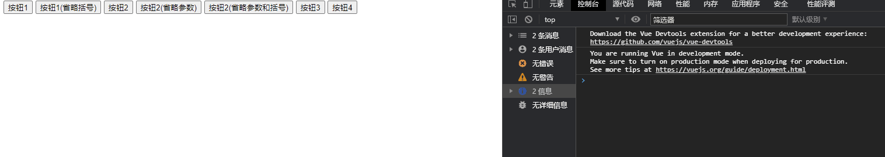
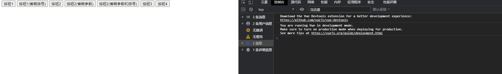
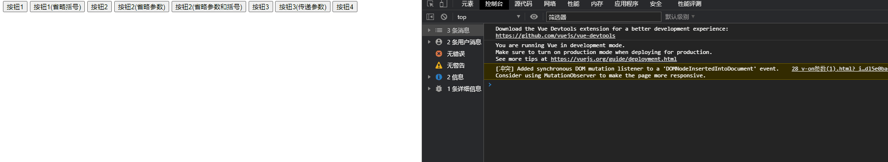

## v-on参数

- 当通过methods中定义方法，以供@click调用时，需要注意**参数**问题：
- 情况一：如果该方法不需要额外参数，那么方法后的()可以不添加。
  - 但是注意：如果方法本身中有一个参数，那么会默认将原生事件event参数传递进去
- 情况二：如果需要同时传入某个参数，同时需要event时，可以通过$event传入事件。

```html
<!DOCTYPE html>
<html lang="en">
<head>
  <meta charset="UTF-8">
  <title>Title</title>
</head>
<body>
<div id="app">
  <button @click="btnClick()">按钮1</button>
  <button @click="btnClick">按钮1(省略括号)</button>

  <!--在事件定义时，写函数时忽略了小括号，但是方法本身是需要一个参数的-->
  <button @click="btn2Click('abc')">按钮2</button>
  <!--有括号没有参数就会变成undefined-->
  <button @click="btn2Click()">按钮2(省略参数)</button>
  <!--vue会默认将浏览器生产的event事件对象最为参数传入到方法中-->
  <button @click="btn2Click">按钮2(省略参数和括号)</button>

  <!--方法定义时候，我们需要event对象，同时又需要其他参数-->
  <!--这个时候会将浏览器产生的默认的event事件传递给abc,event参数是undefined-->
  <button @click="btn3Click">按钮3</button>
  <button @click="btn3Click(123,event)">按钮3(传递参数)</button>
  <!--在调用的时候，如何手动获取到浏览器参数event对象：$event-->
  <button @click="btn3Click(123,$event)">按钮3(传递参数)</button>
  
</div>

<script src="../vue.js"></script>

<script>
  const app = new Vue({
    el:"#app",
    data:{
      message:"hello world"
    },
    methods:{
      btnClick(){
        console.log("btn1Click");
      },
      btn2Click(abc){
        console.log("----------",abc);
      },
      btn3Click(abc,event){
        console.log("++++++++++",abc,event);
      },
    }
  })
</script>
</body>
</html>
```

**按钮二**的效果：



**按钮三**的效果：



