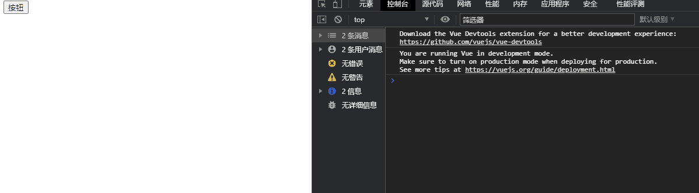
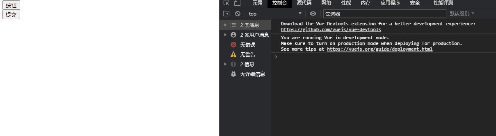
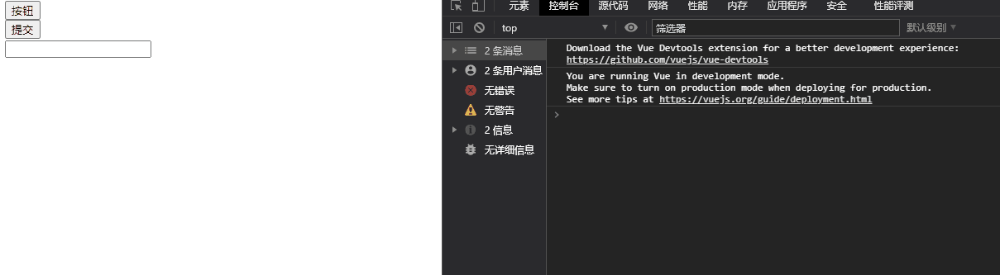

## v-on修饰符

- 在某些情况下，我们拿到event的目的可能是进行一些事件处理
- Vue提供了修饰符来帮助我们方便的处理一些事件：
  - .stop - 调用 event.stopPropagation()
  - .prevent - 调用 event.preventDefault()
  - .{keyCode | keyAlias} - 只当事件是从特定键触发时才触发回调
  - .native - 监听组件根元素的原生事件
  - .once - 只触发一次回调

```html
<!DOCTYPE html>
<html lang="en">
<head>
  <meta charset="UTF-8">
  <title>Title</title>
</head>
<body>
<div id="app">
  <!--.stop修饰符的使用--阻止冒泡-->
  <div @click="divClick">
    <button @click.stop="btnClick">按钮</button>
  </div>

  <!--.prevent修饰符的使用--阻止默认事件的发生-->
  <form action="http://www.baidu.com/">
    <input type="submit" value="提交" @click.prevent="submitclick">
  </form>

  <!--监听某个键盘的键帽-->
  <input type="text" @keyup.enter="keyUp">

  <!--.once修饰符的使用-->
  <button @click.once="onceclick">按钮</button>
</div>

<script src="../vue.js"></script>

<script>
  const app = new Vue({
    el:"#app",
    data:{
      message:"hello world"
    },
    methods:{
      btnClick(){
        console.log("btnClick")
      },
      divClick(){
        console.log("divClick")
      },
      submitclick(){
        console.log("submitclick")
      },
      keyUp(){
        console.log("keyUp")
      },
      onceclick(){
        console.log("onceclick")
      },
    }
  })
</script>
</body>
</html>
```

**事件的冒泡效果**



**使用.stop修饰符阻止冒泡**


**使用.prevent修饰符阻止默认事件的发生**



**.{keyCode | keyAlias} - 只当事件是从特定键触发时才触发回调**



**.once - 只触发一次回调。**


