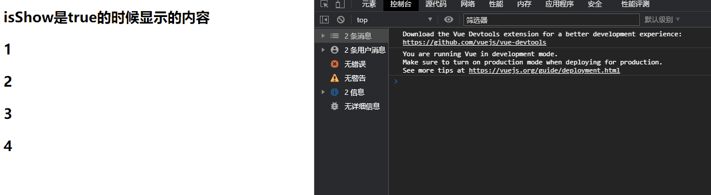
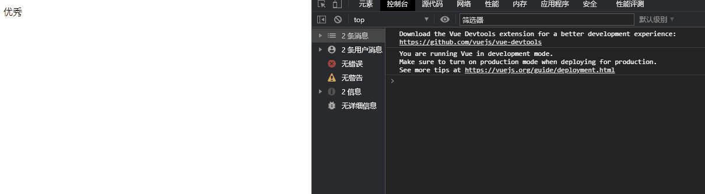

## v-if、v-else-if、v-else

- v-if、v-else-if、v-else
  - 这三个指令与JavaScript的条件语句if、else、else if类似。
  - Vue的条件指令可以**根据表达式的值在DOM中渲染或销毁元素或组件**
- 简单的案例演示：

简单v-if的使用

```html
<!DOCTYPE html>
<html lang="en">
<head>
  <meta charset="UTF-8">
  <title>Title</title>
</head>
<body>
<div id="app">
  <h2 v-if="istrue">{{message}}</h2>
  <h2 v-if="isfalse">{{message1}}</h2>
</div>

<script src="../vue.js"></script>

<script>
  const app = new Vue({
    el:"#app",
    data:{
      message:"hello world",
      message1:"hello world111",
      istrue:true,
      isfalse:false
    }
  })
</script>
</body>
</html>
```

效果：


v-if和v-else的使用

```html


<!DOCTYPE html>
<html lang="en">
<head>
  <meta charset="UTF-8">
  <title>Title</title>
</head>
<body>
<div id="app">
  <h2 v-if="isShow">
    isShow是true的时候显示的内容
    <p>1</p>
    <p>2</p>
    <p>3</p>
    <p>4</p>
  </h2>
  <h2 v-else>
    isShow是false的时候显示的内容
  </h2>
</div>

<script src="../vue.js"></script>

<script>
  const app = new Vue({
    el:"#app",
    data:{
      message:"hello world",
      isShow:true
    }
  })
</script>
</body>
</html>
```

效果如图:



v-if和v-else-if和v-else的使用

```html
<!DOCTYPE html>
<html lang="en">
<head>
  <meta charset="UTF-8">
  <title>Title</title>
</head>
<body>
<div id="app">
  <p v-if="score>=90">优秀</p>
  <p v-else-if="score>=80">优秀</p>
  <p v-else-if="score>=60">及格</p>
  <p v-else>不及格</p>
</div>

<script src="../vue.js"></script>

<script>
  const app = new Vue({
    el:"#app",
    data:{
      score:90
    }
  })
</script>
</body>
</html>
```

效果如图：



使用计算属性进行改进(更通用)

```html
<!DOCTYPE html>
<html lang="en">
<head>
  <meta charset="UTF-8">
  <title>Title</title>
</head>
<body>
<div id="app">
  {{result}}
</div>

<script src="../vue.js"></script>

<script>
  const app = new Vue({
    el:"#app",
    data:{
      score:90
    },
    computed:{
      result(){
        let showMessage="";
        if (this.score >= 90){
          showMessage = "优秀"
        }else if(this.score >= 80){
          showMessage = "良好"
        }else if(this.score >= 60){
          showMessage = "及格"
        }else{
          showMessage = "不及格"
        }
        return showMessage
    }}
  })
</script>
</body>
</html>
```

- v-if的原理：
  - v-if后面的条件为false时，对应的元素以及其子元素不会渲染
  - 也就是根本没有不会有对应的标签出现在DOM中

