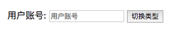

## v-if条件渲染案例

我们来做一个简单的小案例：
用户再登录时，可以切换使用用户账号登录还是邮箱地址登录。
类似如下情景：



```html
<!DOCTYPE html>
<html lang="en">
<head>
  <meta charset="UTF-8">
  <title>Title</title>
</head>
<body>
<div id="app">
  <div></div>
  <span v-if="isShow">{{user_style}}
    <label for="name"></label>
    <input type="text" name="" id="name" :placeholder="user_style">
  </span>
  <span v-else>{{passwd_style}}
    <label for="name1"></label>
    <input type="text" name="" id="name1" :placeholder="passwd_style">
  </span>

  <button @click="changename">切换类型</button>
</div>

<script src="../vue.js"></script>

<script>
  const app = new Vue({
    el:"#app",
    data:{
      isShow:true,
      user_style:"用户账号",
      passwd_style:"密码登录",
    },
    methods:{
      changename(){
        this.isShow = !this.isShow;
    }}
  })
</script>
</body>
</html>
```

会存在一个小问题：就是我们在输入了值后，在点击切换按钮，输入框中的值并不会消失


- 小问题：
  - 如果我们在有输入内容的情况下，切换了类型，我们会发现文字依然显示之前的输入的内容。
  - 但是按道理讲，我们应该切换到另外一个input元素中了。
  - 在另一个input元素中，我们并没有输入内容。
  - 为什么会出现这个问题呢？
- 问题解答：
  - **这是因为Vue在进行DOM渲染时，出于性能考虑，会尽可能的复用已经存在的元素，而不是重新创建新的元素**。
    - 就是我们的两个span和input都是共用一套体系，然后在渲染到真实的场景中的时候，直接复用，在在复用元素上进行比较，不同的部分进行抽离替换，就是变量的部分，但是相同部分不动，input不进行切换就是这个原因
  - **在上面的案例中，Vue内部会发现原来的input元素不再使用，直接作为else中的input来使用了**。
- 解决方案：
  - 如果我们不希望Vue出现类似重复利用的问题，可以给对应的input添加key
  - 并且我们需要保证key的不同

解决方案代码

```html
<!DOCTYPE html>
<html lang="en">
<head>
  <meta charset="UTF-8">
  <title>Title</title>
</head>
<body>
<div id="app">
  <div></div>
  <span v-if="isShow">{{user_style}}
    <label for="name"></label>
    <input type="text" name="" id="name" :placeholder="user_style" key="abc">
  </span>
  <span v-else>{{passwd_style}}
  <label for="name1"></label>
    <input type="text" name="" id="name1" :placeholder="passwd_style" key="def">
  </span>

  <button @click="changename">切换类型</button>
</div>

<script src="../vue.js"></script>

<script>
  const app = new Vue({
    el:"#app",
    data:{
      isShow:true,
      user_style:"用户账号",
      passwd_style:"密码登录",
    },
    methods:{
      changename(){
        this.isShow = !this.isShow;
    }}
  })
</script>
</body>
</html>
```

效果展示

