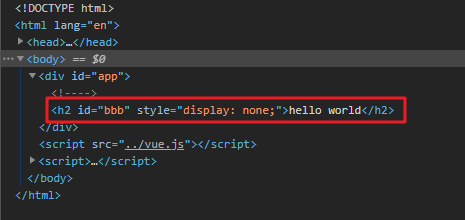

## v-show

- v-show的用法和v-if非常相似，也用于决定一个元素是否渲染：
- **v-if和v-show对比**
  - v-if和v-show都可以决定一个元素是否渲染，那么开发中我们如何选择呢？
  - v-if当条件为false时，压根不会有对应的元素在DOM中
  - v-show当条件为false时，仅仅是将元素的display属性设置为none而已
- 开发中如何选择呢？
  - **当需要在显示与隐藏之间切片很频繁时，使用v-show**
  - **当只有一次切换时，通过使用v-if**

```html
<!DOCTYPE html>
<html lang="en">
<head>
  <meta charset="UTF-8">
  <title>Title</title>
</head>
<body>
<div id="app">
  <!--v-if 当条件为false时，包含v-if指令元素，根本就不会存在dom中-->
  <h2 v-if="isShow" id="aaa">{{message}}</h2>
  <!--v-show 当条件为false时，包含v-show指令是指给我们的元素增加了一个行内样式display:none-->
  <h2 v-show="isShow" id="bbb">{{message}}</h2>
</div>

<script src="../vue.js"></script>

<script>
  const app = new Vue({
    el:"#app",
    data:{
      message:"hello world",
      isShow:true
    }
  })
</script>
</body>
</html>
```

v-show的原理操控display属性



