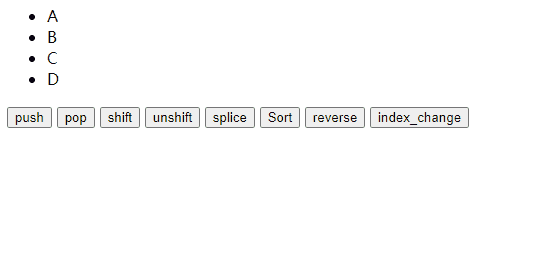
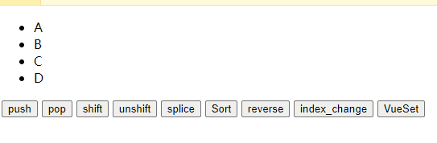

## 检测数组更新

因为Vue是响应式的，所以当数据发生变化时，Vue会自动检测数据变化，视图会发生对应的更新
Vue中包含了一组观察数组编译的方法，使用它们改变数组也会触发视图的更新

- 下面的操作都是响应式的：
  - push()
  - pop()
  - shift()
  - unshift()
  - splice()
  - sort()
  - reverse()
- 这个操作除外
  - index_change通过下标修改值

```html
<!DOCTYPE html>
<html lang="en">
<head>
  <meta charset="UTF-8">
  <title>Title</title>
</head>
<body>
<div id="app">
  <ul>
    <li v-for="item in letter">{{item}}</li>
  </ul>
  <button @click="btnClickPush">push</button>
  <button @click="btnClickPop">pop</button>
  <button @click="btnClickShift">shift</button>
  <button @click="btnClickUnshift">unshift</button>
  <button @click="btnClickSplice">splice</button>
  <button @click="btnClickSort">Sort</button>
  <button @click="btnClickReverse">reverse</button>
  <button @click="btnClickIndexChange">index_change</button>
  <button @click="btnClickVueSet">VueSet</button>
</div>

<script src="../vue.js"></script>

<script>
  const app = new Vue({
    el:"#app",
    data:{
      letter:["A","B","C","D"]
    },
    methods:{
      btnClickPush:function (){
        this.letter.push("aaa")
      },
      btnClickPop:function (){
        this.letter.pop()
      },
      btnClickShift:function (){
        // shift删除数组中的第一个元素
        this.letter.shift()
      },
      btnClickUnshift:function (){
        // unshift在数组最前面增加元素
        this.letter.unshift("aaa")
      },
      btnClickSplice:function (){
        //删除一个元素
        this.letter.splice(2,1)
      },
      btnClickSort:function (){
        this.letter.sort()
      },
      btnClickReverse:function (){
        this.letter.reverse()
      },
      btnClickIndexChange:function (){
        //并不具有响应式
        this.letter[0] = "index_change"
      },
      btnClickVueSet:function (){
        //具有响应式
        Vue.set(this.letter,1,"vue_set")
      }
    }
  })
</script>
</body>
</html>
```

效果展示：



补充通过下标修改值不能做到响应式，我们可以使用Vue的set方法

