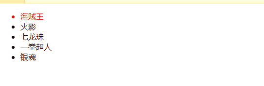

## 作业的完成

需求：**我们的数组列表数据，当我们点击其中一个li节点的时候，该节点变成红色，其他的都是黑色，随点击进行切换**

代码中比较好的思路：

- 首先是v-for 得到index 后续很关键
- 使用v-bind 为class进行active属性的绑定
- 使用currentIndex===index 判定当前active是不是应用
- 在v-on添加点击事件，注意这个事件的写法，带有参数

```html
<!DOCTYPE html>
<html lang="en">
<head>
  <meta charset="UTF-8">
  <title>Title</title>
  <style>
    .active{
        color: red;
    }
  </style>
</head>
<body>
<div id="app">
  <ul>
    <li v-for="(item,index) in movies" :class="{active:currentIndex===index}" @click="changeRed(index)">{{item}}</li>
  </ul>
</div>

<script src="../vue.js"></script>

<script>
  const app = new Vue({
    el:"#app",
    data:{
      movies:["海贼王","火影","七龙珠","一拳超人","银魂"],
      currentIndex:0
    },
    methods:{
      changeRed:function (index){
        this.currentIndex = index
      }
    }
  })
</script>
</body>
</html>
```

效果展示

