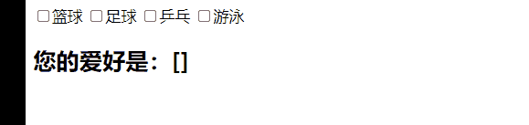

## v-model绑定checkbox

- 复选框分为两种情况：单个勾选框和多个勾选框

- 单个勾选框：
  - v-model即为布尔值
  - 此时input的value并不影响v-model的值

- 多个复选框：
  - 当是多个复选框时，因为可以选中多个，所以对应的data中属性是一个数组
  - 当选中某一个时，就会将input的value添加到数组中

#### 单个勾选框

- 一般用在"同意协议"中，开发的情景属于，当不同意协议的时候，下一步不可以点击；当同意协议的时候才可以进行点击

```html
<!DOCTYPE html>
<html lang="en">
<head>
    <meta charset="UTF-8">
    <title>Title</title>
</head>
<body>

<div id="app">
    <label for="agree">
        <input type="checkbox" id="agree" v-model="isAgree">同意协议
    </label>
    <h2>您的选择是：{{isAgree}}</h2>
    <button :disabled="!isAgree">下一步</button>
</div>

<script src="../vue.js"></script>

<script>
    const app = new Vue({
        el:"#app",
        data:{
            message:"hello world",
            isAgree:false
        }
    })
</script>
</body>
</html>
```

- 效果如图所示

  

#### 多个复选框

```html
<!DOCTYPE html>
<html lang="en">
<head>
    <meta charset="UTF-8">
    <title>Title</title>
</head>
<body>

<div id="app">
    <input type="checkbox" value="篮球" v-model="hobbies">篮球
    <input type="checkbox" value="足球" v-model="hobbies">足球
    <input type="checkbox" value="乒乓" v-model="hobbies">乒乓
    <input type="checkbox" value="游泳" v-model="hobbies">游泳

    <h2>您的爱好是：{{hobbies}}</h2>
</div>

<script src="../vue.js"></script>

<script>
    const app = new Vue({
        el:"#app",
        data:{
            message:"hello world",
            hobbies:[]
        }
    })
</script>
</body>
</html>
```

- 效果如图所示

  