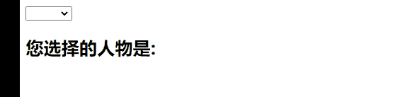
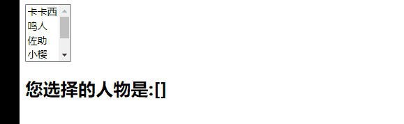

## v-model绑定select

- 和checkbox一样，select也分单选和多选两种情况。

- **单选**：只能选中一个值。
  - v-model绑定的是一个**值**。
  - 当我们选中option中的一个时，会将它对应的value赋值到mySelect中

- **多选**：可以选中多个值。
  - v-model绑定的是一个**数组**。
  - 当选中多个值时，就会将选中的option对应的value添加到数组mySelects中

#### 单值

```html
<!DOCTYPE html>
<html lang="en">
<head>
    <meta charset="UTF-8">
    <title>Title</title>
</head>
<body>

<div id="app">
    <select name="abc" id="" v-model="renwu">
        <option value="卡卡西">卡卡西</option>
        <option value="鸣人">鸣人</option>
        <option value="佐助">佐助</option>
        <option value="小樱">小樱</option>
        <option value="佩恩">佩恩</option>
        <option value="晓楠">晓楠</option>
    </select>
    <h2>您选择的人物是:{{renwu}}</h2>
</div>

<script src="../vue.js"></script>

<script>
    const app = new Vue({
        el:"#app",
        data:{
            message:"hello world",
            renwu:""
        }
    })
</script>
</body>
</html>
```

- 效果如图所示
  - 

#### 多值

```html
<!DOCTYPE html>
<html lang="en">
<head>
  <meta charset="UTF-8">
  <title>Title</title>
</head>
<body>

<div id="app">
  <select name="abc" id="" v-model="renwu" multiple>
    <option value="卡卡西">卡卡西</option>
    <option value="鸣人">鸣人</option>
    <option value="佐助">佐助</option>
    <option value="小樱">小樱</option>
    <option value="佩恩">佩恩</option>
    <option value="晓楠">晓楠</option>
  </select>
  <h2>您选择的人物是:{{renwu}}</h2>
</div>

<script src="../vue.js"></script>

<script>
  const app = new Vue({
    el:"#app",
    data:{
      message:"hello world",
      renwu:[]
    }
  })
</script>
</body>
</html>
```

- 效果如图所示
  - 注意这个地方的多选需要借助着**crtl+点击**完成
  - 