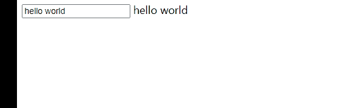
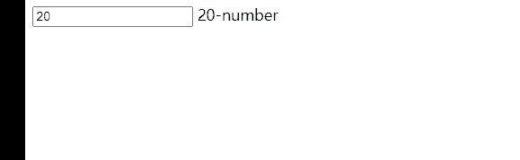
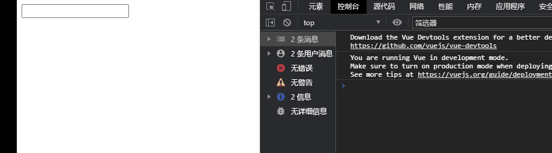

## 修饰符

#### **lazy修饰符**：

- **理解**：像输入，我们没有必要实时绑定进行变化，当**用户失去焦点**或**按下回车**的时候，我们的绑定的值在发生变化
- 默认情况下，v-model默认是在input事件中同步输入框的数据的。
- 也就是说，一旦有数据发生改变对应的data中的数据就会自动发生改变。
- lazy修饰符可以让数据在失去焦点或者回车时才会更新：

```html
<!DOCTYPE html>
<html lang="en">
<head>
    <meta charset="UTF-8">
    <title>Title</title>
</head>
<body>

<div id="app">

    <input type="text" v-model.lazy="message">
    {{message}}
</div>

<script src="../vue.js"></script>

<script>
    const app = new Vue({
        el:"#app",
        data:{
            message:"hello world"
        }
    })
</script>
</body>
</html>
```

效果如下：



### **number修饰符**：

- 默认情况下，在输入框中无论我们输入的是字母还是数字，都会被当做字符串类型进行处理。
- 但是如果我们希望处理的是数字类型，那么最好直接将内容当做数字处理。
- number修饰符可以让在输入框中输入的内容自动转成数字类型

```html
<!DOCTYPE html>
<html lang="en">
<head>
    <meta charset="UTF-8">
    <title>Title</title>
</head>
<body>

<div id="app">

    <input type="number" v-model="age">
    <input type="number" v-model.number="age">
    {{ age}}-{{typeof age}}
</div>

<script src="../vue.js"></script>

<script>
    const app = new Vue({
        el:"#app",
        data:{
            message:"hello world",
            age:20
        }
    })
</script>
</body>
</html>
```

效果如图：

- 在不加.number的时候，默认是string类型

  

- 在加.number的时候，默认是number类型

  

#### **trim修饰符**：

- 如果输入的内容首尾有很多空格，通常我们希望将其去除
- trim修饰符可以过滤内容左右两边的空格

```html
<!DOCTYPE html>
<html lang="en">
<head>
    <meta charset="UTF-8">
    <title>Title</title>
</head>
<body>

<div id="app">

    <input type="text" v-model.trim="message">
    {{message}}
</div>

<script src="../vue.js"></script>

<script>
    const app = new Vue({
        el:"#app",
        data:{
            message:"hello world"
        }
    })
</script>
</body>
</html>
```

效果如图：

