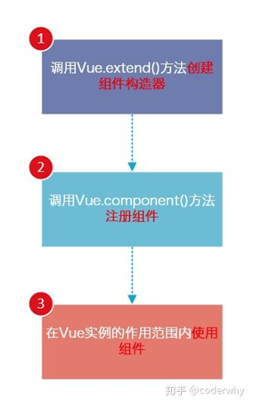

## 注册组件的基本步骤

- **`组件的使用分成三个步骤：`**
  - 创建组件构造器
  - 注册组件
  - 使用组件



- 我们来看看通过代码如何注册组件


```html
<!DOCTYPE html>
<html lang="en">
<head>
    <meta charset="UTF-8">
    <title>Title</title>
</head>
<body>

<div id="app">
    <!--3.组件的使用-->
    <my_cpn></my_cpn>
</div>

<script src="../vue.js"></script>

<script>
    //ES6的``的部分是可换行字符串

    //1.创建组件构造器对象
    const cpnC = Vue.extend({
        template:`
            <div>
                <h2>我是标题</h2>
                <p>我是内容 哈哈哈哈哈</p>
                <p>我是内容2 呵呵呵呵呵呵呵呵</p>
            </div>`
    })


    //2.注册组件
    //组件的名称,我们如何引用这个组件
    Vue.component("my_cpn",cpnC)


    const app = new Vue({
        el:"#app",
        data:{
            message:"hello world"
        }
    })
</script>
</body>
</html>
```

效果展示


- 查看运行结果：
  - 和直接使用一个div看起来并没有什么区别
  - 但是我们可以设想，如果很多地方都要显示这样的信息，我们是不是就可以直接使用<my-cpn></my-cpn>来完成呢


## 注册组件步骤解析

- 这里的步骤都代表什么含义呢？
- 1.**Vue.extend()**：
  - **调用Vue.extend()创建的是一个组件构造器**
  - **通常在创建组件构造器时，传入`template`代表我们自定义组件的模板**
  - **该模板就是在使用到组件的地方，要显示的HTML代码**
  - 事实上，这种写法在Vue2.x的文档中几乎已经看不到了，它会直接使用下面我们会讲到的语法糖，但是在很多资料还是会提到这种方式，而且这种方式是学习后面方式的基础
- 2.**Vue.component()**：
  - **调用Vue.component()是将刚才的组件构造器注册为一个组件，并且给它起一个组件的标签名称**
  - 所以需要传递两个参数：
    - 1、**注册组件的标签名** 
    - 2、**组件构造器**
- 3.组件必须挂载在某个Vue实例下，否则它不会生效
  - 我们来看下面我使用了三次<my-cpn></my-cpn>
  - 而第三次其实并没有生效：


```html
<!DOCTYPE html>
<html lang="en">
<head>
    <meta charset="UTF-8">
    <title>Title</title>
</head>
<body>

<div id="app">
    <!--3.组件的使用-->
    <my_cpn></my_cpn>
    <div>
        <my_cpn></my_cpn>
    </div>
    <my_cpn></my_cpn>
</div>

<script src="../vue.js"></script>

<script>
    //ES6的``的部分是可换行字符串


    //1.创建组件构造器对象
    const cpnC = Vue.extend({
        template:`
            <div>
                <h2>我是标题</h2>
                <p>我是内容 哈哈哈哈哈</p>
                <p>我是内容2 呵呵呵呵呵呵呵呵</p>
            </div>`
    })


    //2.注册组件
    //组件的名称,我们如何引用这个组件
    Vue.component("my_cpn",cpnC)


    const app = new Vue({
        el:"#app",
        data:{
            message:"hello world"
        }
    })
</script>
</body>
</html>
```

效果展示：

