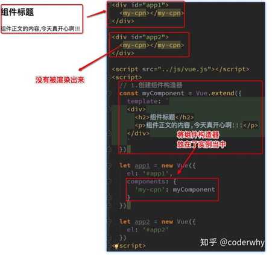
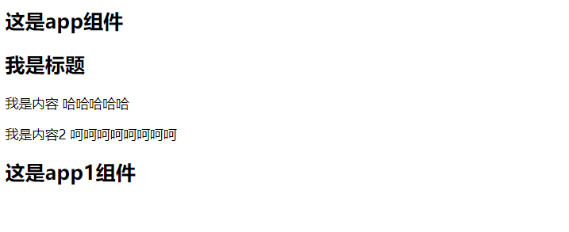

## 全局组件和局部组件

- **当我们通过调用Vue.component()注册组件时，组件的注册是全局的**
  - **这意味着该组件可以在任意Vue示例下使用**
  - 
- **如果我们注册的组件是挂载在某个实例中, 那么就是一个局部组件**
  - 

#### 全局组件

```html
<!DOCTYPE html>
<html lang="en">
<head>
    <meta charset="UTF-8">
    <title>Title</title>
</head>
<body>

<div id="app">
    <!--3.组件的使用-->
    <my_cpn></my_cpn>
</div>

<div id="app1">
    <!--3.组件的使用-->
    <my_cpn></my_cpn>
</div>

<script src="../vue.js"></script>

<script>
    //ES6的``的部分是可换行字符串


    //1.创建组件构造器对象
    const cpnC = Vue.extend({
        template:`
            <div>
                <h2>我是标题</h2>
                <p>我是内容 哈哈哈哈哈</p>
                <p>我是内容2 呵呵呵呵呵呵呵呵</p>
            </div>`
    })


    //2.注册组件(这个地方我们注册的是全局组件，意味着可以在多个Vue的实例下面使用)
    //组件的名称,我们如何引用这个组件
    Vue.component("my_cpn",cpnC)


    const app = new Vue({
        el:"#app",
        data:{
            message:"hello world"
        }
    })

    const app1 = new Vue({
        el:"#app1",
        data:{
            message:"hello world"
        }
    })
</script>
</body>
</html>
```

#### 局部组件

```html
<!DOCTYPE html>
<html lang="en">
<head>
    <meta charset="UTF-8">
    <title>Title</title>
</head>
<body>

<div id="app">
    <h2>这是app组件</h2>
    <cpn></cpn>
</div>

<div id="app1">
    <h2>这是app1组件</h2>
    <!--3.组件的使用-->
    <cpn></cpn>
</div>

<script src="../vue.js"></script>

<script>
    //ES6的``的部分是可换行字符串


    //1.创建组件构造器对象
    const cpnC = Vue.extend({
        template:`
            <div>
                <h2>我是标题</h2>
                <p>我是内容 哈哈哈哈哈</p>
                <p>我是内容2 呵呵呵呵呵呵呵呵</p>
            </div>`
    })

    const app = new Vue({
        el:"#app",
        components:{
            //2.在vue的实例里面进行
            cpn:cpnC
        }
    })

    const app1 = new Vue({
        el:"#app1",

    })
</script>
</body>
</html>
```

效果如图所示：(组件只会在app中可以使用)

