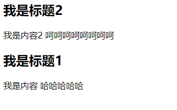
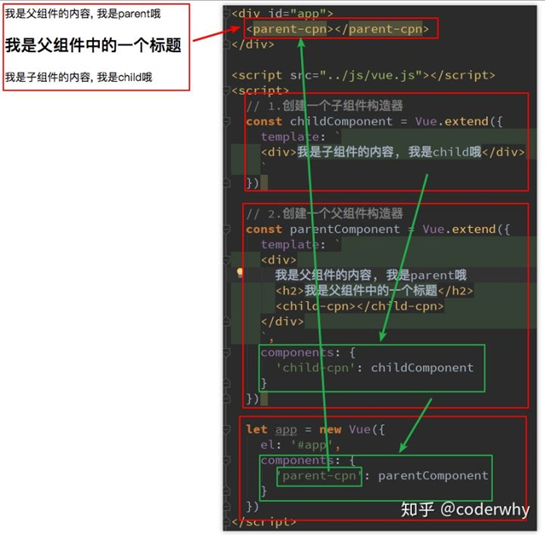

## 父组件和子组件

- 在前面我们看到了组件树：
  - 组件和组件之间存在层级关系
  - 而其中一种非常重要的关系就是父子组件的关系
- 我们来看通过代码如何组成的这种层级关系：

```html
<!DOCTYPE html>
<html lang="en">
<head>
    <meta charset="UTF-8">
    <title>Title</title>
</head>
<body>

<div id="app">
    <cpn2></cpn2>
</div>

<script src="../vue.js"></script>

<script>
    //子组件
    const cpnC1 = Vue.extend({
        template:`
            <div>
                <h2>我是标题1</h2>
                <p>我是内容 哈哈哈哈哈</p>
            </div>`
    })
	
    //父组件
    const cpnC2 = Vue.extend({
        template:`
            <div>
                <h2>我是标题2</h2>
                <p>我是内容2 呵呵呵呵呵呵呵呵</p>
                <cpn1></cpn1>
            </div>`,
        components:{
            cpn1:cpnC1
        }
    })

	//可以看作是一个默认的组件root
    const app = new Vue({
        el:"#app",
        data:{
            message:"hello world"
        },components:{
            cpn2:cpnC2
        }
    })
</script>
</body>
</html>
```

效果展示



- **父子组件错误用法**：以子标签的形式在Vue实例中使用
  - **因为当子组件注册到父组件的components时，Vue会编译好父组件的模块**
  - **该模板的内容已经决定了父组件将要渲染的HTML（相当于父组件中已经有了子组件中的内容了）**
    - 在编译的过程其实就是模板代码替换的过程
    - 现在指定的父组件中进行查找，没有在找全局组件
  - **<child-cpn></child-cpn>是只能在父组件中被识别的**
  - 类似这种用法，<child-cpn></child-cpn>是会被浏览器忽略的




