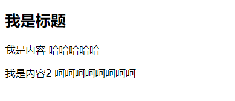

## 模板的分离写法

- 刚才，我们通过语法糖简化了Vue组件的注册过程，另外还有一个地方的写法比较麻烦，就是template模块写法。
- 如果我们能将其中的HTML分离出来写，然后挂载到对应的组件上，必然结构会变得非常清晰。
- Vue提供了两种方案来定义HTML模块内容：
  - 使用<script>标签
  - 使用<template>标签(`推荐`)

#### 第一种使用script的方式进行书写

```html
<!DOCTYPE html>
<html lang="en">
<head>
    <meta charset="UTF-8">
    <title>Title</title>
</head>
<body>

<div id="app">
    <my_cpn></my_cpn>
</div>

<script type="text/x-template" id="cpn1">
    <div>
        <h2>我是标题</h2>
        <p>我是内容 哈哈哈哈哈</p>
        <p>我是内容2 呵呵呵呵呵呵呵呵</p>
    </div>
</script>

<script src="../vue.js"></script>

<script>

    Vue.component("my_cpn",{
        template:"#cpn1"
    })


    const app = new Vue({
        el:"#app",
        data:{
            message:"hello world"
        }
    })
</script>
</body>
</html>
```

#### 第二种使用template的方式进行书写(推荐)

```html
<!DOCTYPE html>
<html lang="en">
<head>
  <meta charset="UTF-8">
  <title>Title</title>
</head>
<body>

<div id="app">
  <my_cpn></my_cpn>
</div>

<template id="cpn1">
  <div>
    <h2>我是标题</h2>
    <p>我是内容 哈哈哈哈哈</p>
    <p>我是内容2 呵呵呵呵呵呵呵呵</p>
  </div>
</template>

<script src="../vue.js"></script>

<script>

  Vue.component("my_cpn",{
    template:'#cpn1'
  })


  const app = new Vue({
    el:"#app",
    data:{
      message:"hello world"
    }
  })
</script>
</body>
</html>
```

效果如图所示

