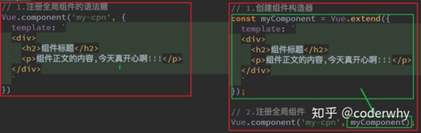
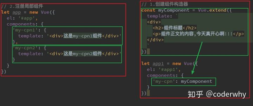
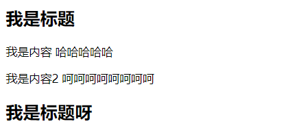

## 注册组件的语法糖

- 在上面注册组件的方式，可能会有些繁琐。

  - Vue为了简化这个过程，提供了注册的语法糖
  - **主要是省去了调用Vue.extend()的步骤，而是可以直接使用一个对象来代替**

- 语法糖注册全局组件和局部组件：

  



```html
<!DOCTYPE html>
<html lang="en">
<head>
    <meta charset="UTF-8">
    <title>Title</title>
</head>
<body>

<div id="app">
    <!--3.组件的使用-->
    <my_cpn></my_cpn>
    <my_cpn2></my_cpn2>
</div>

<script src="../vue.js"></script>

<script>
    /* 原始的调用方式
    const cpnC = Vue.extend({
        template:`
            <div>
                <h2>我是标题</h2>
                <p>我是内容 哈哈哈哈哈</p>
                <p>我是内容2 呵呵呵呵呵呵呵呵</p>
            </div>`
    })

    Vue.component("my_cpn",cpnC)*/


    //语法糖的调用方式，{template} = Vue.extend({template})
    //注册全局组件
    Vue.component("my_cpn",{
        template:`
            <div>
                <h2>我是标题</h2>
                <p>我是内容 哈哈哈哈哈</p>
                <p>我是内容2 呵呵呵呵呵呵呵呵</p>
            </div>`
    })

	//局部组件
    const app = new Vue({
        el:"#app",
        data:{
            message:"hello world"
        },components:{
            my_cpn2:{template:`<div><h2>我是标题呀</h2></div>`
    }
        }
    })
</script>
</body>
</html>
```

效果如图所示：

