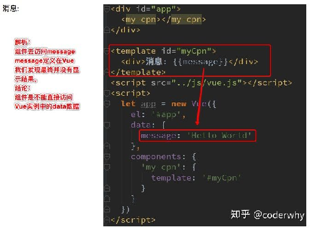
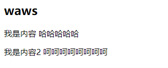
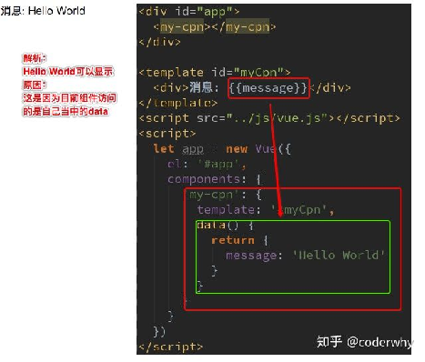
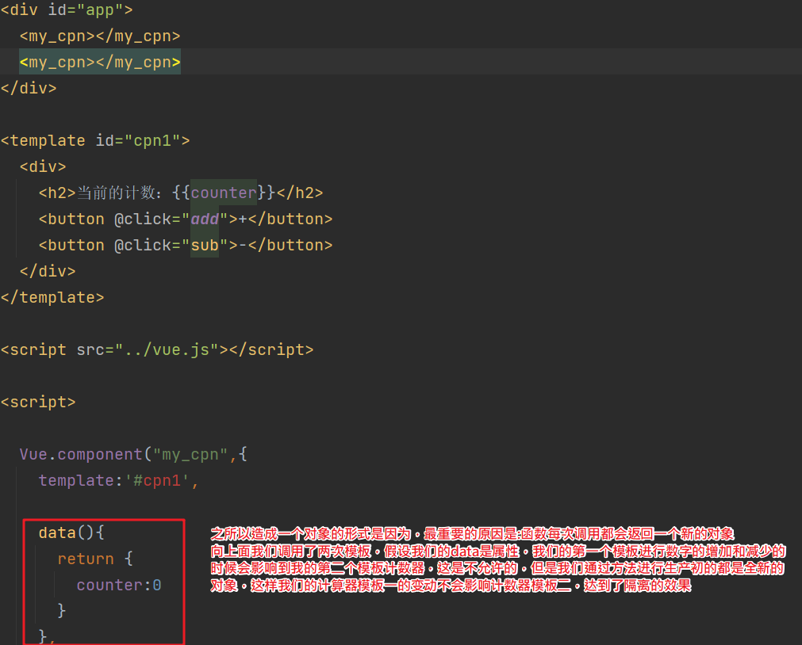

## 组件可以访问Vue实例数据

- 组件是一个单独功能模块的封装：

  - **这个模块有属于自己的HTML模板，也应该有属性自己的数据data**

- 组件中的数据是保存在哪里呢？顶层的Vue实例中吗？

  - 我们先来测试一下，组件中能不能直接访问Vue实例中的data
    - 
    - 我们发现**不能访问**，而且**即使可以访问，如果将所有的数据都放在Vue实例中，Vue实例就会变的非常臃肿**

  - 结论：**Vue组件应该有自己保存数据的地方**

```html
<!DOCTYPE html>
<html lang="en">
<head>
  <meta charset="UTF-8">
  <title>Title</title>
</head>
<body>

<div id="app">
  <my_cpn></my_cpn>
</div>

<template id="cpn1">
  <div>
    <h2>{{title}}</h2>
    <p>我是内容 哈哈哈哈哈</p>
    <p>我是内容2 呵呵呵呵呵呵呵呵</p>
  </div>
</template>

<script src="../vue.js"></script>

<script>

  Vue.component("my_cpn",{
    template:'#cpn1',
    data(){
      return {
        title:"waws"
      }
    }
  })


  const app = new Vue({
    el:"#app",
    data:{
      message:"hello world"
    }
  })
</script>
</body>
</html>
```

效果展示



##  组件数据的存放

- 组件自己的数据存放在哪里呢?
  - 组件对象也有一个data属性(也可以有methods等属性，下面我们有用到)
  - 只是这个**`data属性必须是一个函数`**
  - **而且这个函数返回一个对象，对象内部保存着数据**



### data为什么设置成为一个函数？

- 首先，如果不是一个函数，Vue直接就会报错
- 其次，**原因是在于Vue让每个组件对象都返回一个新的对象，因为如果是同一个对象的，组件在多次使用后会相互影响**

