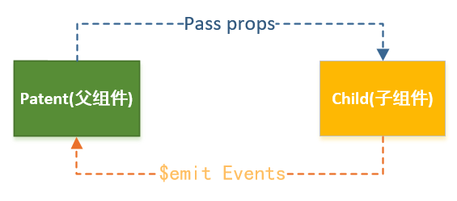
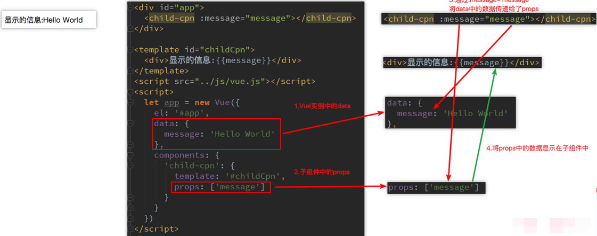
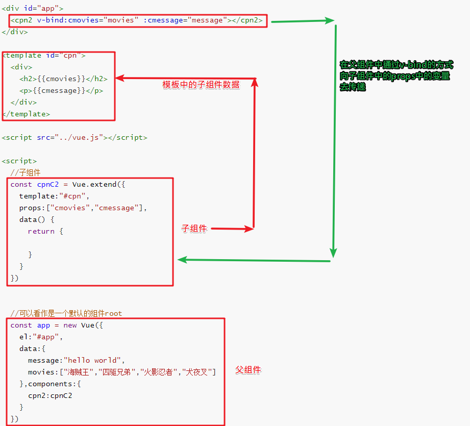
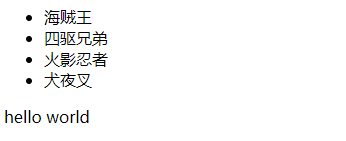
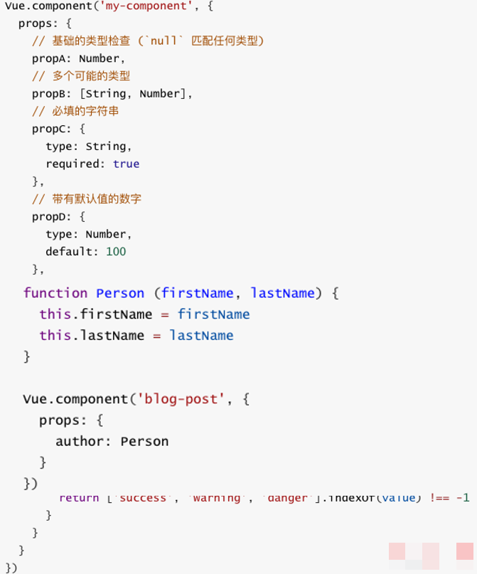
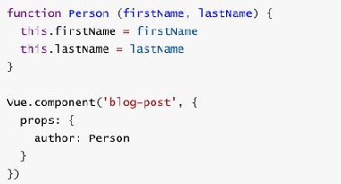

## 父子组件的通信-父向子提供数据

需求理解：我们的整个页面的构成基本上就是一个大的组件，在大组件中不断进行详细的划分成中组件，部分中组件还是由不同的子组件进行组合得到的，在我们的请求数据的时候，一般是最外边的大组件，一次请求后端拿到所有的数据，然后需要进行子组件和父组件之间的通信，将父组件的数据传递给子组件。

- 在上一个小节中，我们提到了子组件是不能引用父组件或者Vue实例的数据的

- 但是，在开发中，往往一些数据确实需要从**上层传递到下层**：

  - 比如在一个页面中，我们从服务器请求到了很多的数据。
  - 其中一部分数据，并非是我们整个页面的大组件来展示的，而是需要下面的子组件进行展示。
  - 这个时候，并不会让子组件再次发送一个网络请求，而是直接让大组件(父组件)将数据传递给小组件(子组件)。

- **如何进行父子组件间的通信呢**？Vue官方提到

  - **通过props向子组件传递数据**
  - **通过事件向父组件发送消息**

  

- 在下面的代码中，我直接将**Vue实例当做父组件**，**并且其中包含子组件来简化代码**。
- 真实的开发中，**Vue实例和子组件的通信和父组件和子组件的通信过程是一样的**。

## props基本用法

- 在组件中，使用选项props来声明需要从父级接收到的数据。
- props的值有两种方式：
  - 方式一：**字符串数组，数组中的字符串就是传递时的名称**
  - 方式二：**对象，对象可以设置传递时的类型，也可以设置默认值等**
- 我们先来看一个最简单的props传递：



#### 父组件向子组件传递数据

- 注意我们在不使用v-bind的时候，我们的数据是"movies"和"message"是以字符串的方式传递到下一层的

```html
<!DOCTYPE html>
<html lang="en">
<head>
  <meta charset="UTF-8">
  <title>Title</title>
</head>
<body>

<div id="app">
  <cpn2 v-bind:cmovies="movies" :cmessage="message"></cpn2>
</div>

<template id="cpn">
  <div>
    <ul>
      <li v-for="item in cmovies">{{item}}</li>
    </ul>
    <p>{{cmessage}}</p>
  </div>
</template>

<script src="../vue.js"></script>

<script>
  //子组件
  const cpnC2 = Vue.extend({
    template:"#cpn",
    props:["cmovies","cmessage"],
    data() {
      return {

      }
    }
  })


  //可以看作是一个默认的组件root
  const app = new Vue({
    el:"#app",
    data:{
      message:"hello world",
      movies:["海贼王","四驱兄弟","火影忍者","犬夜叉"]
    },components:{
      cpn2:cpnC2
    }
  })
</script>
</body>
</html>
```

代码原理剖析



效果展示：



### 通过对象的方式父组件向子组件传递数据

```html
<!DOCTYPE html>
<html lang="en">
<head>
  <meta charset="UTF-8">
  <title>Title</title>
</head>
<body>

<div id="app">
  <cpn2 v-bind:cmovies="movies" :cmessage="message"></cpn2>
</div>

<template id="cpn">
  <div>
    <ul>
      <li v-for="item in cmovies">{{item}}</li>
    </ul>
    <p>{{cmessage}}</p>
  </div>
</template>

<script src="../vue.js"></script>

<script>
  //子组件
  const cpnC2 = Vue.extend({
    template:"#cpn",
    props:{
      //1.类型限制
      // cmovies:Array,
      // cmessage:String,

      //2.提供一些默认值,类型，必要性
      cmessage:{
        type:String,
        default:"aaaaa",
        required:true
      },
      
      //类型是对象或者数组的时候，默认值必须是工厂函数
      // cmovies:{
      //   type:Array,
      //   default:[]  //vue 2.5.17以后会报错
      // }
      
      cmovies:{
        type:Array,
        default(){
          return []
        }
      }
    },
    data() {
      return {

      }
    }
  })


  //可以看作是一个默认的组件root
  const app = new Vue({
    el:"#app",
    data:{
      message:"hello world",
      movies:["海贼王","四驱兄弟","火影忍者","犬夜叉"]
    },components:{
      cpn2:cpnC2
    }
  })
</script>
</body>
</html>
```

## props数据验证

- 在前面，我们的props选项是使用一个数组。

- 我们说过，除了数组之外，我们也可以使用对象，当需要对**props进行类型等验证**时，就需要**对象写法**了。

- 验证都支持哪些数据类型呢？

  - String
  - Number
  - Boolean
  - Array
  - Object
  - Date
  - Function
  - Symbol

  

- 当我们有**自定义构造函数时，验证也支持自定义的类型**



