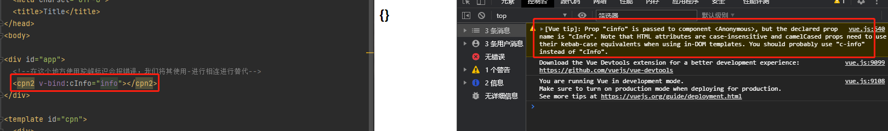
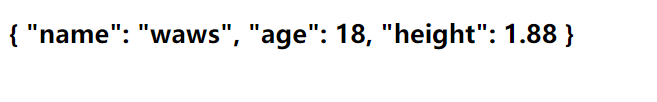

## 组件通信-父传子(props中的驼峰标识)

使用驼峰表示会造成一些错误



正确的方式在我们的父组件中使用的时候，我们需要将在父组件中的驼峰表示改变成-进行相连的形式

```html
<!DOCTYPE html>
<html lang="en">
<head>
  <meta charset="UTF-8">
  <title>Title</title>
</head>
<body>

<div id="app">
  <!--在这个地方使用驼峰标识会报错误，我们将其使用-进行相连进行替代-->
  <cpn2 v-bind:c-info="info"></cpn2>
</div>

<template id="cpn">
  <div>
    <h2>{{cInfo}}</h2>
  </div>
</template>

<script src="../vue.js"></script>

<script>
  //子组件
  const cpnC2 = Vue.extend({
    template:"#cpn",
    props: {
      cInfo:{
        type:Object,
        default() {
          return {};
        }
      }
    }
  })


  //可以看作是一个默认的组件root
  const app = new Vue({
    el:"#app",
    data:{
      info:{
        name:"waws",
        age:18,
        height:1.88
      },
      message:"aaaaa"
    },components:{
      cpn2:cpnC2
    }
  })
</script>
</body>
</html>
```

效果如图所示



