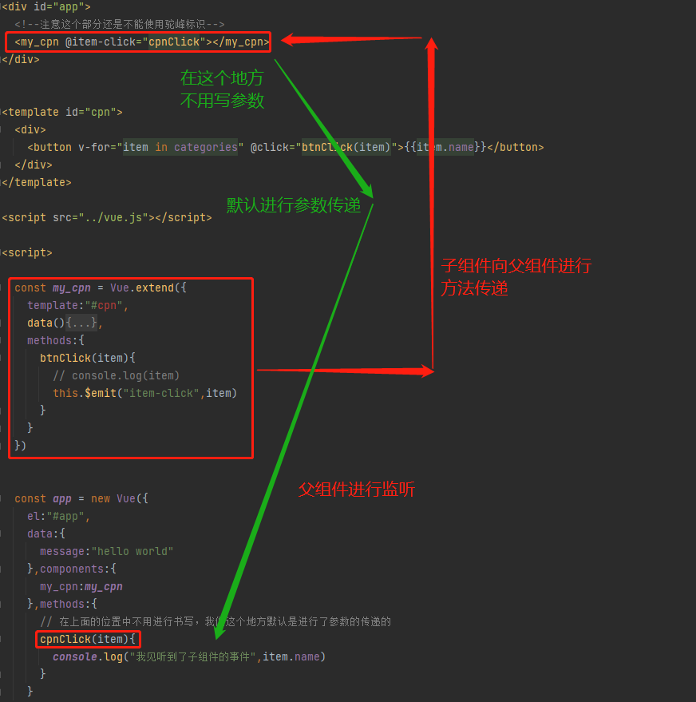

## 子级向父级传递

- props用于**父组件向子组件传递数据**，还有一种比较常见的是**子组件传递数据或事件到父组件**中。

- 我们应该如何处理呢？这个时候，我们需要使用`自定义事件`来完成。

- 什么时候需要自定义事件呢？

  - 当子组件需要向父组件传递数据时，就要用到自定义事件了
  - **我们之前学习的v-on不仅仅可以用于监听DOM事件，也可以用于组件间的自定义事件**

- 自定义事件的流程：

  - **在子组件中，通过$emit()来触发事件**
  - **在父组件中，通过v-on来监听子组件事件**

- 我们来看一个简单的例子：

  - 我们之前做过一个两个按钮+1和-1，点击后修改counter
  - 我们整个操作的过程还是在子组件中完成，但是之后的展示交给父组件
  - 这样，我们就需要将子组件中的counter，传给父组件的某个属性，比如total

  

```html
<!DOCTYPE html>
<html lang="en">
<head>
  <meta charset="UTF-8">
  <title>Title</title>
</head>
<body>

<div id="app">
  <!--注意这个部分还是不能使用驼峰标识-->
  <my_cpn @item-click="cpnClick"></my_cpn>
</div>


<template id="cpn">
  <div>
    <button v-for="item in categories" @click="btnClick(item)">{{item.name}}</button>
  </div>
</template>

<script src="../vue.js"></script>

<script>

  const my_cpn = Vue.extend({
    template:"#cpn",
    data(){
      return {
        categories:[
          {id:"aaa",name:"手机数码"},
          {id:"bbb",name:"热门推荐"},
          {id:"ccc",name:"家用电器"},
          {id:"ddd",name:"空调维修"},
        ]
      }
    },
    methods:{
      btnClick(item){
        // console.log(item)
        this.$emit("item-click",item)
      }
    }
  })


  const app = new Vue({
    el:"#app",
    data:{
      message:"hello world"
    },components:{
      my_cpn:my_cpn
    },methods:{
      // 在上面的位置中不用进行书写，我们这个地方默认是进行了参数的传递的
      cpnClick(item){
        console.log("我见听到了子组件的事件",item.name)
      }
    }
  })
</script>
</body>
</html>
```

代码解析：



效果如图所示


带有参数的自动传递参数,效果演示

