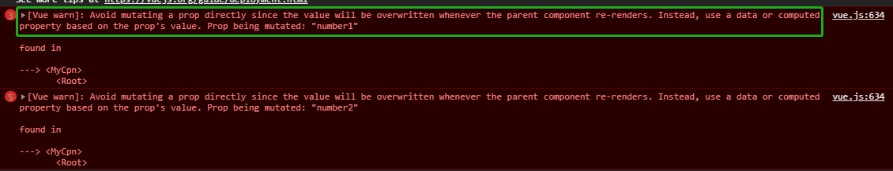
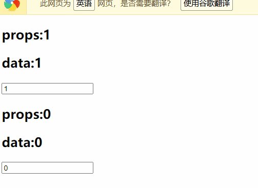
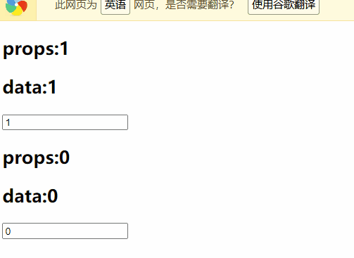

## 父子组件通信中v-model的问题

在子组件中我们将v-model绑定我们的子组件中的数据，但是我们子组件中的数据是通过父组件传递过来的，这样我们在通过input的v-model进行数据的更改的话，我们的数据可以发生变化，但是却**违背了我们父子组件之间通信的基本原则，就是我们的子组件的数据是要通过父组件的data-->props的传递关系进行传递的规则，修改可能造成数据的错乱**。

```html
<!DOCTYPE html>
<html lang="en">
<head>
    <meta charset="UTF-8">
    <title>Title</title>
</head>
<body>

<div id="app">
    <my_cpn :number1="num1" :number2="num2" />
</div>


<template id="cpn">
    <div>
        <h2>{{number1}}</h2>
        <input type="text" v-model="number1">
        <h2>{{number2}}</h2>
        <input type="text" v-model="number2">
    </div>
</template>

<script src="../vue.js"></script>

<script>
    Vue.component("my_cpn",{
        template:"#cpn",
        props:{
            number1:Number,
            number2:Number
        }
    })


    const app = new Vue({
        el:"#app",
        data:{
            num1:1,
            num2:0
        },
    })
</script>
</body>
</html>
```

效果展示


错误展示



#### 正确的做法是：

我们设置一个data或者是计算属性，然后可以解决这个问题，此时并不会改变我们的props中的数据

```html
<!DOCTYPE html>
<html lang="en">
<head>
    <meta charset="UTF-8">
    <title>Title</title>
</head>
<body>

<div id="app">
    <my_cpn :number1="num1" :number2="num2" />
</div>


<template id="cpn">
    <div>
        <h2>props:{{number1}}</h2>
        <h2>data:{{dnumber1}}</h2>
        <input type="text" v-model="dnumber1">
        <h2>props:{{number2}}</h2>
        <h2>data:{{dnumber2}}</h2>
        <input type="text" v-model="dnumber2">
    </div>
</template>

<script src="../vue.js"></script>

<script>
    Vue.component("my_cpn",{
        template:"#cpn",
        props:{
            number1:Number,
            number2:Number
        },data(){
            return {
                dnumber1:this.number1,
                dnumber2:this.number2,
            }
        }
    })


    const app = new Vue({
        el:"#app",
        data:{
            num1:1,
            num2:0
        },
    })
</script>
</body>
</html>
```



#### 我们希望可以改变父组件中data的数值

完整的代码：

```html
<!DOCTYPE html>
<html lang="en">
<head>
    <meta charset="UTF-8">
    <title>Title</title>
</head>
<body>

<div id="app">
    <!--在这个位置我们可以使用单标签代替双标签-->
    <my_cpn :number1="num1" :number2="num2" @num1change="num1change" @num2change="num2change"/>
</div>


<template id="cpn">
    <div>
        <h2>props:{{number1}}</h2>
        <h2>data:{{dnumber1}}</h2>
<!--        <input type="text" v-model="dnumber1">-->
        <input type="text" :value="dnumber1" @input="num1Input">
        <h2>props:{{number2}}</h2>
        <h2>data:{{dnumber2}}</h2>
<!--        <input type="text" v-model="dnumber2">-->
        <input type="text" :value="dnumber2" @input="num2Input">
    </div>
</template>

<script src="../vue.js"></script>

<script>
    Vue.component("my_cpn",{
        template:"#cpn",
        props:{
            number1:Number,
            number2:Number
        },data(){
            return {
                dnumber1:this.number1,
                dnumber2:this.number2,
            }
        },methods:{
            num1Input(){
                this.dnumber1 = event.target.value;
                this.$emit("num1change",this.dnumber1)
				
                # 多了一个监听num2变动的事件
                this.dnumber2 = this.dnumber1 * 100;
                this.$emit("num2change",this.dnumber2)
            },
            num2Input(){
                this.dnumber2 = event.target.value;
                this.$emit("num2change",this.dnumber2)
                
                # 多了一个监听num1变动的事件
                this.dnumber1 = this.dnumber2 / 100;
                this.$emit("num1change",this.dnumber1)
            }
        }
    })


    const app = new Vue({
        el:"#app",
        data:{
            num1:1,
            num2:0
        },methods:{
            num1change(num){
                this.num1 = parseInt(num)
            },num2change(num){
                parseInt(num)
                this.num2 = parseInt(num)
            }
        }
    })
</script>
</body>
</html>
```

效果如图所示



在更进一步，我们实现的是num1和num2的联动

