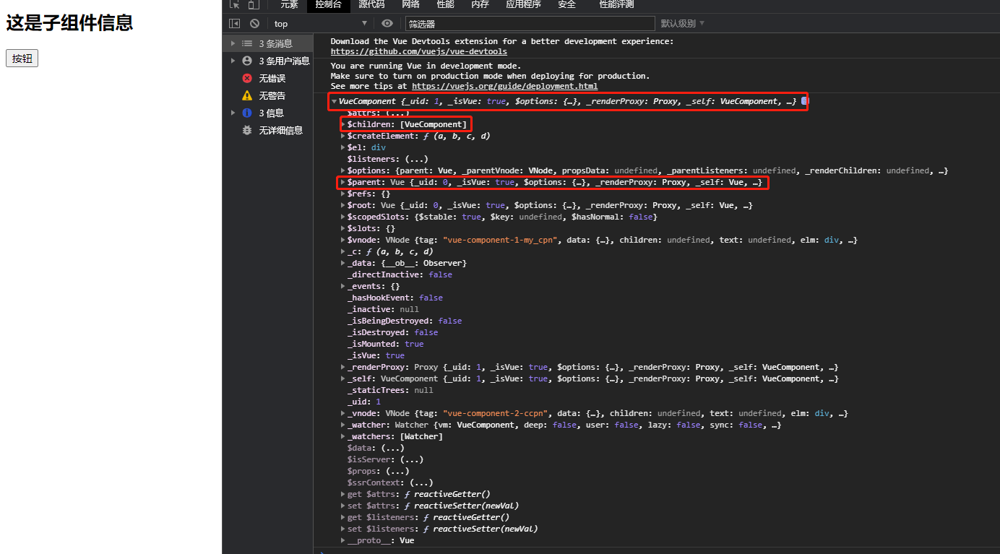
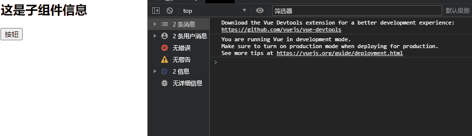

## **父子组件的访问方式：** **$parent**

- 如果我们想在**子组件中直接访问父组件**，可以通过`$parent`
- 注意事项：
  - 尽管在Vue开发中，我们**允许通过\$parent来访问父组件，但是在真实开发中尽量不要这样做**
  - 子组件应该尽量避免直接访问父组件的数据，因为这样**耦合度**太高了
  - 如果我们将子组件放在另外一个组件之内，很可能该父组件没有对应的属性，往往会引起问题
  - 另外，更不好做的是通过$parent直接修改父组件的状态，那么父组件中的状态将变得飘忽不定，很不利于我的调试和维护

#### parent

```html
<!DOCTYPE html>
<html lang="en">
<head>
  <meta charset="UTF-8">
  <title>Title</title>
</head>
<body>

<div id="app">
  <my_cpn></my_cpn>
</div>


<template id="cpn">
  <ccpn></ccpn>
</template>

<template id="ccpn">
  <div>
    <h2>这是子组件信息</h2>
    <button @click="btnClick">按钮</button>
  </div>
</template>

<script src="../vue.js"></script>

<script>

  const app = new Vue({
    el:"#app",
    data:{
      message:"hello world"
    },
    components:{
      my_cpn:{
        template:"#cpn",
        data(){
          return {
            name:'waws'
          }
        }
        components: {
          ccpn: {
            template: "#ccpn",
            methods: {
              btnClick() {
                console.log(this.$parent)
                console.log(this.$parent.name)
              }
            }
          }
        }
      }
    },
  })
</script>
</body>
</html>
```

效果如图所示



#### root

```html
<!DOCTYPE html>
<html lang="en">
<head>
  <meta charset="UTF-8">
  <title>Title</title>
</head>
<body>

<div id="app">
  <my_cpn></my_cpn>
</div>


<template id="cpn">
  <ccpn></ccpn>
</template>

<template id="ccpn">
  <div>
    <h2>这是子组件信息</h2>
    <button @click="btnClick">按钮</button>
  </div>
</template>

<script src="../vue.js"></script>

<script>

  const app = new Vue({
    el:"#app",
    data:{
      message:"hello world"
    },
    components:{
      my_cpn:{
        template:"#cpn",
        data(){
          return {
            name:"waws",
          }
        },
        components: {
          ccpn: {
            template: "#ccpn",
            methods: {
              btnClick() {
                console.log(this.$root)
                console.log(this.$root.message)
              }
            }
          }
        }
      }
    },
  })
</script>
</body>
</html>
```

效果展示：

