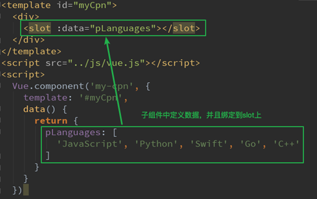
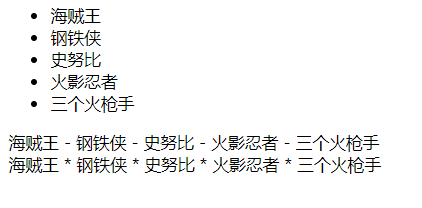

## 作用域插槽

- 作用域插槽是slot一个比较难理解的点，而且官方文档说的又有点不清晰
- 这里，我们用一句话对其做一个总结，然后我们在后续的案例中来体会：
  - **父组件替换插槽的标签，但是内容由子组件来提供**
- 我们先提一个需求：
  - 子组件中包括一组数据，比如：movies: ['海贼王', '钢铁侠', '史努比', '火影忍者', '三个火枪手']
  - 需要在多个界面进行展示：
    - 某些界面是以水平方向一一展示的
    - 某些界面是以列表形式展示的
    - 某些界面直接展示一个数组
  - 内容在子组件，希望父组件告诉我们如何展示，怎么办呢？
    - 利用slot作用域插槽就可以了
- 我们来看看子组件的定义：



#### 使用

- 在父组件使用我们的子组件时，从子组件中拿到数据：
  - 我们通过<template slot-scope="slotProps">获取到slotProps对象
    - 就是子组件模板中的slot对象
  - 在通过slotProps.data就可以获取到刚才我们传入的data了

```html
<!DOCTYPE html>
<html lang="en">
<head>
    <meta charset="UTF-8">
    <title>Title</title>
</head>
<body>

<div id="app">
    <cpn></cpn>

    <cpn>
        <!--目的是获取子组件中的movies-->
        <template slot-scope="slot">
<!--            <span v-for="item in slot.data"> - {{item}}</span>-->
            <span>{{slot.data.join(' - ')}}</span>
        </template>
    </cpn>

    <cpn>
        <!--目的是获取子组件中的movies-->
        <template slot-scope="slot">
            <!--<span v-for="item in slot.data">{{item}} * </span>-->
            <span>{{slot.data.join(' * ')}}</span>
        </template>
    </cpn>
    <!--<cpn></cpn>-->
</div>

<template id="cpn">
    <div>
        <slot :data="movies">
            <ul>
                <li v-for="item in movies">{{item}}</li>
            </ul>
        </slot>
    </div>
</template>
<script src="../vue.js"></script>
<script>
    const app = new Vue({
        el: '#app',
        data: {
            message: '你好啊'
        },
        components: {
            cpn: {
                template: '#cpn',
                data() {
                    return {
                        movies: ['海贼王', '钢铁侠', '史努比', '火影忍者', '三个火枪手']
                    }
                }
            }
        }
    })
</script>


</body>
</html>
```

效果如图所示



