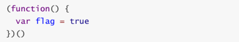
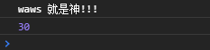
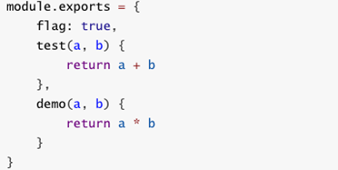
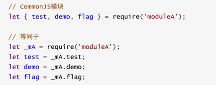

## 模块化开发

### JavaScript原始功能

- 在网页开发的早期，js制作作为一种脚本语言，做一些简单的表单验证或动画实现等，那个时候代码还是很少的
  - 那个时候的代码是怎么写的呢？直接将代码写在<script>标签中即可
- 随着ajax异步请求的出现，慢慢形成了前后端的分离
  - 客户端需要完成的事情越来越多，代码量也是与日俱增
  - 为了应对代码量的剧增，我们通常会将代码组织在多个js文件中，进行维护
  - 但是这种维护方式，依然不能避免一些**灾难**性的问题
- 比如全局变量同名问题：
- 另外，**这种代码的编写方式对js文件的`依赖顺序`几乎是强制性的**
  - 但是当js文件过多，比如有几十个的时候，弄清楚它们的顺序是一件比较同时的事情
  - 而且即使你弄清楚顺序了，也不能避免上面出现的这种尴尬问题的发生

模块化解决的两个问题：

- 同名变量的使用问题
- 代码的复用问题

### 匿名函数的解决方案

- 我们可以使用匿名函数来解决方面的重名问题
  - 在aaa.js文件中，我们使用匿名函数

  

- 但是如果我们希望在main.js文件中，用到flag，应该如何处理呢？
  
  - 显然，另外一个文件中不容易使用，因为flag是一个局部变量


### 使用模块作为出口

- 我们可以使用将需要暴露到外面的变量，使用一个模块作为出口，什么意思呢？
- 来看下对应的代码：
- 我们做了什么事情呢？
  - 非常简单，**在匿名函数内部，定义一个对象**
  - **给对象添加各种需要暴露到外面的属性和方法**(不需要暴露的直接定义即可)
  - **最后将这个对象返回，并且在外面使用了一个MoudleA接受**
- 接下来，我们在man.js中怎么使用呢？
  - 我们只需要使用属于自己模块的属性和方法即可
- 这就是模块最基础的封装，事实上模块的封装还有很多高级的话题：
  - 但是我们这里就是要认识一下为什么需要模块，以及模块的原始雏形
  - 幸运的是，前端模块化开发已经有了很多既有的规范，以及对应的实现方案
- 常见的模块化规范：
  - `CommonJS`、`AMD`、`CMD`，也有ES6的`Modules`

#### 实例代码

在bbb.js中通过匿名函数 + 抛出对象的方式，在其他的地方使用

 ```javascript
var moduleB = (function (){

    var obj = {}
    var name = "waws"
    var flag = true

    function sum(num1,num2){
        return num1 + num2
    }

    obj.name = name
    obj.flag = flag
    obj.sum = sum

    return obj
})()
 ```

在·`aaa.js`中我们使用在`bbb`模块中创建的`moduleB`对象，进行逻辑

```javascript
;(function (){
    if (moduleB.flag){
        console.log("waws 就是神!!!")
    }

    console.log(moduleB.sum(10,20))
})()
```

index.html中进行引入

```html
<!DOCTYPE html>
<html lang="en">
<head>
    <meta charset="UTF-8">
    <title>Title</title>
    <script src="bbb.js"></script>
    <script src="aaa.js"></script>
</head>
<body>

</body>
</html>
```

效果展示



### CommonJS

- 模块化有两个核心：导出和导入

- CommonJS的导出：

  

- CommonJS的导入

  

