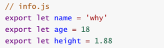
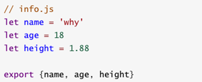
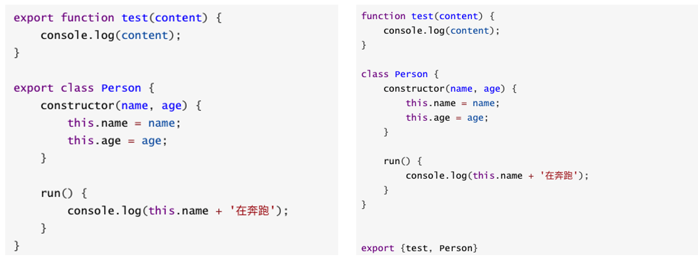
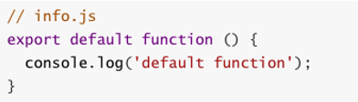
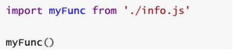
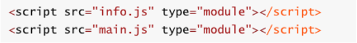
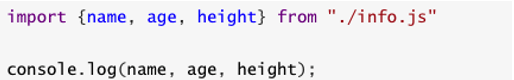
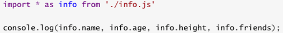

## 模块化开发ES6

### export基本使用

- **export**指令用于导出变量，比如下面的代码：

  

- 上面的代码还有另外一种写法:



### 实战代码

对aaa.js的代码进行模块化封装

```javascript
var name = 'waws'
var age = 18
var flag = true

function sum(num1, num2) {
  return num1 + num2
}

if (flag) {
  console.log(sum(20, 30));
}

// 1.导出方式一:导出就将变量和方法放到对象中即可
export {
  flag, sum
}

// 2.导出方式二:
export var num1 = 1000;
export var height = 1.88


// 3.导出函数/类
export function mul(num1, num2) {
  return num1 * num2
}

export class Person {
  run() {
    console.log('在奔跑');
  }
}

// 5.export default
// const address = '北京市'
// export {
//   address
// }
// export const address = '北京市'
// const address = '北京市'
//
// export default address

export default function (argument) {
  console.log(argument);
}
```

在bbb.js中进行导入aaa中的变量和方法

```javascript
// 1.导入的{}中定义的变量
import {flag, sum} from "./aaa.js";

if (flag) {
  console.log('小明是天才, 哈哈哈');
  console.log(sum(20, 30));
}

// 2.直接导入export定义的变量
import {num1, height} from "./aaa.js";

console.log(num1);
console.log(height);

// 3.导入 export的function/class
import {mul, Person} from "./aaa.js";

console.log(mul(30, 50));

const p = new Person();
p.run()

// 4.导入 export default中的内容
import addr from "./aaa.js";

addr('你好啊');

// 5.统一全部导入
// import {flag, num, num1, height, Person, mul, sum} from "./aaa.js";

import * as aaa from './aaa.js'

console.log(aaa.flag);
console.log(aaa.height);
```

在index.html中我们对导入的js文件，加上type="module"属性

```html
<!DOCTYPE html>
<html lang="en">
<head>
  <meta charset="UTF-8">
  <title>Title</title>
</head>
<body>

<script src="aaa.js" type="module"></script>
<script src="bbb.js" type="module"></script>
<script src="mmm.js" type="module"></script>
</body>
</html>
```

### 导出函数或类

- 上面我们主要是输出变量，也可以输出函数或者输出类
  - 上面的代码也可以写成这种形式：



### export default

- 某些情况下，一个模块中包含某个的功能，**我们并不希望给这个功能命名，而且让导入者可以自己来命名**

  - 这个时候就可以使用**`export default`**

  

- 我们来到main.js中，这样使用就可以了

  - 这里的myFunc是我自己命名的，你可以根据需要命名它对应的名字

  

- 另外，需要注意：

  - **export default在同一个模块中，不允许同时存在多个**

### import使用

- 我们使用**export指令**导出了模块对外提供的接口，下面我们就可以通过**import命令**来加载对应的这个模块了
- 首先，我们需要在HTML代码中引入两个js文件，并且**类型需要设置为module**



- import指令用于导入模块中的内容，比如main.js的代码



- 如果我们希望某个模块中所有的信息都导入，一个个导入显然有些麻烦：
  - 通过\*可以导入模块中所有的export变量
  - 但是通常情况下我们需要给\*起一个别名，方便后续的使用

