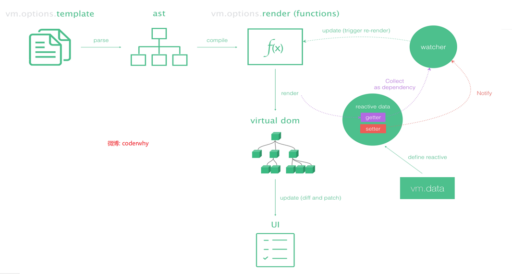
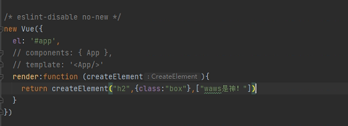
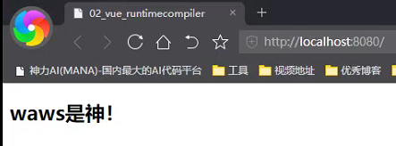
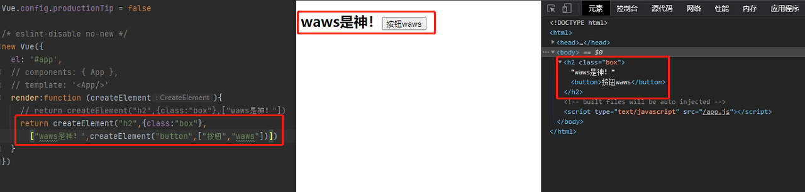
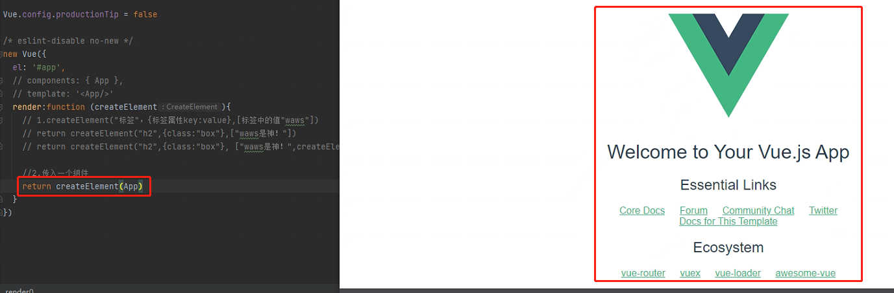
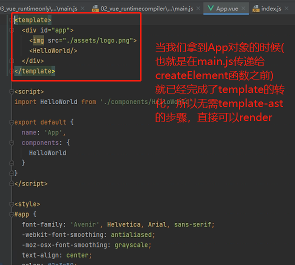
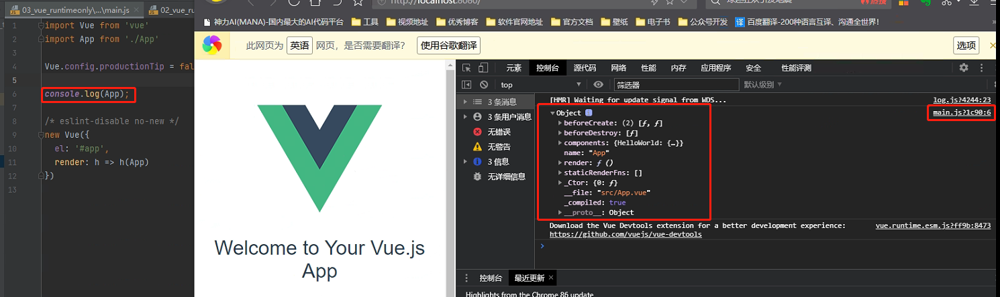
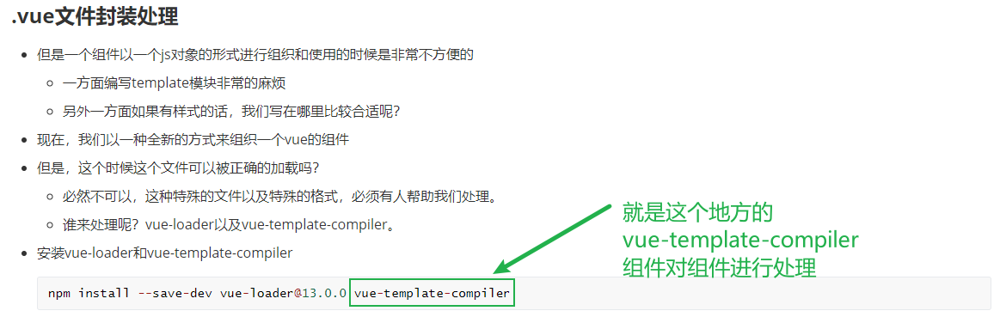
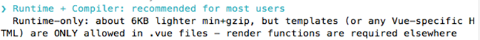
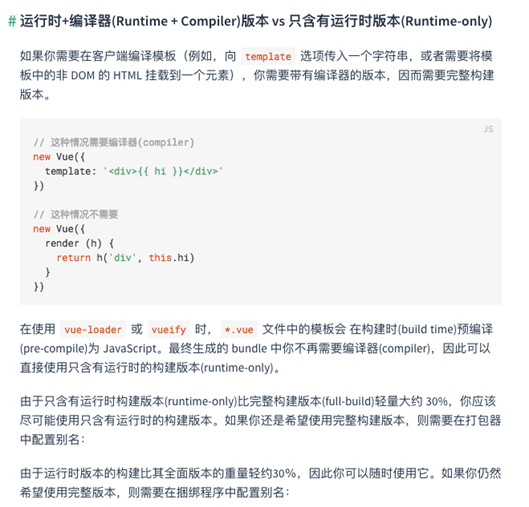

## runtime-compiler和runtimeonly

区别：

- main.js

  - runtime-compiler

    ```python
    // The Vue build version to load with the `import` command
    // (runtime-only or standalone) has been set in webpack.base.conf with an alias.
    import Vue from 'vue'
    import App from './App'
    
    Vue.config.productionTip = false
    
    /* eslint-disable no-new */
    new Vue({
      el: '#app',
      components: { App },
      template: '<App/>'
    })
    ```

  - runtimeonly

    ```python
    import Vue from 'vue'
    import App from './App'
    
    Vue.config.productionTip = false
    
    /* eslint-disable no-new */
    new Vue({
      el: '#app',
      render: h => h(App)
    })
    ```

- 从代码中我们可以看到一个使用的是`components + template` 的模式，另外的一个使用的是`render`的模式

### vue的运行过程



> - 自我理解：
>   - 首先我们得template会先在vm.options.template中进行放置
>   - 然后，这些文档会被解析成抽象语法树(ast:abstract syntax tree)
>   - 下一步，将上面的抽象语法树经过编译变成vm.options.render，实际上就是一个函数
>   - 在经过render的过程，变成我们的虚拟DOM
>   - 我们通过diff查找不同和patch打补丁的方式变成真实的DOM元素，更新UI的部分
> - 对比转换过程
>   - compiler的转换过程:
>     - template-->ast-->render-->virtual DOM--> UI
>   - only的转换过程(性能更高，代码更加简洁，小6kb(不用处理template-ast的部分))
>     - render-->virtual DOM --> UI

```python
render:function (createElement){
    # 1.createElement("标签"，{标签属性key:value},[标签中的值"waws"]) 对上面el:#app进行替换
    return createElement(App)
}
```

- 效果如图所示

  

  

```python
render:function (createElement){
    return createElement("h2",{class:"box"},
         ["waws是神！",createElement("button",["按钮","waws"])])
}
```



```python
render:function (createElement){
    # 2.传入一个组件
    return createElement(App)
}
```



在App传入到createElement函数之前，我们的App就已经被编译成了一个Object，可以直接完成渲染的过程





那么.vue文件中的template是由谁进行处理的那？

是由vue-template-compiler完成的

> 实际上，我们在开发的过程中我们安装了vue-template-compiler这个组件，这个组件会将我们的.vue中的template直接编译成一个包含render方法的对象，可以直接在VUE对象中进行渲染得到，所以在我们将项目打包的时候，我们的.vue文件都是经过编译的文件了，这样我们在prod环境只需要vue就能执行相关的代码，并不需要依赖vue-template-compiler。
>
> 
>
> 因为在开发时后才需要这个组件将template转化成render，当我们build之后，我们的文件中就不存在template了，都被render替换掉了，所以vue-template-compiler是开发时依赖



- 简单总结
  - 如果在之后的开发中，你依然使用template，就需要选择Runtime-Compiler
  - 如果你之后的开发中，使用的是.vue文件夹开发，那么可以选择Runtime-only

