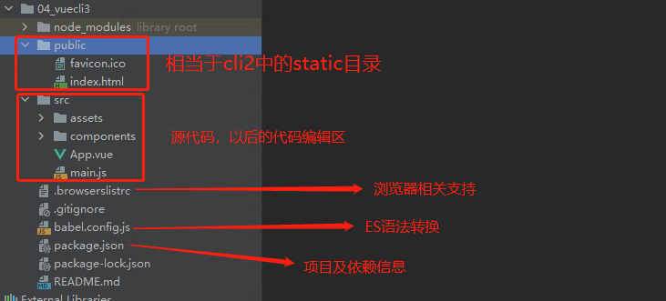

## 认识Vue CLI3

- vue-cli 3 与 2 版本有很大区别
  - vue-cli 3 是基于 webpack 4 打造，vue-cli 2 还是 webapck 3
  - vue-cli 3 的设计原则是“**0配置**”，**移除的配置文件根目录下的，build和config等目录**
  - vue-cli 3 提供了 `vue ui `命令，**提供了可视化配置，更加人性化**
  - **移除了static文件夹，新增了public文件夹，并且index.html移动到public中**


当我们第一次使用vue cli3构建项目的时候只有两个preset

- default
- Manually

当我们第二次使用vue cli3构建项目的时候，我们就会保留第一次创建出来的一个配置风格

- waws
- default
- Manually


当我们像删除自定义风格的配置文件的时候，我们找到.vuerc文件，删除里面的自定义配置即可


使用vue cli3创建的过程：使用空格进行选择


创建成功


CLI3的项目路径解读




运行vue cli3的命令 `npm run serve`


我们看src中main.js文件

```python
import Vue from 'vue'
import App from './App.vue'

# 在生产环境是不是要给一些提示信息
Vue.config.productionTip = false

# 使用$mount("#app") 对app的元素进行挂载
new Vue({
  render: h => h(App),
}).$mount('#app')
```

