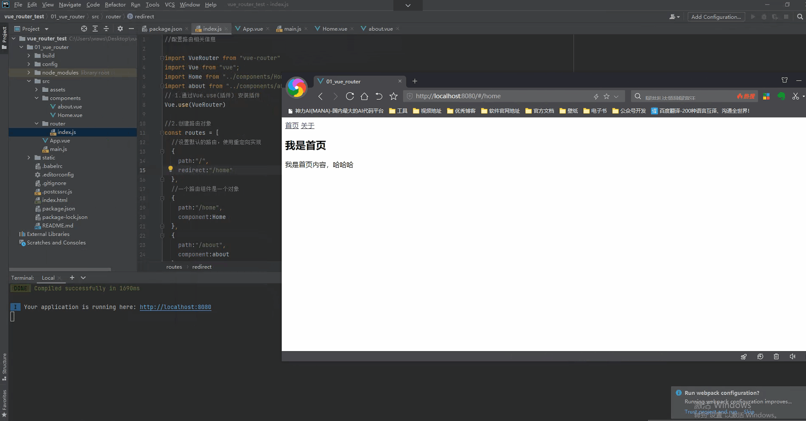
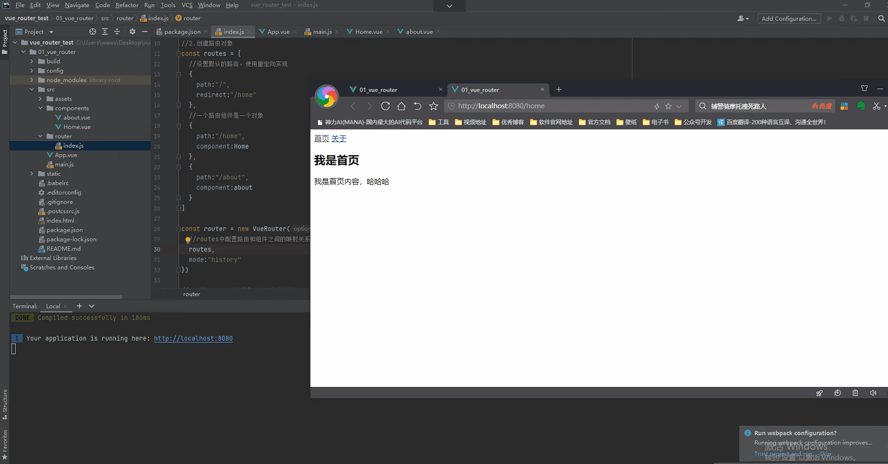
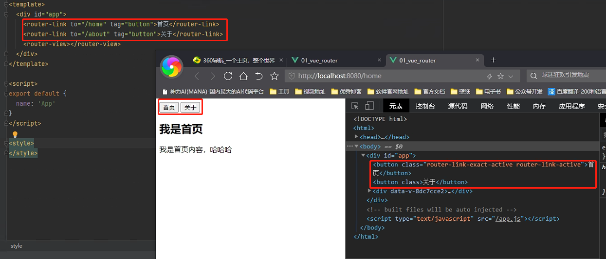
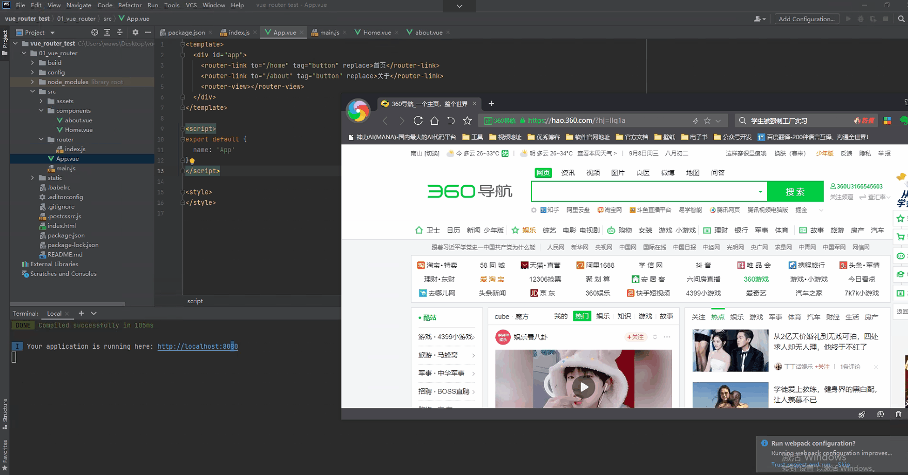
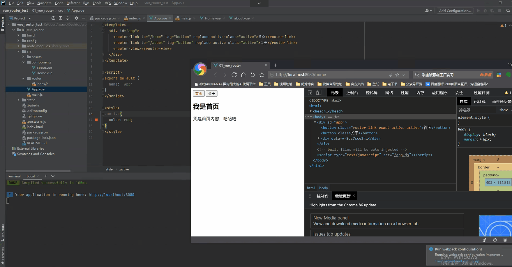
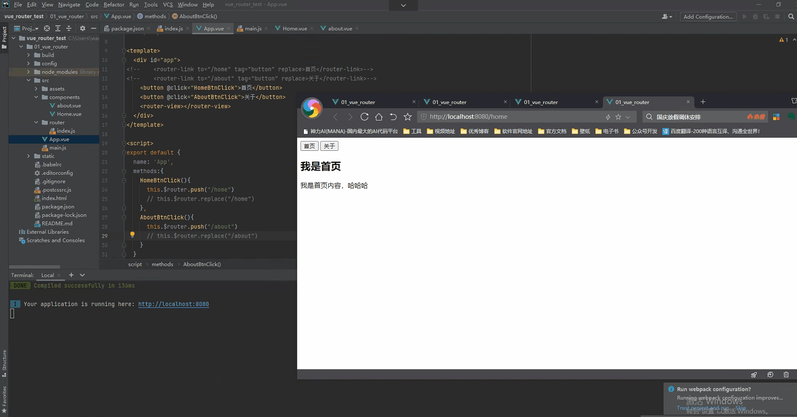
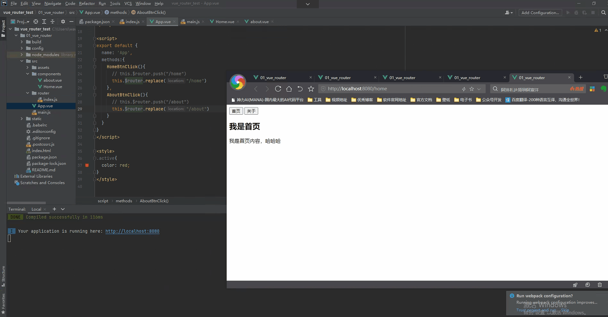

## 路由的简单使用(二)

### 路由的默认路径

- 我们这里还有一个不太好的实现:
  - 默认情况下, 进入网站的首页, 我们希望<router-view>渲染首页的内容
  - 但是我们的实现中, 默认没有显示首页组件, 必须让用户点击才可以
- 如何可以让路径默认跳到到首页, 并且<router-view>渲染首页组件呢?
  - 非常简单, 我们只需要配置**多配置一个映射**就可以了

- 配置解析:
  - 我们在routes中又配置了一个映射
  - path配置的是根路径: /
  - redirect是重定向, 也就是我们将**根路径重定向到/home的路径下**, 这样就可以得到我们想要的结果了

```python
const routes = [
  //设置默认的路由，使用重定向实现
  {
    path:"/",
    redirect:"/home"
  },
  //一个路由组件是一个对象
  {
    path:"/home",
    component:Home
  },
  {
    path:"/about",
    component:about
  }
]
```



### HTML5的History模式

- 我们前面说过改变路径的方式有两种:
  - URL的hash
  - **HTML5的history**
  - 默认情况下, 路径的改变使用的URL的hash.
- 如果希望使用HTML5的history模式, 非常简单, 进行如下配置即可:

```python
const router = new VueRouter({
  //routes中配置路由和组件之间的映射关系
  routes,
  mode:"history"
})
```



### router-link补充

- 在前面的<router-link>中, 我们只是使用了一个属性: to, 用于指定跳转的路径.

- <router-link>还有一些其他属性:

  - **tag**: tag可以指定<router-link>之后渲染成什么组件, 比如上面的代码会被渲染成一个<li>元素, 而不是<a>

    ```python
    <template>
      <div id="app">
        <router-link to="/home" tag="button">首页</router-link>
        <router-link to="/about" tag="button">关于</router-link>
        <router-view></router-view>
      </div>
    </template>
    ```

    

  - **replace**: replace不会留下history记录, 所以指定replace的情况下, 后退键返回不能返回到上一个页面中

    ```python
    <template>
      <div id="app">
        <router-link to="/home" tag="button" replace>首页</router-link>
        <router-link to="/about" tag="button" replace>关于</router-link>
        <router-view></router-view>
      </div>
    </template>
    ```

    

  - **active-class**: 当<router-link>对应的路由匹配成功时, 会自动给当前元素设置一个router-link-active的class, 设置active-class可以修改默认的名称.

    - 在进行高亮显示的导航菜单或者底部tabbar时, 会使用到该类.
    - 但是通常不会修改类的属性, 会直接使用默认的router-link-active即可. 

    ```python
    # 第一种方式在每一个router-link中都添加上active-class的属性
    <template>
      <div id="app">
        <router-link to="/home" tag="button" replace active-class="active">首页</router-link>
        <router-link to="/about" tag="button" replace active-class="active">关于</router-link>
        <router-view></router-view>
      </div>
    </template>
    
    <script>
    export default {
      name: 'App'
    }
    </script>
    
    <style>
    .active{
      color: red;
    }
    </style>
    ```

    

  ```python
  # 在router/index.js中进行修改
  const router = new VueRouter({
    //routes中配置路由和组件之间的映射关系
    routes,
    mode:"history",
    linkActiveClass:"active"
  })
  ```

### 修改linkActiveClass

- 该class具体的名称也可以通过router实例的属性进行修改

- **exact-active-class**
  - 类似于active-class, 只是在精准匹配下才会出现的class.
  - 后面看到嵌套路由时, 我们再看下这个属性.

### 路由代码跳转

- 有时候, 页面的跳转可能需要执行对应的JavaScript代码, 这个时候, 就可以使用第二种跳转方式了
  
- **安装vue-router后，我们的vue-router会给每个对象都添加一个$router的属性**
  
- 比如, 我们将代码修改如下: 

  ```python
  # 使用push的方式进行切换路由
  <template>
    <div id="app">
      <button @click="HomeBtnClick">首页</button>
      <button @click="AboutBtnClick">关于</button>
      <router-view></router-view>
    </div>
  </template>
  
  <script>
  export default {
    name: 'App',
    methods:{
      HomeBtnClick(){
        this.$router.push("/home")
      },
      AboutBtnClick(){
        this.$router.push("/about")
      }
    }
  }
  </script>
  
  <style>
  .active{
    color: red;
  }
  </style>
  ```

  

  ```python
  # 使用replace的方式进行切换路由
  <template>
    <div id="app">
      <button @click="HomeBtnClick">首页</button>
      <button @click="AboutBtnClick">关于</button>
      <router-view></router-view>
    </div>
  </template>
  
  <script>
  export default {
    name: 'App',
    methods:{
      HomeBtnClick(){
        this.$router.replace("/home")
      },
      AboutBtnClick(){
        this.$router.replace("/about")
      }
    }
  }
  </script>
  
  <style>
  .active{
    color: red;
  }
  </style>
  ```

  

  