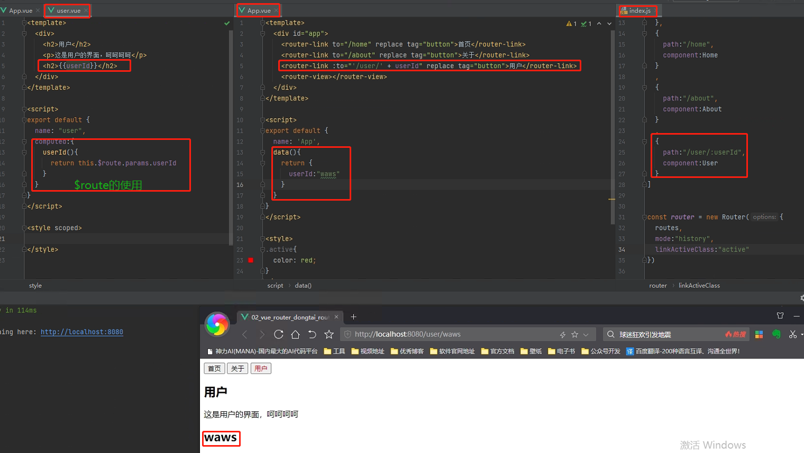

## 动态路由

- 在某些情况下，一个页面的path路径可能是不确定的，比如我们进入用户界面时，希望是如下的路径：
  - /user/aaaa或/user/bbbb
  - 除了有前面的/user之外，后面还跟上了用户的ID
  - 这种path和Component的匹配关系，我们称之为动态路由(也是路由传递数据的一种方式)。

> $route 当前那个路由处于活跃状态，获取到的就是哪个路由

```js
// user.vue
<template>
  <div>
    <h2>用户</h2>
    <p>这是用户的界面，呵呵呵呵</p>
    <h2>{{userId}}</h2>
  </div>
</template>

<script>
export default {
  name: "user",
  computed:{
    userId(){
      // 在这个地方中我们从路由中获取参数
      return this.$route.params.userId
    }
  }
}
</script>

<style scoped>
</style>
```

```js
// App.vue
<template>
  <div id="app">
    <router-link to="/home" replace tag="button">首页</router-link>
    <router-link to="/about" replace tag="button">关于</router-link>
    <router-link :to="'/user/' + userId" replace tag="button">用户</router-link>
    <router-view></router-view>
  </div>
</template>

<script>
export default {
  name: 'App',
  data(){
    return {
      userId:"waws"
    }
  }
}
</script>

<style>
.active{
  color: red;
}
</style>
```

```js
import Vue from 'vue'
import Router from 'vue-router'
import Home from "../components/home";
import About from "../components/about";
import User from "../components/user";

Vue.use(Router)

const routes = [
  {
    path:"/",
    redirect:"/home"
  },
  {
    path:"/home",
    component:Home
  }
  ,
  {
    path:"/about",
    component:About
  }
  ,
  //注意这个地方的动态路由
  {
    path:"/user/:userId",
    component:User
  }
]


const router = new Router({
  routes,
  mode:"history",
  linkActiveClass:"active"
})

export default router
```




