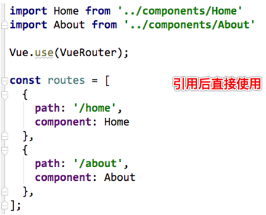

## 认识路由的懒加载

- 官方给出了解释:

  - 当打包构建应用时，Javascript 包会变得非常大，影响页面加载
  - 如果我们能**把不同路由对应的组件分割成不同的代码块，然后当路由被访问的时候才加载对应组件**，这样就更加高效了

- 官方在说什么呢?

  - 首先, 我们知道路由中通常会定义很多不同的页面
  - 这个页面最后被打包在哪里呢? 一般情况下, 是放在一个js文件中
  - 但是, 页面这么多放在一个js文件中, 必然会造成这个页面非常的大
  - 如果我们一次性从服务器请求下来这个页面, 可能需要花费一定的时间, 甚至用户的电脑上还出现了短暂空白的情况
  - 如何避免这种情况呢? 使用**路由懒加载**就可以了

- 路由懒加载做了什么?

  - **路由懒加载的主要作用就是将路由对应的组件打包成一个个的js代码块**
  - **只有在这个路由被访问到的时候, 才加载对应的组件**

- 打包完成后代码的格式

  

  

> - 自我理解：
>   - 之前我们使用webpack进行打包的时候，最终会生成一个commen.js文件，其实是将我们的业务代码直接作为参数传递给打包的底层支撑函数，然后就解决了各个文件之间相互依赖的问题，将整个的代码封装到了一个文件中
>   - 在js分块中同样需要打包的底层支撑，我们将业务代码和第三方文件进行分离，但是不同的文件之间依旧需要依赖关系，底层支撑恰好是做了这个事情，解决各调用文件之间的依赖关系
> - 一个路由打包成一个js文件，也就是处理一次请求的所有js代码，其他和本次处理代码无关的js都不用请求，节省资源，同时效率比较高

### 路由懒加载的效果

> 实现中暂时出了问题，暂放




### 懒加载的方式

- 方式一: 结合Vue的异步组件和Webpack的代码分析.

```python
const Home = resolve => { require.ensure(['../components/Home.vue'], () => { resolve(require('../components/Home.vue')) })};
```

- 方式二: AMD写法

```python
const About = resolve => require(['../components/About.vue'], resolve);
```

- 方式三: 在ES6中, 我们可以有更加简单的写法来组织Vue异步组件和Webpack的代码分割.

```python
const Home = () => import('../components/Home.vue')
```

