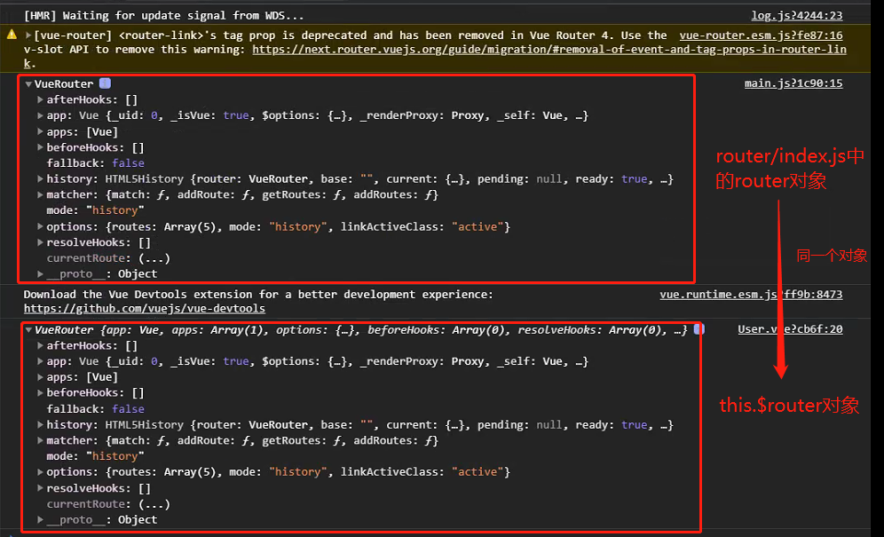
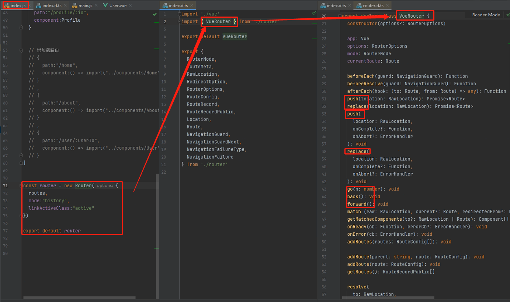
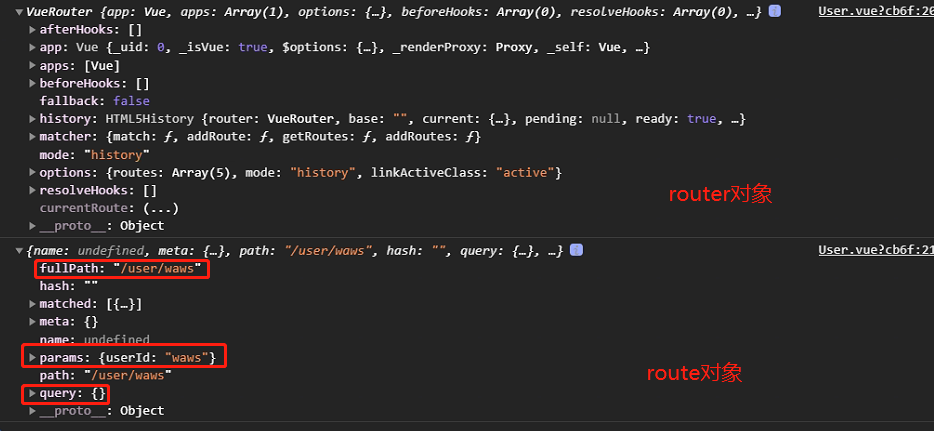
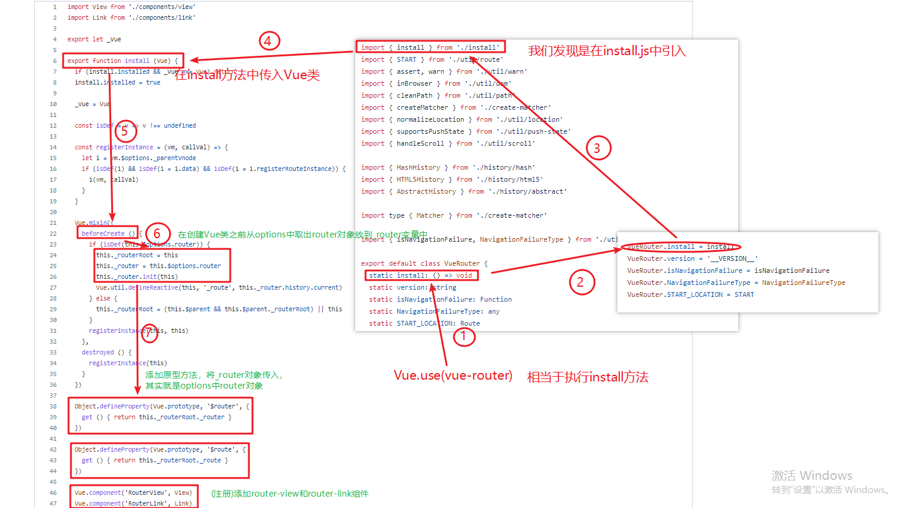

## \$route和\$router的区别

### $router对象

验证this.$router对象和router/index.js中导出的router对象是同一个对象

main.js

```js
import Vue from 'vue'
import App from './App'
import router from './router'

Vue.config.productionTip = false

/* eslint-disable no-new */
new Vue({
  el: '#app',
  router,
  render: h => h(App)
})

// 打印router/index.js中的router对象
console.log(router);
```

User.vue

```js
<template>
  <div>
    <h2>用户</h2>
    <p>这是用户的界面，呵呵呵呵</p>
    <h2>{{userId}}</h2>
    <button @click="btnClick">按钮</button>
  </div>
</template>

<script>
export default {
  name: "user",
  computed:{
    userId(){
      return this.$route.params.userId
    }
  },
  methods:{
    btnClick(){
      // 打印this.$router对象
      console.log(this.$router);
    }
  }
}
</script>

<style scoped>

</style>
```

效果展示



router对象追根溯源



### \$router对象和\$route对象的比较

- $router 是整体的路由对象
- $route  是当前活跃的路由对象

> 所有的组件都继承自vue类的原型



源代码剖析原理

