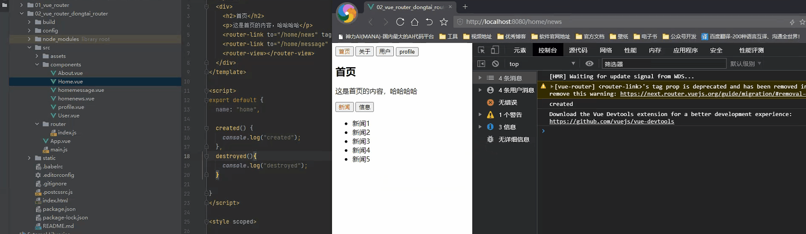
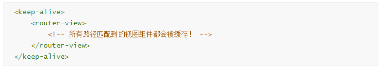
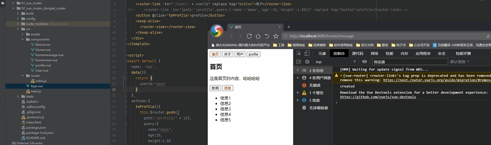
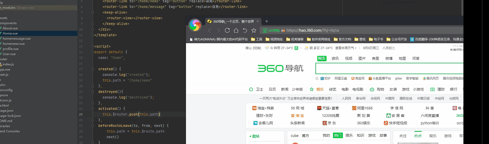
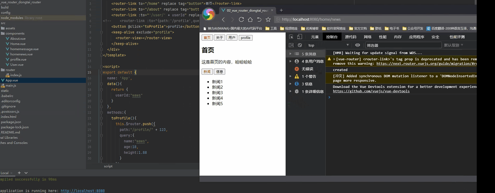

## keep-alive遇见vue-router

- keep-alive 是 Vue内置的一个组件，可以是被包含的组件保留状态，或避免重新渲染

之前我们在home下有两个子路由news和message，默认是news当我们点击了message后，我们在点击用户、我的、关于的时候，我们在切换回首页，我们发现这个还是直接使用了home下默认的news,并不能保留最后的message界面信息

原因如下：

- 我们每次从一个组件切换到另一个组件的时候我们发现，这个组件都是重新创建，在离开的时候，会销毁这个组件，可以使用created和destoryed函数进行验证

  ```js
  <template>
    <div>
      <h2>首页</h2>
      <p>这是首页的内容，哈哈哈哈</p>
      <router-link to="/home/news" tag="button" replace>新闻</router-link>
      <router-link to="/home/message" tag="button" replace>信息</router-link>
      <router-view></router-view>
    </div>
  </template>
  
  <script>
  export default {
    name: "home",
  
    created() {
      console.log("created");
    },
    destroyed(){
      console.log("destroyed");
    }
  
  }
  </script>
  
  <style scoped>
  
  </style>
  ```

- 效果展示

  

- **router-view 也是一个组件，如果直接被包在 keep-alive 里面，所有路径匹配到的视图组件都会被缓存**：

  

- 通过create声明周期函数来验证

  

### 保证切换之后再回到页面保留离开前的信息

```js
created() {
    console.log("created");
    this.path = "/home/news"
},
destroyed(){
    console.log("destroyed");
},
activated() {
    this.$router.push(this.path)
},
beforeRouteLeave(to, from, next) {
    this.path = this.$route.path
    next()
}
```

> - 基本的思路
>   - 我们再创建的时候，添加一个默认的变量，一是为了嵌套路由下的默认路由的跳转，二是为了保留跳转前的路径信息，真正起作用的是activated函数再页面路由处于激活状态的时候，我们对切换的路由进行push方法的加载，我们再使用组件内的守卫，再路由离开前，将现有的路由保存下来，当我们再次激活这个页面的时候，将保留的路径直接放入进行跳转，就可以保留嵌套路由的跳转前的信息



>  activated和deactivated函数起作用的主要原因是存在keep-alive（不做演示了，记住）

### keep-alive的属性

**keep-alive 是 Vue 内置的一个组件，可以使被包含的组件保留状态，或避免重新渲染**

- 它们有两个非常重要的属性:
  - include - 字符串或正则表达，只有匹配的组件会被缓存
  - exclude - 字符串或正则表达式，任何匹配的组件都不会被缓存

```js
<keep-alive exclude="profile">
	<router-view></router-view>
</keep-alive>

# 多个
<keep-alive exclude="profile，user">  //不能多余空格
	<router-view></router-view>
</keep-alive>
```

- 效果展示如图

  