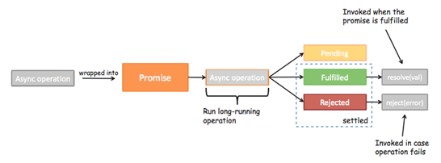
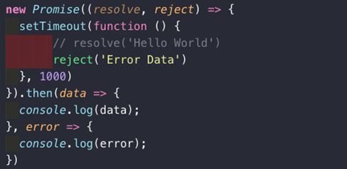
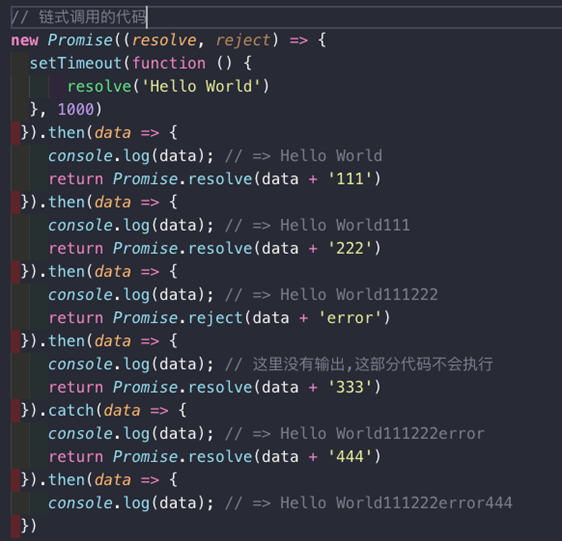
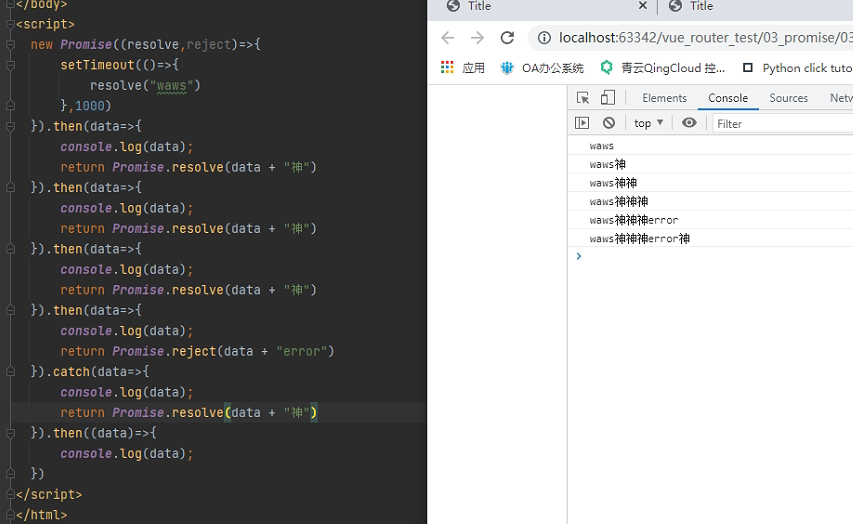
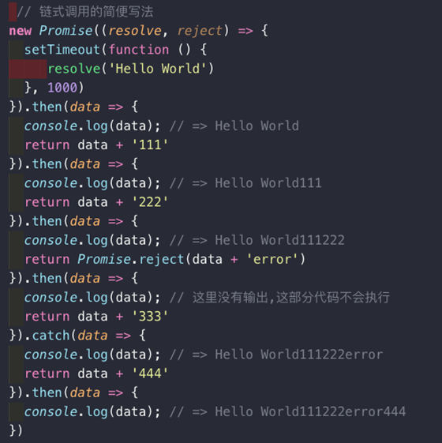
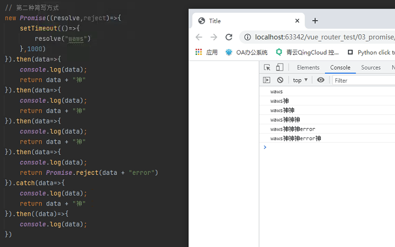
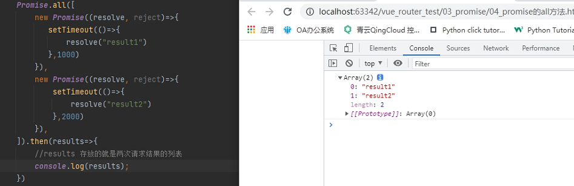

## promise(二)

### Promise三种状态

- 首先, 当我们开发中有异步操作时, 就可以给异步操作包装一个Promise
  
- 异步操作之后会有三种状态
  
- 我们一起来看一下这三种状态:
  - **pending**：**等待状态**，比如正在进行网络请求，或者定时器没有到时间。
  - **fulfill**：**满足状态**，当我们主动回调了`resolve`时，就处于该状态，并且会回调`.then()`
  - **reject**：**拒绝状态**，当我们主动回调了`reject`时，就处于该状态，并且会回调`.catch()`

  

  

  ```python
  # 我们可以再then函数中传递两个函数，一个表示成功，一个表示失败
  new Promise((resolve,reject)=>{
      setTimeout(()=>{
          resolve("hello waws")
          //reject("err message")
      })
  }).then(data=>{
      console.log(data);
  },err => {
      console.log(err);
  })
  ```

### Promise链式调用

- 我们在看Promise的流程图时，发现无论是then还是catch都可以返回一个Promise对象。
- 所以，我们的代码其实是可以进行链式调用的：
- 这里我们直接通过Promise包装了一下新的数据，将Promise对象返回了
  - **Promise.resovle()：将数据包装成Promise对象，并且在内部回调resolve()函数**
  - **Promise.reject()：将数据包装成Promise对象，并且在内部回调reject()函数**

  

```js
<script>
  new Promise((resolve,reject)=>{
      setTimeout(()=>{
          resolve("waws")
      },1000)
  }).then(data=>{
      console.log(data);
      return Promise.resolve(data + "神")
  }).then(data=>{
      console.log(data);
      return Promise.resolve(data + "神")
  }).then(data=>{
      console.log(data);
      return Promise.resolve(data + "神")
  }).then(data=>{
      console.log(data);
      return Promise.reject(data + "error")
  }).catch(data=>{
      console.log(data);
      return Promise.resolve(data + "神")
  }).then((data)=>{
      console.log(data);
  })
</script>
```



### 链式调用简写

- 简化版代码：
  - 如果我们希望数据直接包装成Promise.resolve，那么在then中可以直接返回数据
  - 注意下面的代码中，我讲**return Promise.resovle(data)改成了return data**
  - 结果依然是一样的



```js
// 第二种简写方式
new Promise((resolve,reject)=>{
    setTimeout(()=>{
        resolve("waws")
    },1000)
}).then(data=>{
    console.log(data);
    return data + "神"
}).then(data=>{
    console.log(data);
    return data + "神"
}).then(data=>{
    console.log(data);
    return data + "神"
}).then(data=>{
    console.log(data);
    return Promise.reject(data + "error")
}).catch(data=>{
    console.log(data);
    return data + "神"
}).then((data)=>{
    console.log(data);
})
```



### promise的all方法

> 需求：我们的成功执行代码部分是需要两个或多个异步需求都成功返回才执行

```js
<script>
    Promise.all([
        new Promise((resolve, reject)=>{
            $.ajax({
                url:"url1",
                success:function (){
                    resolve(data)
                }
            })
        }),
        new Promise((resolve, reject)=>{
            $.ajax({
                url:"url2",
                success:function (){
                    resolve(data)
                }
            })
        }),
    ]).then(results=>{
        //results 存放的就是两次请求结果的列表
        results[0]
        results[1]
    })
</script>
```

