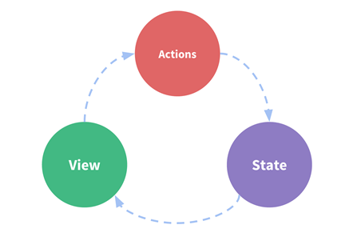
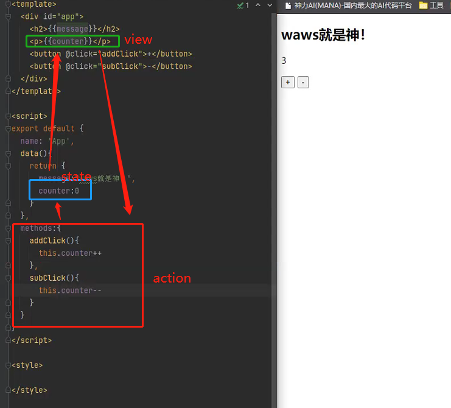

## 单界面的状态管理

- 我们知道，要在单个组件中进行状态管理是一件非常简单的事情

  - 什么意思呢？我们来看下面的图片

    

- 这图片中的三种东西，怎么理解呢？

  - **State**：不用多说，就是我们的状态。（你姑且可以当做就是data中的属性）
  - **View**：视图层，可以针对State的变化，显示不同的信息。（这个好理解吧？）
  - **Actions**：这里的Actions主要是用户的各种操作：点击、输入等等，会导致状态的改变

- 写点代码，加深理解：

  ```python
  <template>
    <div id="app">
      <h2>{{message}}</h2>
      <p>{{counter}}</p>
      <button @click="addClick">+</button>
      <button @click="subClick">-</button>
    </div>
  </template>
  
  <script>
  export default {
    name: 'App',
    data(){
      return {
        message:"waws就是神！",
        counter:0
      }
    },
    methods:{
      addClick(){
        this.counter++
      },
      subClick(){
        this.counter--
      }
    }
  }
  /script>
  
  <style>
  
  </style>
  ```

- 看下右边的代码效果, 肯定会实现吧?

  

### 单界面状态管理的实现

- 在这个案例中，我们有木有状态需要管理呢？没错，就是个数counter
  - counter需要某种方式被记录下来，也就是我们的State
  - counter目前的值需要被显示在界面中，也就是我们的View部分
  - 界面发生某些操作时（我们这里是用户的点击，也可以是用户的input），需要去更新状态，也就是我们的Actions