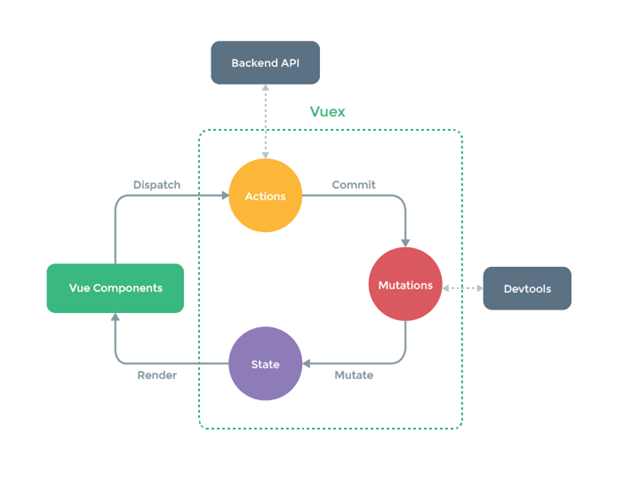
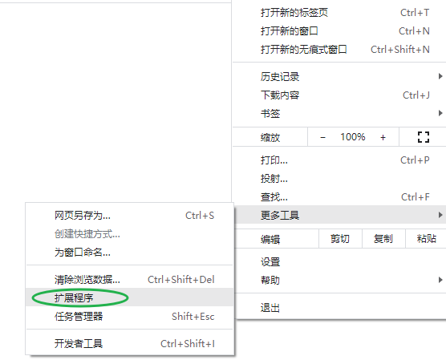
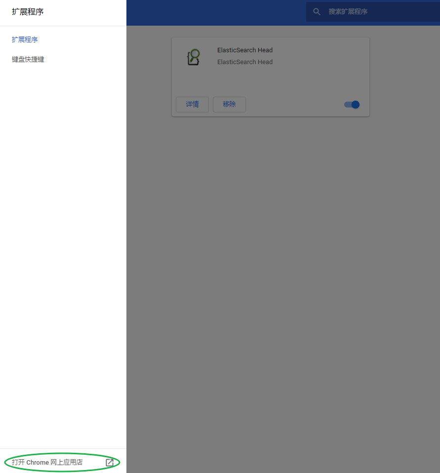
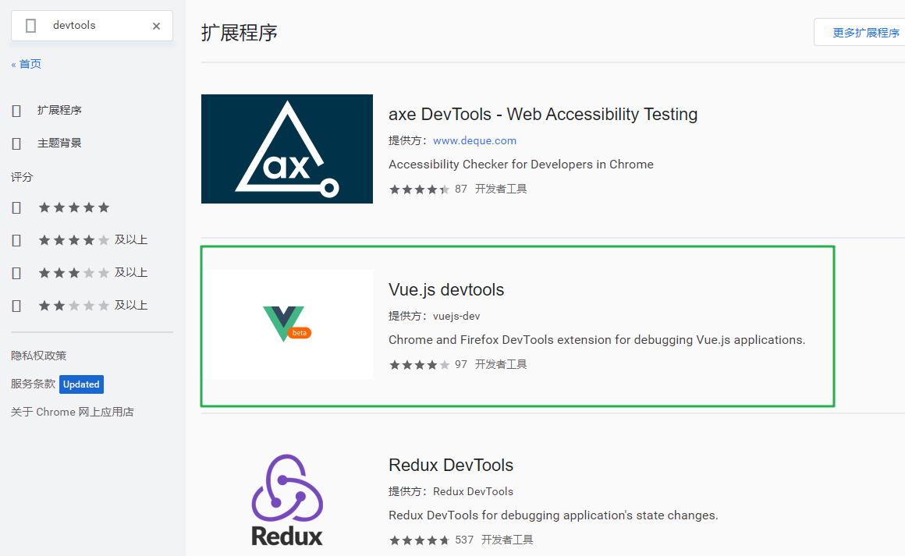
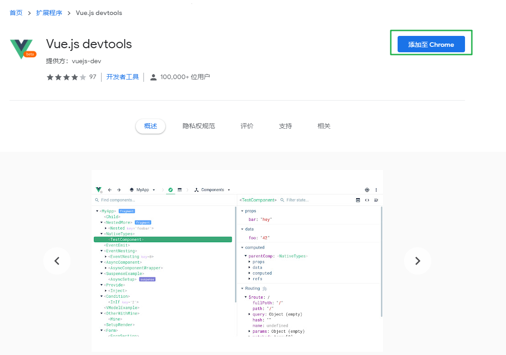
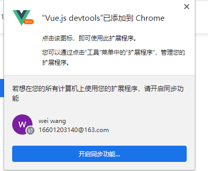
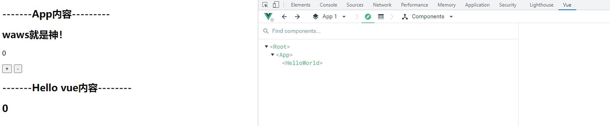
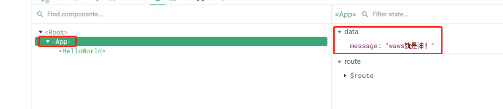
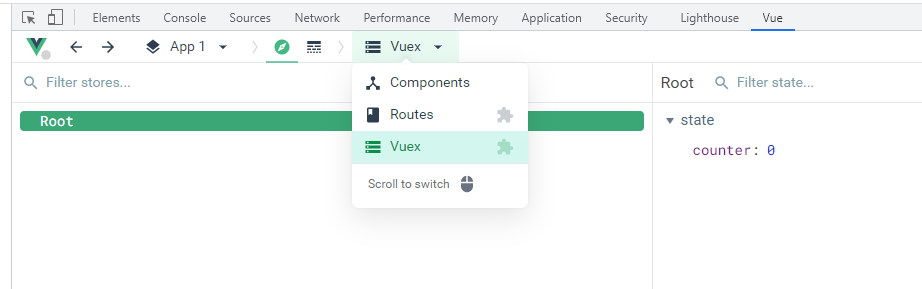
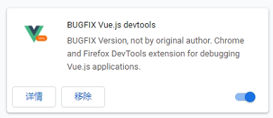

## 多界面状态管理

- Vue已经帮我们做好了单个界面的状态管理，但是如果是多个界面呢？
  - 多个试图都依赖同一个状态（一个状态改了，多个界面需要进行更新）
  - 不同界面的Actions都想修改同一个状态（Home.vue需要修改，Profile.vue也需要修改这个状态）
- 也就是说对于某些状态(状态1/状态2/状态3)来说只属于我们某一个试图，但是也有一些状态(状态a/状态b/状态c)属于多个试图共同想要维护的
  - **状态1/状态2/状态3**你放在自己的房间中，你自己管理自己用，没问题
  - 但是**状态a/状态b/状态c**我们希望交给一个大管家来统一帮助我们管理！！！
  - 没错，Vuex就是为我们提供这个大管家的工具
- 全局单例模式（大管家）
  - 我们现在要做的就是将共享的状态抽取出来，交给我们的大管家，统一进行管理
  - 之后，你们每个试图，按照我规定好的规定，进行访问和修改等操作
  - 这就是Vuex背后的基本思想

### Vuex状态管理图例

> - 自我的理解：
>   - **建议的做法**：我们的vue组件可以直接引用state的状态数据，但是我们并不能在组件中直接更改state的数据，我们需要组件进行dispatch(分发) 到不同的actions，actions会将行为提交到Mutations中(这个在我们的vue提供的devtools中可以记录修改的过程和状态)，然后通过Mutations对state中的数据进行修改Mutate，最后在将state中的数据渲染到我们的组件中，实现响应式
>   - `devtools`是vue开发的一个浏览器插件，可以记录修改的过程和状态
>   - actions的步骤可有可无，我们的组件可以直接对接到Mutations上，对state的数据进行修改，actions的实际的作用是当我们的代码中存在异步的操作的时候，我们最好不要将异步的代码放到Mutations中进行执行，异步操作一定放在actions中，我们也可以看到actions连接的部分是API，一般就是网络请求

### vue-devtools的安装

前面安装的工具有点问题，我们可以换用这个工具

