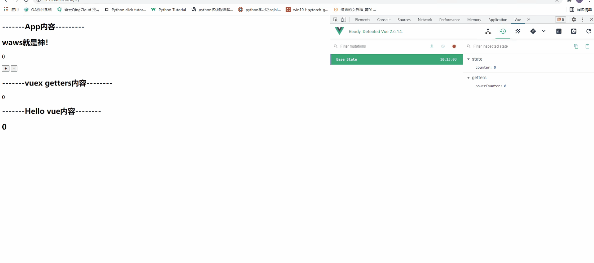
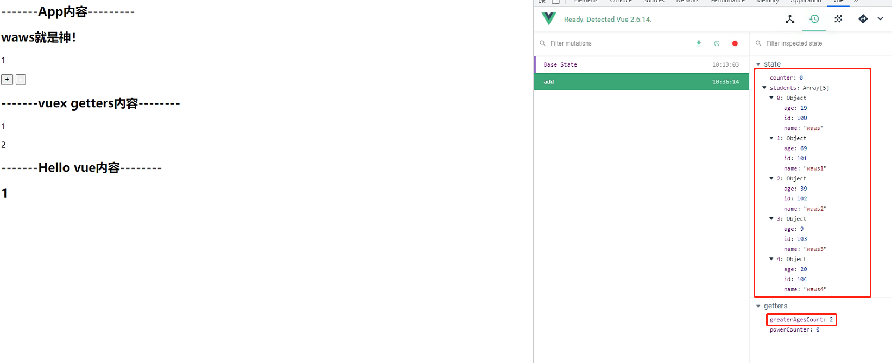
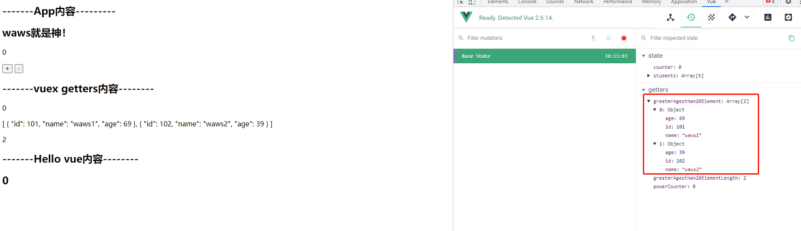
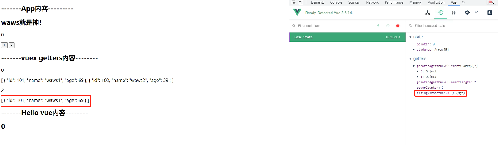

## Getters

### Getters基本使用

- 基本使用

  ```python
  //相当于计算属性
  getters:{
      powerCounter(state){
          return state.counter * state.counter
      }
  }
  ```

  在App.vue中引入数据

  ```python
  <h2>-------vuex getters内容--------</h2>
  <p>{{$store.getters.powerCounter}}</p>
  ```

  效果展示

  

- 有时候，我们需要从store中获取一些state变异后的状态，比如下面的Store中：

  ```python
  state:{
      counter:0,
      students:[
        {id:100,name:"waws",age:19},
        {id:101,name:"waws1",age:69},
        {id:102,name:"waws2",age:39},
        {id:103,name:"waws3",age:9},
        {id:104,name:"waws4",age:20}
      ]
    },
  ```

  - 我们可以在Store中定义getters:获取学生年龄大于20的个数

  ```python
  getters:{
      powerCounter(state){
          return state.counter * state.counter
      },
      greaterAgesCount:state=>{
          return state.students.filter(s=>s.age > 20).length
      }
  }
  ```

  

### Getters作为参数和传递参数

- 如果我们已经有了一个获取所有年龄大于20岁学生列表的getters, 那么代码可以这样来写

  ```python
  getters:{
      powerCounter(state){
          return state.counter * state.counter
      },
      greaterAgesthan20Element:state=>{
          return state.students.filter(s=>s.age > 20)
      },
      // 将getters作为参数向另一个getters函数中进行传递
      greaterAgesthan20ElementLength:(state,getters)=>{
          return getters.greaterAgesthan20Element.length
      }
  }
  ```

  App.vue

  ```python
  <h2>-------vuex getters内容--------</h2>
  <p>{{$store.getters.powerCounter}}</p>
  <p>{{$store.getters.greaterAgesthan20Element}}</p>
  <p>{{$store.getters.greaterAgesthan20ElementLength}}</p>
  ```

  

- getters默认是不能传递参数的, 如果**希望传递参数**, 那么**只能让getters本身返回另一个函数**

  - 自定义年龄，过滤年龄在age之上的学生

    ```python
    //传递参数其实就是返回一个函数
    zidingyimorethan20(state){
        return function (age){
            return state.students.filter(s => s.age > age)        
        }
    }
    ```

    App.vue

    ```python
    <p>{{$store.getters.zidingyimorethan20(40)}}</p>
    ```

    

