## Mutation(一)

### Mutation状态更新

- Vuex的store状态的更新唯一方式：提交Mutation

- Mutation主要包括两部分：

  - **字符串的事件类型**（type）

  - **一个回调函数**（handler）,该回调函数的第一个参数就是state

- mutation的定义方式：

  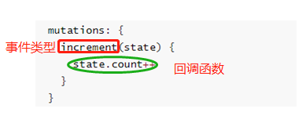

- 通过mutation更新

  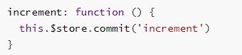

### Mutation传递参数

- 在通过mutation更新数据的时候, 有可能我们希望**携带一些额外的参数**

  - **参数被称为是mutation的载荷**(`Payload`)

- Mutation中的代码:

  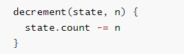

  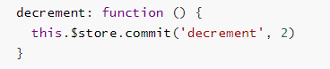

  ```python
  # mutations中传递参数
  mutations:{
      //方法
      add(state){
          state.counter++
      },
      sub(state){
          state.counter--
      },
      addnum(state,count){
          state.counter += count
      },
  }
  ```

  App.vue

  ```python
  <button @click="addnumClick(5)">+5</button>
  <button @click="addnumClick(10)">+10</button>
  
  # script
  methods:{
      addClick(){
          this.$store.commit("add")
      },
      subClick(){
          this.$store.commit("sub")
      },
      # 带参数的mutations的注册方法
      addnumClick(count){
          this.$store.commit("addnum",count)
      }
  }
  ```

  效果展示：

  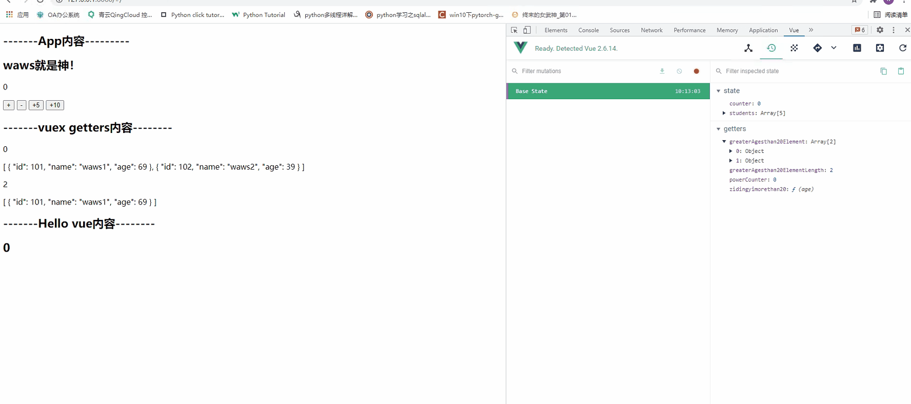

- 但是如果参数不是一个呢?

  - 比如我们有很多参数需要传递
  - 这个时候, 我们通常会以对象的形式传递, 也就是payload是一个对象
  - 这个时候可以再从对象中取出相关的信息

  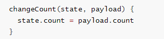

  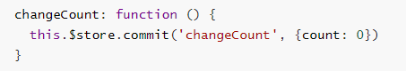
  
  ```python
  #store/index.js
  addnum(state,count){
      console.log(count);
      state.counter += count
  }
  
  
  # App.vue
  <button @click="addnumClickanostyle(20)">+20</button>
  
  addnumClickanostyle(count){
      this.$store.commit({
          type:"addnum",
          count:count
      })
  }
  ```
  
  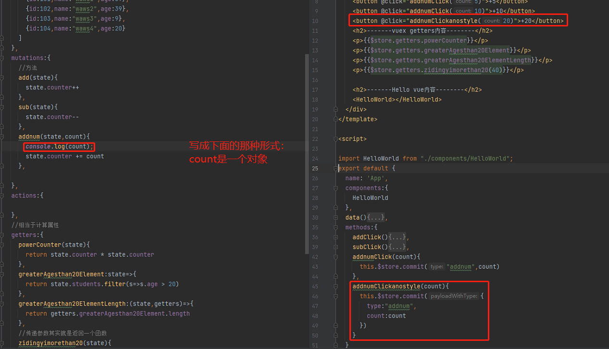
  
  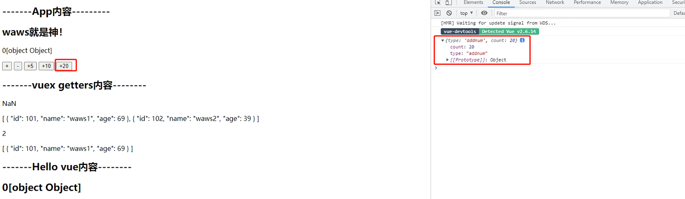

### Mutation提交风格

- 上面的通过commit进行提交是一种普通的方式

- Vue还提供了另外一种风格, 它是一个包含type属性的对象

  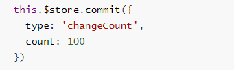

- Mutation中的处理方式是将整个commit的对象作为payload使用, 所以代码没有改变, 依然如下

  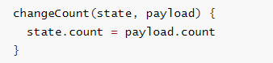