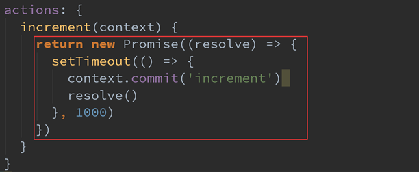
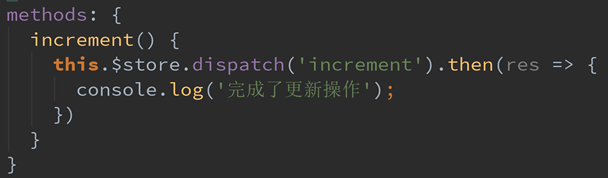

## Action

### Action的基本定义

- 我们强调, 不要再Mutation中进行异步操作
  - 但是某些情况, 我们确实希望在Vuex中进行一些异步操作, 比如网络请求, 必然是异步的. 这个时候怎么处理呢?
  - Action类似于Mutation, 但是是用来代替Mutation进行异步操作的
- Action的基本使用代码如下:
- context是什么?
  - **context是和store对象具有相同方法和属性的对象**
  - 也就是说, 我们可以通过context去进行commit相关的操作, 也可以获取context.state等
  - 但是注意, 这里它们并不是同一个对象, 为什么呢? 我们后面学习Modules的时候, 再具体说
- 这样的代码是否多此一举呢?
  - 我们定义了actions, 然后又在actions中去进行commit, 这不是脱裤放屁吗?
  - 事实上并不是这样, 如果在Vuex中有异步操作, 那么我们就可以在actions中完成了

### Action的分发

- 在Vue组件中, 如果我们调用action中的方法, 那么就需要使用dispatch

  ```python
  # App.vue
  <h2>-------响应式内容更新--------</h2>
  <p>{{$store.state.info}}</p>
  <button @click="updateInfo">修改信息</button>
  
  methods:{
      updateInfo(){
          this.$store.dispatch("aupdateInfo")
      }
  }
      
  # store
  actions:{
      aupdateInfo(context){
          setTimeout(()=>{
              context.commit("updateInfo")
          },1000)
      }
  }
  
  mutations:{
      updateInfo(state){
          // state.info["address"] = "双城"
          state.info.name = "waws520"
  	}
  }
  ```

- 同样的, 也是支持传递payload

### Action返回的Promise

- 前面我们学习ES6语法的时候说过, Promise经常用于异步操作.
  
  - 在Action中, 我们可以将异步操作放在一个Promise中, 并且在成功或者失败后, 调用对应的resolve或reject.
- OK, 我们来看下面的代码

  

  