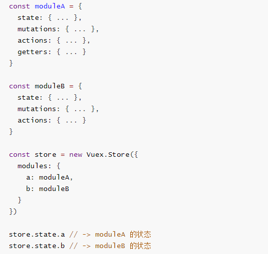
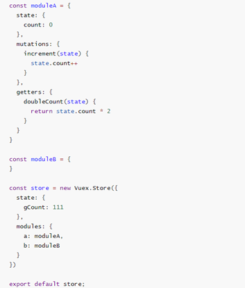
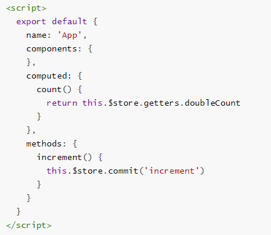
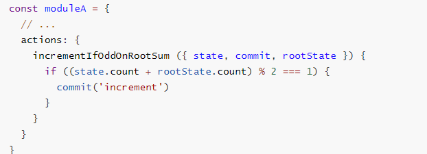
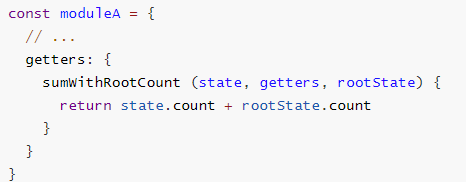

## Module

### 认识Module

- Module是模块的意思, 为什么在Vuex中我们要使用模块呢?
  - Vue使用单一状态树,那么也意味着很多状态都会交给Vuex来管理
  
  - 当应用变得非常复杂时,store对象就有可能变得相当臃肿.

  - 为了解决这个问题, **Vuex允许我们将store分割成模块(Module)**, **而每个模块拥有自己的state、mutations、actions、getters等**
  
    
  

### Module局部状态

- 上面的代码中, 我们已经有了整体的组织结构, 下面我们来看看具体的局部模块中的代码如何书写.
  - 我们在moduleA中添加state、mutations、getters
  
  ```python
    modules:{
        a:{
            state:{},
            mutations:{},
            actions:{},
            getters:{}
        },
        b:{
            state:{},
            mutations:{},
            actions:{},
            getters:{}
        },
        c:{
            state:{},
            mutations:{},
            actions:{},
            getters:{}
        },
    }
  ```
  
  - **mutation和getters接收的第一个参数是局部状态对象**
  
- 注意:
  - 虽然, 我们的doubleCount和increment都是定义在对象内部的
  
  - 但是在调用的时候, 依然是通过this.$store来直接调用的
  
    
  
    

### Actions的写法

- actions的写法呢? 接收一个context参数对象
  
- **局部状态通过 context.state 暴露出来**，**根节点状态则为 context.rootState**
  
    
  
- 如果getters中也需要使用全局的状态, 可以接受更多的参数

  

