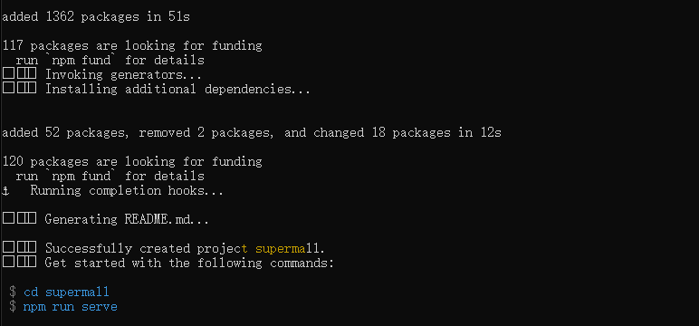

# 项目_01

## 前期准备

### 创建项目

>  这里直接使用`vue-cli3`的方式进行项目的创建

```
vue create supermall
```

直接使用Manually的方式进行创建(将lint的检查去掉)

> 保存preset预设，下次可以直接使用预设即可



创建成功，使用`npm run serve`查看创建结果

项目成功启动起来了


### Github上传代码

> 将我们的代码上传到github，进行版本控制

这个部分省略

注意下.gitignore下的写法，可以借鉴

```python
.DS_Store
node_modules
/dist

# Editor directories and files
.idea
.vscode
```

### 清理杂项

> 将创建好的项目中无用的代码和组件进行删除

1. App.vue

```js
<template>
  <div id="app">
  </div>
</template>

<script>

export default {
  name: 'App',
  components: {
  }
}
</script>

<style>
</style>
```

2. 将`HelloWorld.vue`组件直接删除
3. 将`assets`中的图片直接删除

## 项目构建

### 项目目录划分

> 主要是针对src中的目录进行规划


### css文件进行引用

1. 不同浏览器中的css设置略有差异，需要我们使用文件进行统一，这里使用[normalize.css](https://github.com/necolas/normalize.css)，直接下载下来放到`assets/css`中
2. 在`assets/css`创建一个`base.css`，其中存放的是我们的基础设置，例如字体，文字大小等

```js
@import "./normalize.css";

/*:root -> 获取根元素html,*/
/* css中定义变量的方式*/
:root {
  --color-text: #666;
  --color-high-text: #ff5777;
  --color-tint: #ff8198;
  --color-background: #fff;
  --font-size: 14px;
  --line-height: 1.5;
}

*,
*::before,
*::after {
  margin: 0;
  padding: 0;
  box-sizing: border-box;
}

body {
  font-family: "Helvetica Neue",Helvetica,"PingFang SC","Hiragino Sans GB","Microsoft YaHei","微软雅黑",Arial,sans-serif;
  user-select: none; /* 禁止用户鼠标在页面上选中文字/图片等 */
  -webkit-tap-highlight-color: transparent; /* webkit是苹果浏览器引擎，tap点击，highlight背景高亮，color颜色，颜色用数值调节 */
  background: var(--color-background);
  color: var(--color-text);
  /* rem vw/vh */
  width: 100vw;
}

a {
  color: var(--color-text);
  text-decoration: none;
}


.clear-fix::after {
  clear: both;
  content: '';
  display: block;
  width: 0;
  height: 0;
  visibility: hidden;
}

.clear-fix {
  zoom: 1;
}

.left {
  float: left;
}

.right {
  float: right;
}
```

> 对上面的文件进行说明：
>
> - --font-size：15px 
>   - css中定义变量的方式，在其他部分引用的话 font-size：var(--font-size)
>   - 下面有个地方有应用
>     - a {
>         color: var(--color-text);
>         text-decoration: none;
>       }
> - --color-text: #666;                  文本颜色
>     --color-high-text: #ff5777;  高亮时候的文本颜色
>     --color-tint: #ff8198;            背景颜色(导航等位置)
>     --color-background: #fff;    背景颜色
>     --font-size: 14px;                  文字大小
>     --line-height: 1.5;                 行高
> - 字体、鼠标移入变化
> - 清除浮动
> - 其他

3. 在App.vue中引用，让`base.css`生效

```js
<style>
 @import 'assets/css/base.css';
</style>
```

### 路径别名

在`cli2`创建的项目中，webpack的配置是暴漏出来的，所以我们直接去对应文件改即可

在`cli3`创建的项目中，配置都被隐藏起来了，所以我们不能修改源码中的配置，但是我们可以自己定义一个配置文件，在运行时候，会将我们的配置文件和系统配置merge到一起

修改vue.config.js文件

> 源码中已经存在了一个别名
>
> '@' : 'src'
>
> 

```js
module.exports = {
  configureWebpack: {
    resolve: {
      alias: {
        'assets': '@/assets',
        'common': '@/common',
        'components': '@/components',
        'network': '@/network',
        'views': '@/views',
      }
    }
  }
}
```

### 项目编码风格统一

新建`.editorconfig` 文件(cli3中不自动生成)

使用`.editorconfig`规范(**自定义**规范)

```js
root = true

[*]
charset = utf-8
indent_style = space
indent_size = 2
end_of_line = lf
insert_final_newline = true
trim_trailing_whitespace = true
```

