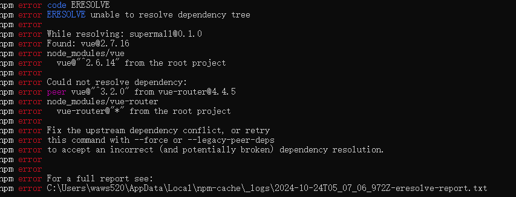
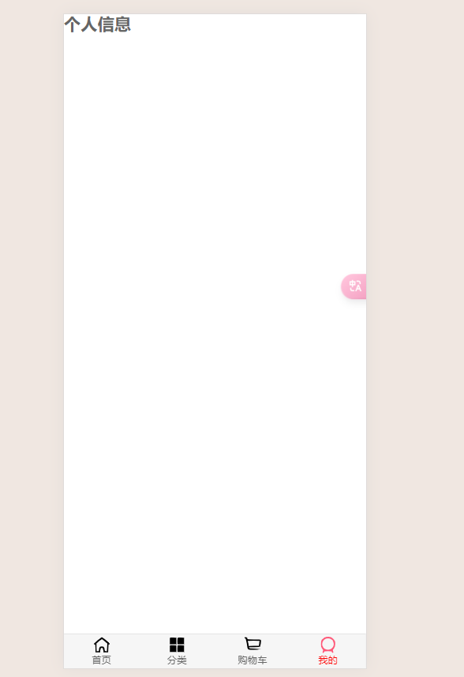
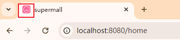
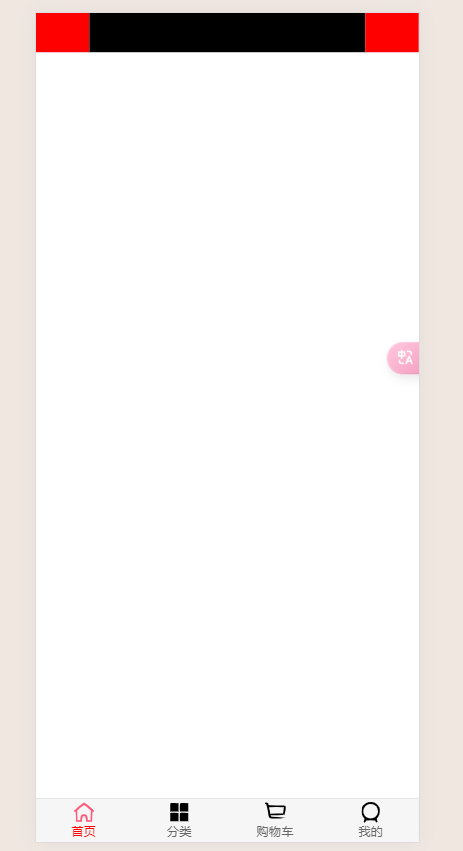
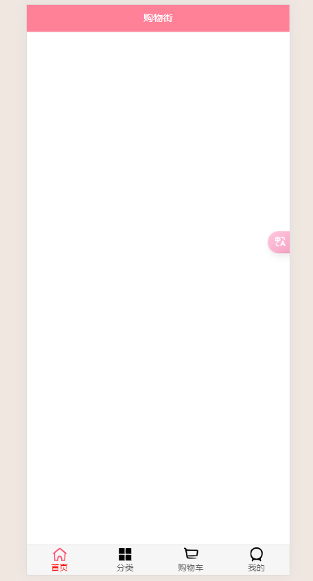

# 项目_02

### tabbar部分

#### 代码编写

详细讲解见前文

##### 复制代码

因为前文中手写过这个组件，所以这里直接复制，复制的步骤如下:

1. 将图片资源复制到assets/img
2. 将`tabbar`文件夹(包含两个组件)复制到components/common中
   - 和项目无关，直接放到common中，方便以后复用
3. 将`mainTabBar`文件夹(一个组件)复制到components/content中
   - 和项目相关，放入到content中
4. 修改原来的`mainTabBar.vue`中的资源(图片)路径为当前assets中的路径
5. 在`App.vue`中注册并使用`mainTabBar`组件
6. 在views下面新建home、category、cart、profile文件夹，将之前写过的home/category/cart/profile组件分别复制到views下面各自的文件夹中
7. [配置路由](#jump1)
8. 运行代码，测试是否成功

##### <a id='jump'>配置vue-router</a>

1. 安装vue-router

```js
// 错误
npm install vue-router --save
```

不能使用最新版本的`vue-router`，因为我们使用的是`vue2`，最新的`vue-router`需要`vue3`



```js
// 安装指定版本的vue-router
npm install vue-router@3.0.1 --save
```

2. 在router下面新建`index.js`文件，创建一个router对象

```js
import Vue from 'vue'
import VueRouter from 'vue-router'

const Home = () => import('../views/home/Home')
const Category = () => import('../views/category/Category')
const Cart = () => import('../views/cart/Cart')
const Profile = () => import('../views/profile/Profile')

// 1.安装插件
Vue.use(VueRouter)

// 2.创建router
const routes = [
  {
    path: '',
    redirect: '/home'
  },
  {
    path: '/home',
    component: Home
  },
  {
    path: '/category',
    component: Category
  },
  {
    path: '/cart',
    component: Cart
  },
  {
    path: '/profile',
    component: Profile
  },
]
const router = new VueRouter({
  routes,
  mode: 'history'
})

export default router
```

3. 在main.js中引入并注册

```js
import router from './router'

new Vue({
  render: h => h(App),
  router
}).$mount('#app')
```

4. 在`App.vue`中添加`router-view`标签

成功运行



### 小图标更新

将public中的`favicon.ico`图片进行替换即可

更新成功



### 导航组件

在components的common中新建一个`navbar`的文件夹，在其中新建一个文件`NavBar.vue`

代码如下:

```js
<template>
  <div class="nav-bar">
    <div class="left"><slot name="left"></slot></div>
    <div class="center"><slot name="center"></slot></div>
    <div class="right"><slot name="right"></slot></div>
  </div>
</template>

<script>
  export default {
    name: "NavBar"
  }
</script>

<style scoped>
  .nav-bar {
    display: flex;
    height: 44px;
    line-height: 44px;
  }

  // 这个左右中的布局可以学习一下
  .left, .right {
    width: 60px;
  }

  .center {
    flex: 1;
  }
</style>
```

在Home.vue组件中进行使用

```js
<template>
  <div id="home">
      // 使用
      <nav-bar></nav-bar>
  </div>
</template>

<script>
  // 导入
  import NavBar from 'components/common/navbar/NavBar'
  export default {
    name: "Home",
    components: {
      // 注册
      NavBar,
    },
  }
</script>
```

效果如图所示(为了展示效果，加上了背景颜色)



对插槽内填充数据

`Home.vue`

```js
<nav-bar class="home-nav"><div slot="center">购物街</div></nav-bar>
```

`NavBar.vue`

```js
// 添加样式
.nav-bar {
  display: flex;
  height: 44px;
  line-height: 44px;
  // 文本居中
  text-align: center;
  // 添加阴影
  box-shadow: 0 1px 1px rgba(100,100,100,.1);
}
```

在`home.vue`中设置背景颜色(因为每个组件中导航栏颜色不同，需要自己进行设置)

```js
<style scoped>
.home-nav {
  background-color: var(--color-tint);
  color: #fff;
}
</style>
```

