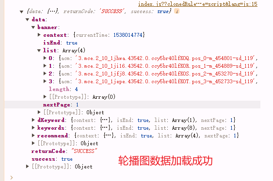

# 项目_03

## 轮播图组件

#### 网络请求封装

先要从后台请求数据，然后前台进行展示

- 首要就是对网络请求进行封装
  - 安装axios
  - 对axios进行封装

1. 安装axios

```js
npm install axios --save
```

安装成功

2. 在network文件夹下新建一个`request.js`的文件

```js
import axios from 'axios'

export function request(config) {
  // 1.创建axios的实例
  const instance = axios.create({
    baseURL: 'http://123.207.32.32:8000',
    timeout: 5000
  })

  // 2.axios的拦截器
  // 2.1.请求拦截的作用
  instance.interceptors.request.use(config => {
    return config
  }, err => {
    // console.log(err);
  })

  // 2.2.响应拦截
  instance.interceptors.response.use(res => {
    return res.data
  }, err => {
    console.log(err);
  })

  // 3.发送真正的网络请求
  return instance(config)
}
```

在建立一个`home.js`的文件，是对**所有首页请求**的再一次封装

```js
import {request} from "./request";

export function getHomeMultidata() {
  return request({
    url: '/home/multidata'
  })
}
```

在`home.vue`中进行数据请求

```js
import { getHomeMultidata } from "network/home"

export default {
  created() {
    // 1.请求多个数据
    getHomeMultidata().then(res => {
      console.log(res)
    })
  },
}
```

数据请求成功



对`Home.vue`中进行改进，将数据保存下来，设置data

```js
import { getHomeMultidata } from "network/home"

export default {
    data(){
        return {
            result:null
        }
    },
    created() {
        // 1.请求多个数据
        getHomeMultidata().then(res => {
            this.result = res
        })
    },
}
```


一个变量中保存的数据太多，可以细化

```js
export default {
    data(){
        return {
            banners: [],
        }
    },
    created() {
        // 1.请求多个数据
        getHomeMultidata().then(res => {
            this.banners = res.data.banner.list;
        })
    },
}
```


#### 组件封装

在components/common中，定义`Swiper.vue`和`SwiperItem.vue`组件，代码太长，不进行展示

还有个`index.js`文件，将两个组件作为对象的形式导出

这个形式使得我们的导入更加的方便


- 在没有index.js的情况下，我们需要导入两次

- 有index.js的情况下，我们需要导入一次

有几个属性值得研究下

```js
props: {
    // 轮播的间隔时间，多少秒换图
    interval: {
        type: Number,
        default: 3000
    },
    // 轮播的延迟
    animDuration: {
        type: Number,
        default: 300
    },
    // 比例：用户滑动超过图片1/4就自动换图片，一般是图片过半，展示下一张，没有过半，还是展示这张
    // 用户体验感较好的位置是1/3左右，这里使用0.25
    moveRatio: {
         type: Number,
         default: 0.25
    },
    // 是否显示圆点(指示器)
    showIndicator: {
         type: Boolean,
         default: true
    }
}
```

在home.vue中进行导入使用

```js
<template>
  <div id="home">
    <nav-bar class="home-nav"><div slot="center">购物街</div></nav-bar>
    <swiper>
      <swiper-item v-for="item in banners">
        <a :href="item.link">
          
        </a>
      </swiper-item>
    </swiper>
  </div>
</template>


import {Swiper,SwiperItem} from 'components/common/swiper'

export default {
  components: {
    NavBar,
    Swiper,
    SwiperItem,
  }
}
```


轮播完成

#### 代码抽离

再度优化，将其抽离到home的一个子组件

创建一个文件夹`childComps`，在其中创建一个组件`HomeSwiper`，这个时候就是父子组件通信了

```js
<template>
  <swiper>
    <swiper-item v-for="item in banners">
      <a :href="item.link">
        
      </a>
    </swiper-item>
  </swiper>
</template>

<script>
  import {Swiper, SwiperItem} from 'components/common/swiper'

  export default {
    name: "HomeSwiper",
    props: {
      banners: {
        type: Array,
        default() {
          return []
        }
      }
    },
    data() {
      return {
        isLoad: false
      }
    },
    components: {
      Swiper,
      SwiperItem
    },
    methods: {
      imageLoad() {
        if (!this.isLoad) {
          this.$emit('swiperImageLoad')
          this.isLoad = true
        }
      }
    }
  }
</script>

<style scoped>

</style>
```

home.vue代码简化

```js
<template>
  <div id="home">
    <nav-bar class="home-nav"><div slot="center">购物街</div></nav-bar>
   <home-swiper :banners="banners"></home-swiper>
  </div>
</template>

<script>
  import HomeSwiper from './childComps/HomeSwiper'

  export default {
    components: {
      NavBar,
      HomeSwiper
    },
  }
</script>
```

刷新，可以滚，没问题

## 推荐

在views/home/homeComps文件夹中创建`RecommendView.vue`在其中写关于推荐内容

```js
<template>
  <div class="recommend">
    <div v-for="item in recommends" class="recommend-item">
      <a :href="item.link">
        
        <div>{{item.title}}</div>
      </a>
    </div>
  </div>
</template>

<script>
  export default {
    name: "RecommendView",
    props: {
      recommends: {
        type: Array,
        default() {
          return []
        }
      }
    }
  }
</script>

<style scoped>
  .recommend {
    display: flex;
    width: 100%;
    text-align: center;
    font-size: 12px;

    padding: 10px 0 20px;
    border-bottom: 10px solid #eee;
  }

  .recommend-item {
    flex: 1;
  }

  .recommend-item img {
    width: 70px;
    height: 70px;
    margin-bottom: 10px;
  }
</style>
```

在home.vue中进行展示

```js
<template>
  <div id="home">
    <recommend-view :recommends="recommends"></recommend-view>
  </div>
</template>

<script>
  import RecommendView from './childComps/RecommendView'

  export default {
    components: {
      NavBar,
      HomeSwiper,
      RecommendView
    },
</script>
```

效果展示


## 本周流行

就是一张图片，不能是因为一张图片就直接使用img标签的方式直接在home.vue中使用，也需要对其进行封装

在views/home/homeComps文件夹中创建`FeatureView.vue`在其中写关于本周流行的东西

```js
<template>
  <div class="feature">
    <a href="https://act.mogujie.com/zzlx67">
      
    </a>
  </div>
</template>

<script>
  export default {
    name: "FeatureView"
  }
</script>

<style scoped>
  .feature img {
    width: 100%;
  }
</style>
```

在home.vue中进行引入

```js
<feature-view></feature-view>

import FeatureView from './childComps/FeatureView'

components: {
  NavBar,
  HomeSwiper,
  RecommendView,
  FeatureView
},
```

效果展示：


上下滚动的时候，导航栏也会跟着一起动

在使用浏览器原生滚动时, 为了让导航不跟随一起滚动

```js
.home-nav {
  background-color: var(--color-tint);
  color: #fff;
  /*在使用浏览器原生滚动时, 为了让导航不跟随一起滚动*/
  position: fixed;
  left: 0;
  right: 0;
  top: 0;
  z-index: 9; // 遮盖问题，提升展示优先级
}
```

使用position固定导航栏，使其脱离文档流，会使导航栏遮盖轮播图


简单解决

```js
#home {
  // 因为导航栏的高度就是44px，直接让其距离顶部充满44px的padding,真睿智
  padding-top: 44px;
}
```

解决了，大聪明


还有个问题

> 底部的tabbar也是position的方式固定的，所以也会对图片进行遮挡，之后在解决
>
> 