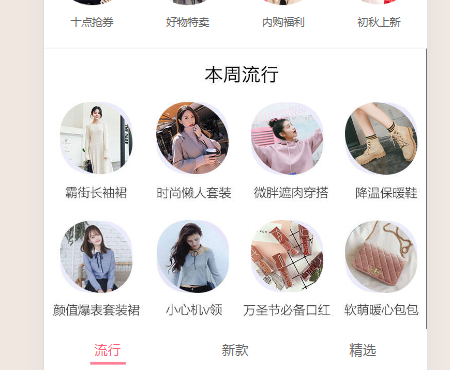
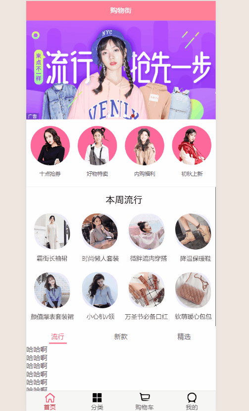
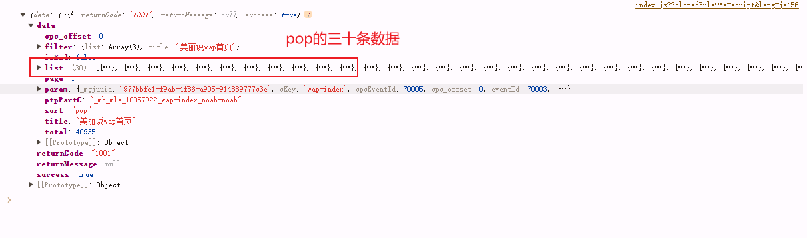
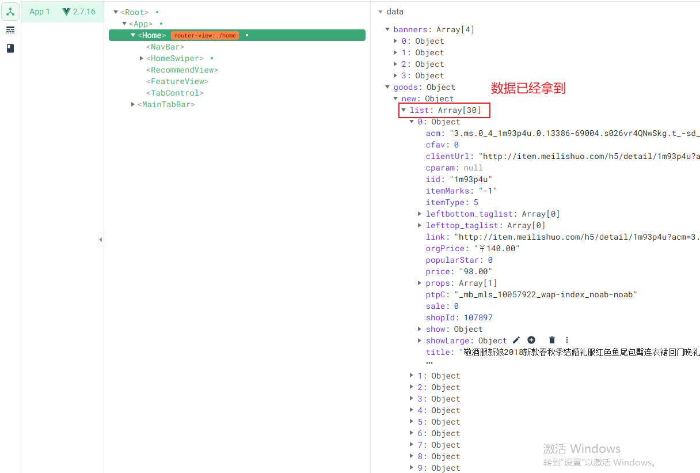
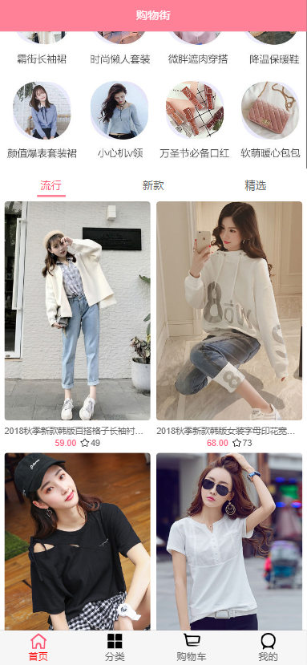
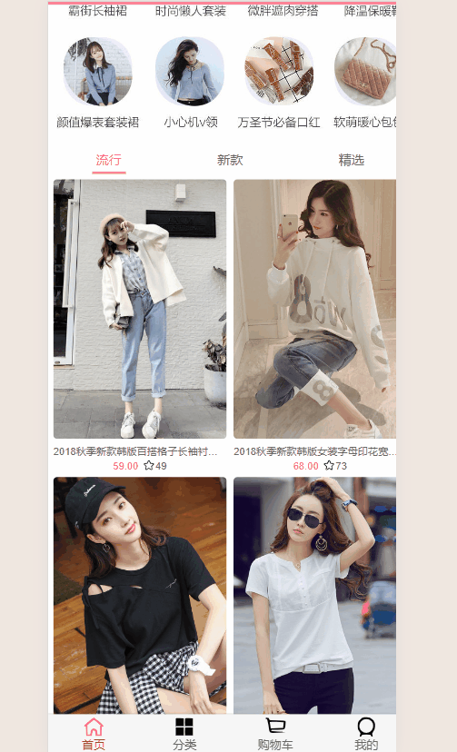

# 项目_04

## 选项卡组件

选项卡和业务的相关性更高一些，所以放在content下面

在components/content中，创建一个`tabControl`文件夹，定义`tabControl.vue`组件

```js
<template>
  <div class="tab-control">
    <div v-for="(item, index) in titles"
         class="tab-control-item"
         :class="{active: index === currentIndex}"
         @click="itemClick(index)">
      <span>{{item}}</span>
    </div>
  </div>
</template>

<script>
  export default {
    name: "TabControl",
    props: {
      titles: {
        type: Array,
        default() {
          return []
        }
      }
    },
    data() {
      return {
        currentIndex: 0
      }
    },
    methods: {
      itemClick(index) {
        this.currentIndex = index;
      }
    }
  }
</script>

<style scoped>
  .tab-control {
    display: flex;
    text-align: center;
    font-size: 15px;
    height: 40px;
    line-height: 40px;
    background-color: #fff;
  }

  .tab-control-item {
    flex: 1;
  }

  .tab-control-item span {
    padding: 5px;
  }

  .active {
    color: var(--color-high-text);
  }

  .active span {
    border-bottom: 3px solid var(--color-tint);
  }
</style>
```

在这个地方不需要高插槽的一个很大的因素就是：其实标签和效果都是相同的，只是文字不同(可以将文字作为参数传入即可)，直接使用标签定义即可，不用使用插槽

> 插槽更多的作用于：标签不确定，样式也不确定的情况

注意当前高亮的`currentIndex`的书写方式

在`home.vue`中添加代码

```js
<tab-control :titles="['流行', '新款', '精选']" class="tab-control"/>
    
import TabControl from 'components/content/tabControl/TabControl'

components: {
    NavBar,
    HomeSwiper,
    RecommendView,
    FeatureView,
    TabControl
},
```

效果展示：



#### 吸顶效果

使用position: sticky;的方式完成简单的吸顶操作，其实还是使用position在某个位置停下，距离上面的位置是44个像素的时候，position:fixed变成固定

只是一个临时方案

```js
.tab-control {
  position: sticky;
  top:44px;
}
```

效果展示



## 商品数据

### 商品数据结构

> 说明：
>
> - 在goods中，存储pop/new/sell的数据，一次请求
>   - 分别请求会造成延迟，用户体验感不好
> - 在里面需要一个`page`字段，来记录用户当前上滑数据到了第几页，因为pop已经5页了，但是sell还是第一页

```js
goods:{
    'pop':{page:1,[当前页码对应数据列表]}，
    'new':{page:1,[当前页码对应数据列表]}
    'sell':{page:1,[当前页码对应数据列表]}
}
```

在home.vue中data中添加goods

```js
goods: {
    'pop': {page: 0, list: []},
    'new': {page: 0, list: []},
    'sell': {page: 0, list: []},
}
```

### 请求数据

在页面初始阶段的时候我们置请求pop/new/sell的第一页数据，当上滑操作的时候在追加数据

#### 封装请求

在network/home.js中追加代码

```js
export function getHomeGoods(type, page) {
  return request({
    url: '/home/data',
    params: {
      type,
      page
    }
  })
}
```

#### 请求数据

在home.vue中created的阶段请求数据

```js
// 先导入
import { getHomeMultidata, getHomeGoods } from "network/home"

// 在请求
created() {
    // 1.请求多个数据
    getHomeMultidata().then(res => {
        this.banners = res.data.banner.list;
        this.recommends = res.data.recommend.list;
      })

    // 2.请求商品数据
    getHomeGoods('pop', 1).then(res => {
      console.log(res);
    })
}
```



对上面的代码进行封装，将created中的逻辑简化,抽出来的代码放在methods中

```js
created() {
  // 1.请求多个数据
  this.getHomeMultidata()

  // 2.请求商品数据
  this.getHomeGoods('pop',1)
  this.getHomeGoods('new',1)
  this.getHomeGoods('sell',1)
},

methods: {
  /**
   * 网络请求相关的方法
   */
  getHomeMultidata() {
    getHomeMultidata().then(res => {
      this.banners = res.data.banner.list;
      this.recommends = res.data.recommend.list;
    })
  },
  getHomeGoods(type) {
    getHomeGoods(type, page).then(res => {
      console.log(res)
    })
  }
}
```

#### 数据处理

> 数据更新的方式：
>
> - page + 1
> - 请求回来的30条数据追加到原来的数据列表中 

```js
created() {
  // 1.请求多个数据
  this.getHomeMultidata()

  // 2.请求商品数据
  this.getHomeGoods('pop')
  this.getHomeGoods('new')
  this.getHomeGoods('sell')
},
methods: {
  /**
   * 网络请求相关的方法
   */
  getHomeMultidata() {
    getHomeMultidata().then(res => {
      this.banners = res.data.banner.list;
      this.recommends = res.data.recommend.list;
    })
  },
  getHomeGoods(type) {
    // 直接拿page
    const page = this.goods[type].page + 1
    getHomeGoods(type, page).then(res => {
      // 追加30条新数据
      this.goods[type].list.push(...res.data.list)
      // 页码 + 1 更新
      this.goods[type].page += 1
    })
  }
}
```

数据已经拿到，效果展示



#### 展示数据

因为商品数据和业务是强相关的，所以放在content中

在components/content中，创建一个`goods`文件夹，定义`GoodList.vue`组件和`GoodListItem.vue`组件

**GoodList.vue**

```js
<template>
  <div class="goods">
    <goods-list-item v-for="item in goods" :goods-item="item"/>
  </div>
</template>

<script>
  import GoodsListItem from './GoodsListItem'

  export default {
    name: "GoodsList",
    components: {
      GoodsListItem
    },
    props: {
      goods: {
        type: Array,
        default() {
          return []
        }
      }
    }
  }
</script>

<style scoped>
  .goods {
    display: flex;
    flex-wrap: wrap;
    justify-content: space-around;

    padding: 2px;
  }
</style>
```

对于GoodList

**GoodListItem.vue**

```js
<template>
  <div class="goods-item" @click="itemClick">
    
    <div class="goods-info">
      <p>{{goodsItem.title}}</p>
      <span class="price">{{goodsItem.price}}</span>
      <span class="collect">{{goodsItem.cfav}}</span>
    </div>
  </div>
</template>

<script>
  export default {
    name: "GoodsListItem",
    props: {
      goodsItem: {
        type: Object,
        default() {
          return {}
        }
      }
    },
    methods: {
      imageLoad() {
        this.$bus.$emit('itemImageLoad')
      },
      itemClick() {
        this.$router.push('/detail/' + this.goodsItem.iid)
      }
    }
  }
</script>

<style scoped>
  .goods-item {
    padding-bottom: 40px;
    position: relative;

    width: 48%;
  }

  .goods-item img {
    width: 100%;
    border-radius: 5px;
  }

  .goods-info {
    font-size: 12px;
    position: absolute;
    bottom: 5px;
    left: 0;
    right: 0;
    overflow: hidden;
    text-align: center;
  }

  .goods-info p {
    overflow: hidden;
    text-overflow: ellipsis;
    white-space: nowrap;
    margin-bottom: 3px;
  }

  .goods-info .price {
    color: var(--color-high-text);
    margin-right: 20px;
  }

  .goods-info .collect {
    position: relative;
  }

  .goods-info .collect::before {
    content: '';
    position: absolute;
    left: -15px;
    top: -1px;
    width: 14px;
    height: 14px;
    background: url("~assets/img/common/collect.svg") 0 0/14px 14px;
  }
</style>
```

知识点：

1. 出现了`父 -> 子 -> 孙` 的组件数据传递
   - home组件中请求拿到goods的list数据，然后传递给GoodList的组件，然后GoodList组件又将list中的每一条item数据传递给了GoodListItem组件
2. css的应用比较多
   - 相对定位和绝对定位的问题
   - 收藏前面的小星星的伪类的添加方式
   - 两列显示：在Item中设置宽度加上在List中设置flex-wrap铺满的配合使用

在home.vue中对GoodList进行引用

```js
// 组件引用，使用计算方法填充数据
<good-list :goods="showGoods"/>
    
// 导入
import GoodList from 'components/content/goods/GoodsList'

// 注册
components: {
  NavBar,
  HomeSwiper,
  RecommendView,
  FeatureView,
  TabControl,
  GoodList
}

// data 添加一个记录currentType当前的标签
data(){
  return {
    currentType: 'pop',
  }
}

// 计算属性
computed: {
  showGoods() {
    return this.goods[this.currentType].list
  }
}
```

效果展示



存在一个问题，上滑出现图片遮挡tabbar


需要我们提升tabControl的显示优先级,修改home.vue中的tabControl的样式

```js
.tab-control {
  position: sticky;
  top:44px;
  z-index: 9;
}
```

修复完成


子传父的典型代表就是，在tabControl中完成点击切换数据，需要通知Home组件切换成了谁

> 更通俗的理解：就是在tabControl的内部发生了个事件(切换标签)，需要通知父组件(Home)当前切换成的标签类型是谁，Home组件进行相对应的数据展示
>
> 子组件的行为影响了父组件，需要发送事件通知父组件

在子组件中使用$emit(方法，参数)的方式发送通知，在父组件中子组件调用部分添加同名监听通知，并methods中定义监听方法

在tabControl.vue增加代码

```js
itemClick(index) {
    this.currentIndex = index;
    this.$emit('tabClick', index)
}
```

在Home.vue中定义监听函数

```js
// 在调用部分添加监听通知
<tab-control :titles="['流行', '新款', '精选']" class="tab-control" @tabClick="tabClick"/>

// 在method中定义监听方法
methods: {
  /**
   * 事件监听相关的方法
   */
  tabClick(index) {
    switch (index) {
      case 0:
        this.currentType = 'pop'
        break
      case 1:
        this.currentType = 'new'
        break
      case 2:
        this.currentType = 'sell'
        break
    }
  },
}
```

效果展示

