# 项目_05

## 滑动组件

我们的首页已经基本完成了，但是出现了体验感的问题

> - 滑动
>
>   - 现在代码中我们滑动屏幕，滑动多少距离就是多少距离，即使滑动到了一个信息一半的位置，立即停止，这样不丝滑，比较卡顿，同时信息展示不全，用户体验感觉不好
>   - 所以我们要做一个平滑滑动
>
>   - 以前经常使用`iscroll`，不过作者不维护了，不能用了
>   - 根据`iscroll`的源码之间copy版本的`better-scroll`更加好用

我们项目中使用`better-scoll`的方式完成丝滑滑动

官方文档：https://better-scroll.github.io/docs/zh-CN/guide/

github地址：https://github.com/ustbhuangyi/better-scroll

源码：一般在github项目中-->最新tag下的dist文件夹

我们在category中演示better-scroll的代码

官网中的使用

```js
<div class="wrapper">
  <ul class="content">
    <li>...</li>
    <li>...</li>
    ...
  </ul>
  <!-- 这里可以放一些其它的 DOM，但不会影响滚动 -->
</div>
```

上面的代码中 BetterScroll 是作用在外层 **wrapper** 容器上的，滚动的部分是 **content** 元素。这里要注意的是，BetterScroll 默认处理容器（wrapper）的第一个子元素（content）的滚动，其它的元素都会被忽略。

最简单的初始化代码如下：

```js
import BScroll from '@better-scroll/core'
let wrapper = document.querySelector('.wrapper')
let scroll = new BScroll(wrapper)
```

BetterScroll 提供了一个类，实例化的第一个参数是一个原生的 DOM 对象。当然，如果传递的是一个字符串，BetterScroll 内部会尝试调用 querySelector 去获取这个 DOM 对象。

### 滚动原理

浏览器的滚动原理： 浏览器的滚动条大家都会遇到，**当页面内容的高度超过视口高度的时候，会出现纵向滚动条；当页面内容的宽度超过视口宽度的时候，会出现横向滚动条**。也就是当我们的视口展示不下内容的时候，会通过滚动条的方式让用户滚动屏幕看到剩余的内容。

BetterScroll 也是一样的原理，我们可以用一张图更直观的感受一下：

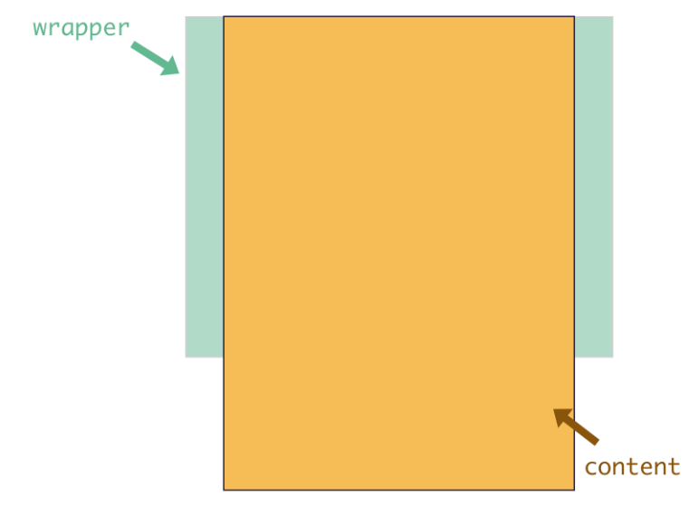

绿色部分为 wrapper，也就是父容器，它会有**固定的高度**。黄色部分为 content，它是父容器的**第一个子元素**，它的高度会随着内容的大小而撑高。那么，当 content 的高度不超过父容器的高度，是不能滚动的，而它一旦超过了父容器的高度，我们就可以滚动内容区了，这就是 BetterScroll 的滚动原理。

> 这个地方，我们需要将content统一成一个元素，不能有多个
>
> 之前的ul作为外部的wrapper,100个li作为content这个是不允许的
>
> 需要在外层包裹一个div将其设置成wrapper,然后将ul整体作为content进行使用

### 使用Better-scroll

1. 安装better-scoll，运行是依赖

```js
npm install better-scroll --save
```

2. 使用

   - 创建100个li标签用于测试

   - 在固定高度中进行滚动

   - 使用原生的方式

```js
<template>
  <div class="wrapper">
    <div>
      <ul class="content">
        <li>分类列表1</li>
        <li>分类列表2</li>
        <li>分类列表3</li>
        <li>分类列表4</li>
        <li>分类列表5</li>
        <li>分类列表6</li>
        <li>分类列表7</li>
        <li>分类列表8</li>
        <li>分类列表9</li>
        <li>分类列表10</li>
        <li>分类列表11</li>
        <li>分类列表12</li>
        <li>分类列表13</li>
        <li>分类列表14</li>
        <li>分类列表15</li>
        <li>分类列表16</li>
        <li>分类列表17</li>
        <li>分类列表18</li>
        <li>分类列表19</li>
        <li>分类列表20</li>
        <li>分类列表21</li>
        <li>分类列表22</li>
        <li>分类列表23</li>
        <li>分类列表24</li>
        <li>分类列表25</li>
        <li>分类列表26</li>
        <li>分类列表27</li>
        <li>分类列表28</li>
        <li>分类列表29</li>
        <li>分类列表30</li>
        <li>分类列表31</li>
        <li>分类列表32</li>
        <li>分类列表33</li>
        <li>分类列表34</li>
        <li>分类列表35</li>
        <li>分类列表36</li>
        <li>分类列表37</li>
        <li>分类列表38</li>
        <li>分类列表39</li>
        <li>分类列表40</li>
        <li>分类列表41</li>
        <li>分类列表42</li>
        <li>分类列表43</li>
        <li>分类列表44</li>
        <li>分类列表45</li>
        <li>分类列表46</li>
        <li>分类列表47</li>
        <li>分类列表48</li>
        <li>分类列表49</li>
        <li>分类列表50</li>
        <li>分类列表51</li>
        <li>分类列表52</li>
        <li>分类列表53</li>
        <li>分类列表54</li>
        <li>分类列表55</li>
        <li>分类列表56</li>
        <li>分类列表57</li>
        <li>分类列表58</li>
        <li>分类列表59</li>
        <li>分类列表60</li>
        <li>分类列表61</li>
        <li>分类列表62</li>
        <li>分类列表63</li>
        <li>分类列表64</li>
        <li>分类列表65</li>
        <li>分类列表66</li>
        <li>分类列表67</li>
        <li>分类列表68</li>
        <li>分类列表69</li>
        <li>分类列表70</li>
        <li>分类列表71</li>
        <li>分类列表72</li>
        <li>分类列表73</li>
        <li>分类列表74</li>
        <li>分类列表75</li>
        <li>分类列表76</li>
        <li>分类列表77</li>
        <li>分类列表78</li>
        <li>分类列表79</li>
        <li>分类列表80</li>
        <li>分类列表81</li>
        <li>分类列表82</li>
        <li>分类列表83</li>
        <li>分类列表84</li>
        <li>分类列表85</li>
        <li>分类列表86</li>
        <li>分类列表87</li>
        <li>分类列表88</li>
        <li>分类列表89</li>
        <li>分类列表90</li>
        <li>分类列表91</li>
        <li>分类列表92</li>
        <li>分类列表93</li>
        <li>分类列表94</li>
        <li>分类列表95</li>
        <li>分类列表96</li>
        <li>分类列表97</li>
        <li>分类列表98</li>
        <li>分类列表99</li>
        <li>分类列表100</li>
      </ul>
    </div>
  </div>
</template>

<script>
export default {
  name: "Category",
}
</script>

<style scoped>
.wrapper {
  // 设置固定高度
  height: 150px;
  background-color: red;

  // 设置这个属性使用浏览器原生的滚动方式
  overflow-y: scroll;
}
</style>
```

效果展示


3. 使用better-scroll进行改进
   - 不能使用created是在创建完成就消失了
     - .wrapper的方式拿到的不是undefined、null，所以我们无法对元素进行操作
   - 但是我们的页面滚动是需要不断的刷新的，所以每次刷新的时候，都需要使用对象，所以需要使用mounted更新

```js
// 导入better-scroll
import BScroll from 'better-scroll'

data() {
  return {
    scroll: null
  }
},
mounted() {
  this.scroll = new BScroll(this.$refs.aaaa, {
    
  })
}
```

完成滚动

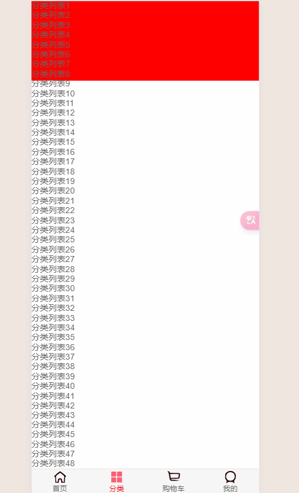

使用`overflow: hidden;`将溢出部分隐藏即可

底部会出现**弹簧效果**

效果展示

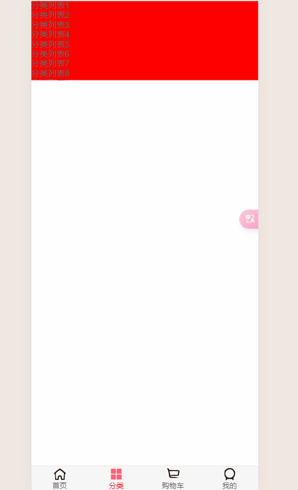

### Better-scroll特性

#### probeType

> **对应项目功能**：实时监听位置，显示to-top

```js
// 类型：number
// 默认值：0
// 可选值：1|2|3
// 作用：决定是否派发 scroll 事件，对页面的性能有影响，尤其是在 useTransition 为 true 的模式下。

// 派发 scroll 的场景分为两种：
// 1. 手指作用在滚动区域（content DOM）上;
// 2. 调用 scrollTo 方法或者触发 momentum 滚动动画（其实底层还是调用 scrollTo 方法）

// 对于 v2.1.0 版本，对 probeType 做了一次统一

// 1. probeType 为 0，在任何时候都不派发 scroll 事件，
// 2. probeType 为 1，仅仅当手指按在滚动区域上，每隔 momentumLimitTime 毫秒派发一次 scroll 事件，
// 3. probeType 为 2，仅仅当手指按在滚动区域上，一直派发 scroll 事件，
// 4. probeType 为 3，任何时候都派发 scroll 事件，包括调用 scrollTo 或者触发 momentum 滚动动画

bscroll.on('scroll',position=>{
    console.log(position)
})
// 默认情况下BScroll是不可以实时的监听滚动的位置的
// probe 侦测
// 1. probeType 为 0，不侦测实时位置
// 2. probeType 为 1，不侦测实时位置
// 3. probeType 为 2，仅仅当手指滚动的过程中侦测，手指离开后的惯性滚动过程中不侦测
// 4. probeType 为 3，只要是滚动，手指 + 惯性都侦测
```

#### click

> **对应项目功能**：监听内按钮不能点击(button的click可以)，需要设置true

```js
// click
// 类型：boolean
// 默认值：false
// 作用：BetterScroll 默认会阻止浏览器的原生 click 事件。当设置为 true，BetterScroll 会派发一个 click 事件，我们会给派发的 event 参数加一个私有属性 _constructed，值为 true。
```

```js
methods: {
	btnClick() {
		console.log('btnClick');
    },
	divClick() {
		console.log('divClick');
	}
}
```

- 无论是否设置`click:false`, button都可以点击
- 自定义的点击事件：必须设置`click:true`, 那么div才能监听点击

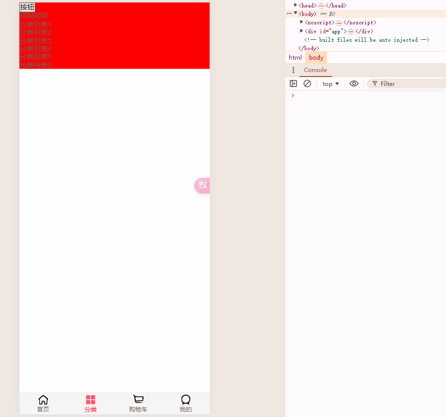

#### pullUpLoad

>  **对应项目功能**：上拉加载更多

```js
1. 通过静态方法 BScroll.use() 注册插件
import BScroll from '@better-scroll/core'
import Pullup from '@better-scroll/pull-up'

BScroll.use(Pullup)

2. 然后，实例化 BetterScroll 时需要传入 pullup 配置项。
new BScroll('.bs-wrapper', {
    pullUpLoad: true
})
```

示例代码：

> `this.bscroll.on('pullingUp', this.pullingUpHandler)` 实际上开启了这个属性 就能对`pullingUp`事件进行监听，上面我们是针对scroll事件进行监听
>
> `pullingUp(pull-up)`
>
> - **触发时机**：当底部下拉距离超过阈值

```js
// template
<template>
  <div class="pullup">
    <div ref="scroll" class="pullup-wrapper">
      <div class="pullup-content">
        <ul class="pullup-list">
          <li v-for="i of data" :key="i" class="pullup-list-item">
            {{ i % 5 === 0 ? 'scroll up 👆🏻' : `I am item ${i} `}}
          </li>
        </ul>
        <div class="pullup-tips">
          <div v-if="!isPullUpLoad" class="before-trigger">
            <span class="pullup-txt">Pull up and load more</span>
          </div>
          <div v-else class="after-trigger">
            <span class="pullup-txt">Loading...</span>
          </div>
        </div>
      </div>
    </div>
  </div>
</template>

// script脚本
<script>
  import BScroll from '@better-scroll/core'
  import Pullup from '@better-scroll/pull-up'

  BScroll.use(Pullup)

  export default {
    data() {
      return {
        isPullUpLoad: false,
        data: 30
      }
    },
    mounted() {
      this.initBscroll()
    },
    methods: {
      initBscroll() {
        this.bscroll = new BScroll(this.$refs.scroll, {
          pullUpLoad: true
        })

        this.bscroll.on('pullingUp', this.pullingUpHandler)
      },
      async pullingUpHandler() {
        this.isPullUpLoad = true

        await this.requestData()

        this.bscroll.finishPullUp()
        this.bscroll.refresh()
        this.isPullUpLoad = false
      },
      async requestData() {
        try {
          const newData = await this.ajaxGet(/* url */)
          this.data += newData
        } catch (err) {
          // handle err
          console.log(err)
        }
      },
      ajaxGet(/* url */) {
        return new Promise(resolve => {
          setTimeout(() => {
            resolve(20)
          }, 1000)
        })
      }
    }
  }
</script>

// style样式
<style lang="stylus" scoped>
.pullup
  height: 100%
  .pullup-wrapper
    height: 100%
    padding: 0 10px
    border: 1px solid #ccc
    overflow: hidden
  .pullup-list
    padding: 0
  .pullup-list-item
    padding: 10px 0
    list-style: none
    border-bottom: 1px solid #ccc
  .pullup-tips
    padding: 20px
    text-align: center
    color: #999
</style>
```

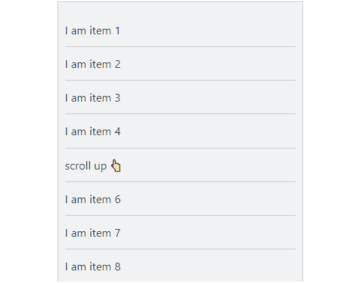

对category代码进行更新

```js
mounted() {
  this.scroll = new BScroll(this.$refs.aaaa, {
    probeType: 3,
    pullUpLoad: true
  })

  this.scroll.on('scroll', (position) => {
    console.log(position);
  })

  this.scroll.on('pullingUp', () => {
    console.log('上啦加载更多');
  })
}
```

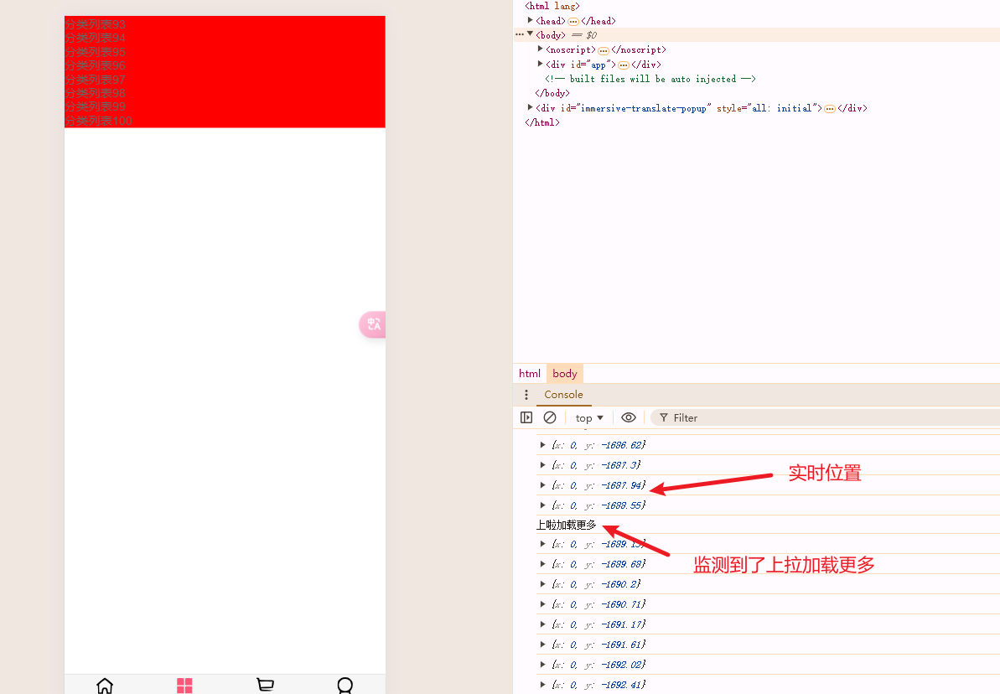

> 上拉加载更多只会展示一次，需要检测当前上拉加载更多的动作已经完成

```js
this.scroll.on('pullingUp', () => {
    console.log('上啦加载更多');
    // 发送网络请求，请求更多页的一个数据

    // 等数据请求完成，并将新的数据展示出来后
    this.scroll.finishPullUp()
})
```

效果展示

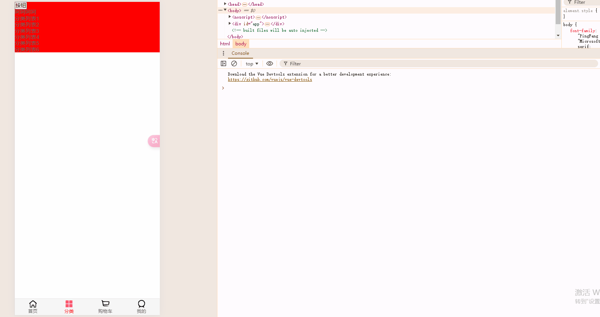

我们还可以将这个`finishPullUp` 函数放入到`setTimeout`函数中，在指定事件内我们不能不断刷新，当时间一到我们可再次刷新

```js
this.scroll.on('pullingUp', () => {
    console.log('上啦加载更多');
    // 发送网络请求，请求更多页的一个数据

    // 等数据请求完成，并将新的数据展示出来后
    setTimeout(()=>{
    	this.scroll.finishPullUp()
    },2000)
})
```

### 封装Better-scroll

> 还是和axios的封装一个道理，当我们直接使用的时候，项目对Better-scroll的依赖太高，当Better-scroll不在维护的时候，我们需要修改大量的项目代码，所以还是需要隔离项目和Better-scroll的依赖，将Better-scroll进行封装，降低耦合度

在components/common中，创建一个`scroll`文件夹，定义`Scroll.vue`组件

> `this.scroll = new BScroll(this.$refs.wrapper, {})` 更优秀
>
> `this.scroll = new BScroll(this.$refs.wrapper, {})` 比 `this.scroll = new BScroll(document.querySelector('.wrapper'), {})`更好的原因是，我们使用`document.querySelector('.wrapper')`的方式，当我们项目中有很多的地方引用了`.wrapper`属性，我们可能会拿错，因为`document.querySelector`是按照顺序查找，代码层次渐深的时候，最终会产生问题难以察觉，所以最好不要使用`document.querySelector('.wrapper')`的方式

**this.$refs.名称**

- 父组件中拿到指定名称的子组件的时候使用 ref = '名称'
- 在**普通标签**中添加ref = '名称' 的时候，我们也可以这种方式this.$refs.名称，拿到指定元素

完整代码

```js
<template>
  <div class="wrapper" ref="wrapper">
    <div class="content">
      <slot></slot>
    </div>
  </div>
</template>

<script>
  import BScroll from 'better-scroll'

  export default {
    name: "Scroll",
    data() {
      return {
        scroll: null,
      }
    },

    mounted() {
      // 1.创建BScroll对象
      this.scroll = new BScroll(this.$refs.wrapper, {
        click: true,
        probeType: this.probeType,
        pullUpLoad: this.pullUpLoad
      })
    },
  }
</script>

<style scoped>

</style>

```

在home.vue中引入

```js
// 引用
<scroll class="content"
        ref="scroll"
        :probe-type="3"
        :pull-up-load="true">
  <home-swiper :banners="banners"></home-swiper>
  <recommend-view :recommends="recommends"></recommend-view>
  <feature-view></feature-view>
  <tab-control :titles="['流行', '新款', '精选']"
               class="tab-control"
               @tabClick="tabClick"/>
  <good-list :goods="showGoods"/>
</scroll>

// 导入子组件
import Scroll from 'components/common/scroll/Scroll'

// 加载
components: {
  NavBar,
  HomeSwiper,
  RecommendView,
  FeatureView,
  TabControl,
  GoodList,
  Scroll
},
    
// 添加样式
.content {
  overflow: hidden;

  position: absolute;
  top: 44px;
  bottom: 49px;
  left: 0;
  right: 0;
}
```

效果展示(未成功)

- 页面只是轻微向上，并未实现真正的向上滑动
- 而且有的时候可以向上滑动很多，但是到一定位置卡住；有时候直接就是不能向上滚动


> **这里的总结顺序和老师讲课顺序不一致，先解决了bug，然后在实现to-top和上拉加载更多功能**

### 滚不动bug

这个问题其实是一个bug

下面是bug的详细原因和解决过程

详细原因：

better-scroll在决定整个区域中有多少个内容可以滚动，其实是取决于内容的长度来决定的，核心就是遍历整个区域中内容的长度，然后进行累加，

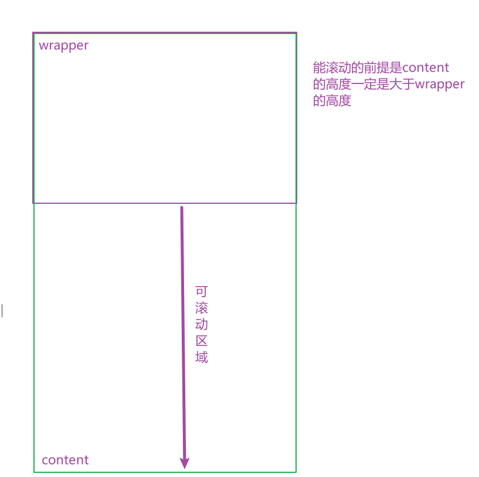


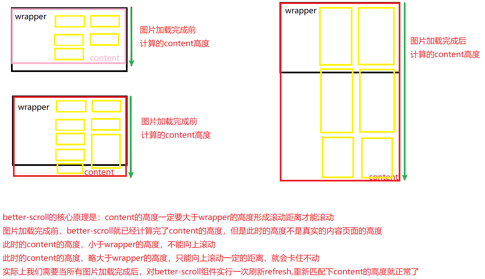

我们可以通过better-scroll的属性`scrollerHeight`得到可滚动距离

> - 问题：
>
>   - better-scroll在决定有多少区域可以滚动时候，是根据属性`scrollerHeight`决定的
>
>   - 属性`scrollerHeight`是根据放在berrer-scroll的content的子组件的高度决定的
>
>   - 但是我们的首页中，刚开始计算出来的属性`scrollerHeight`，是没有将图片计算在内的
>
>   - 所以计算出来的属性是错误的
>
>   - 后来图片加载进来了以后就有了新的高度，但是属性`scrollerHeight`并没有更新，所以滚动出现了问题
>
> - 解决问题：
>   - 监听每一张图片是否加载完成，只要有一张图片加载完成了，就执行一次refresh()
>   - 新问题：什么时候所有图片加载完成那？
>     - 在js中img.onload = function abc() `onload`函数实现对图片加载完成的检测
>     - 在vue中，在img标签中@load函数就能监听的到图片加载完成

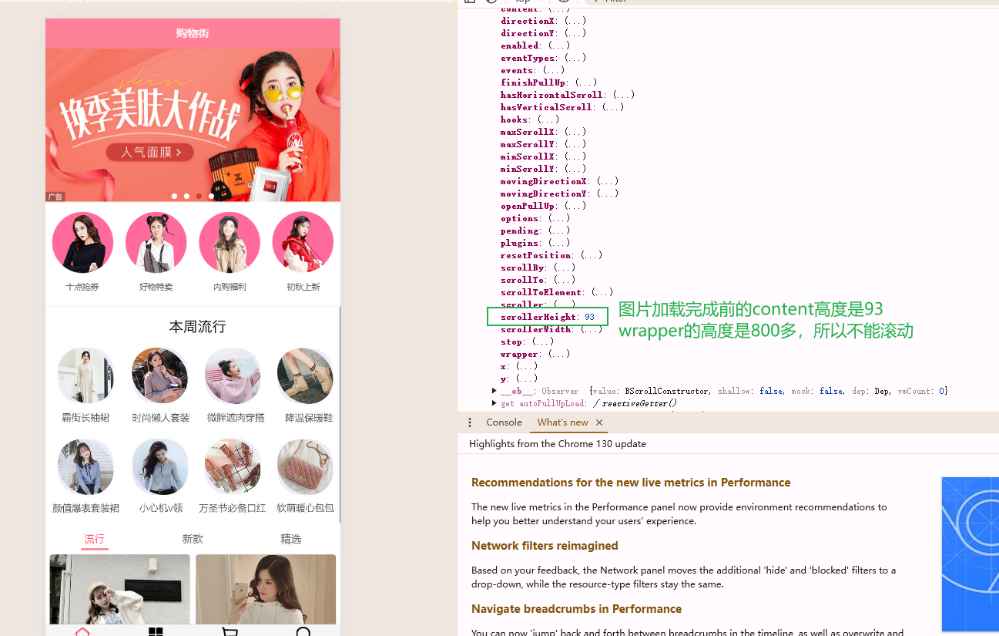

图片加载完成后，我们需要使用scroll.refresh()函数重新计算content的高度，通知better-scroll组件就行了

对GoodListItem.vue中的图片进行监听

```js

    
imageLoad() {
  console.log('itemImageLoad')
},
```

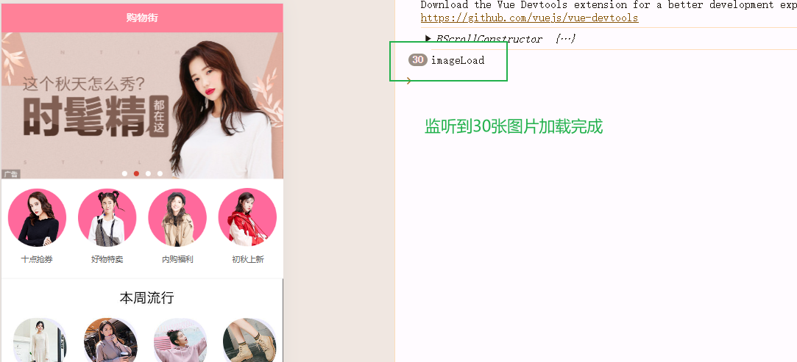

又出现个新问题：在goodsListItem中怎样调用scroll组件scroll对象的refresh方法

- 第一种方式

  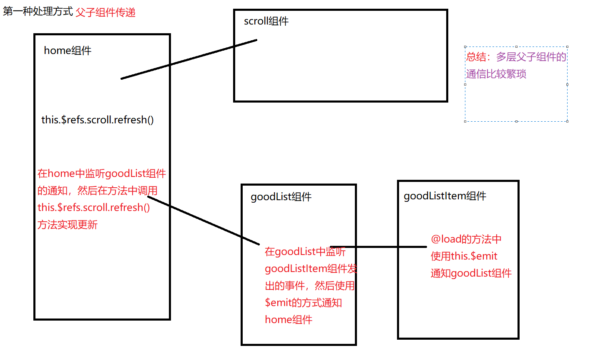

- 第二种方式

  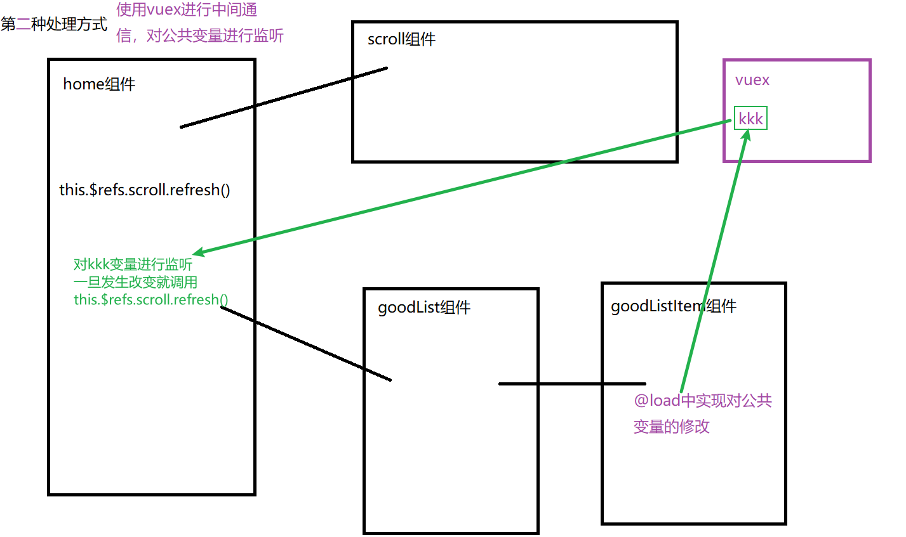

- 第三种方式(非常适合)

  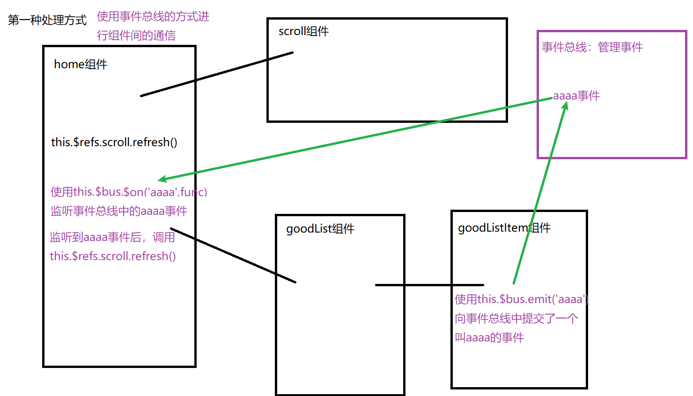

对`GoodListItem.vue`中的图片进行监听

```js

    
imageLoad() {
  this.$bus.$emit('itemImageLoad')
},
```

在home中对总线事件进行监听

```js
created() {
  // 总线事件监听
  this.$bus.$on('itemImageLoad',()=>{
      console.log('-----');
  })
},
```

在Vue中其实是没有总线的，需要我们自己进行创建，其实就是一个vue对象

在main.js中完成创建

```js
// 在原型链上添加一个Vue实例
Vue.prototype.$bus = new Vue()
```

> TODO：**why** Vue实例可以作为一个总线对象？


在scroll.vue中添加refresh方法的调用封装

```js
methods: {
  refresh() {
    this.scroll && this.scroll.refresh()
  }
}
```

在home.vue中完成调用

```js
this.$bus.$on('itemImageLoad',()=>{
    this.$refs.scroll.refresh()
})
```

效果如下所示：


bug已经解决了，可以丝滑的向上滚动了

又出现了一个新的问题：refresh函数找不到

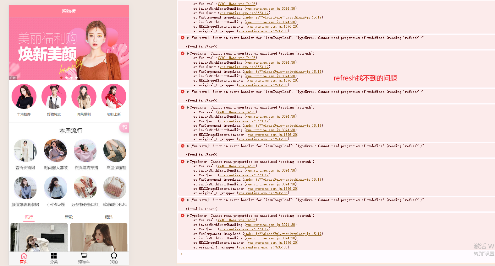

> 原因：其实是因为我们将refresh函数调用放在了created中，这个时候我们的scroll组件可能还没有加载完成，就没有scroll组件，所以调用refresh组件调用找不到
>
> - 在created中去使用document.querySelector() or this.$refs.xxx 拿到的东西可能都是空的

对scroll.vue对象进行修改优化，添加对于scroll对象存在的判断

```js
methods: {
  refresh() {
    this.scroll && this.scroll.refresh()
  },
}
```

同时home.vue将监听从created中更改到mounted中，更改代码

```js
mounted() {
  // 1.图片加载完成的事件监听
  this.$bus.$on('itemImageLoad', () => {
    this.$refs.scroll.refresh()
  })
},
```

### 防抖

> 实际需求中，我们经常能用到搜索框，我们输入一个字符就会有相对应的推荐词条给到我们，其实就是向后端发送了一条请求，将最新的推荐推荐给用户
>
> - 我们输入3个字符，发送三个请求，我们输入4个字符，发送4个请求……
>
> 其实用户可能想要搜索一个固定的东西，并不需要我们实时的变化，或者用户输入较快，第三个的展示还没刷新，他已经输入了第四个字符了
>
> 两个问题：
>
> 1. 我们并不需要每个字符都进行刷新
> 2. 我们每个字符都向后端进行发送请求，给后端的压力也是很大的
>
> 解决问题的方式:
>
> - 我们可以每间隔一段时间，将用户的输入进行一次汇总之后，在将请求发给后端，拿到相对应的数据后在更新界面
> - 汇总操作就是就是：在间隔时间内，将多次请求进行取消，间隔时间到的时候，将最后输入作为一个整体发送给后端
>
> 核心就是：**防抖就是触发事件只能在n秒执行一次，如果n秒内再次执行，则会重新计划执行时间**
>
> 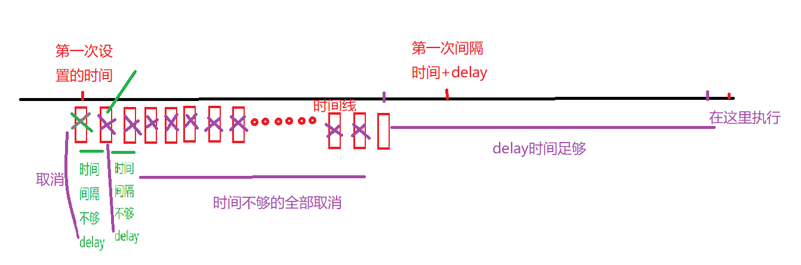
>
> 这个技术就是 `防抖`
>
> 当我们函数中不传delay参数，我们的refresh打印也不是三十次
>
> - 是因为setTimeout函数是放在下一次事件循环中
>
> - ```js
>   console.log('aaa');
>   setTimeout(() => {
>       console.log('bbb');
>   })
>   console.log('ccc');
>   
>   // 打印顺序 aaa --> ccc ---> bbb
>   ```

在common下建立一个utils.js文件，将防抖函数放在里面

```js
// 核心原理：就是设置一个时间，然后每次调用前，先判断有没有已经创建的定时器，有就销毁，始终保持在delay时间中只有一个定时器的存在
export function debounce(func, delay) {
  let timer = null
  return function (...args) {
    if (timer) clearTimeout(timer)
    timer = setTimeout(() => {
      func.apply(this, args)
    }, delay)
  }
}
```

对`home.vue`中的refresh的调用添加防抖动操作

```js
import {debounce} from "common/utils";
mounted() {
  // 1.图片加载完成的事件监听
  const refresh = debounce(this.$refs.scroll.refresh, 50)
  this.$bus.$on('itemImageLoad', () => {
    refresh()
  })
},
```

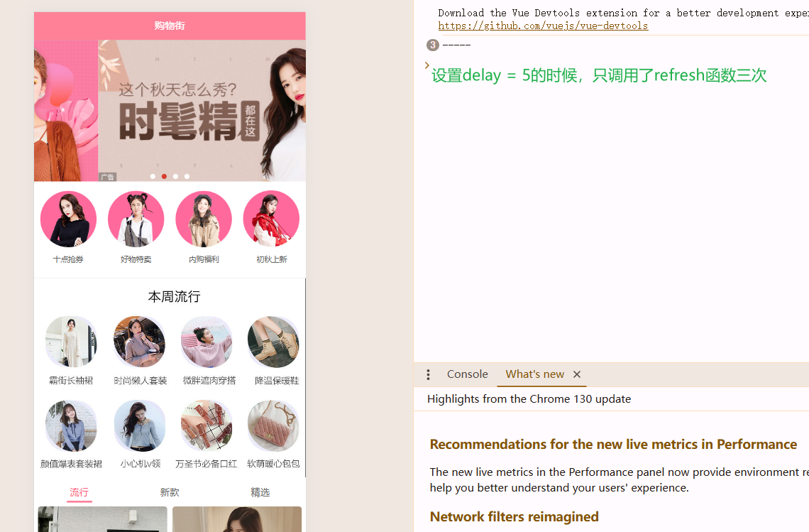