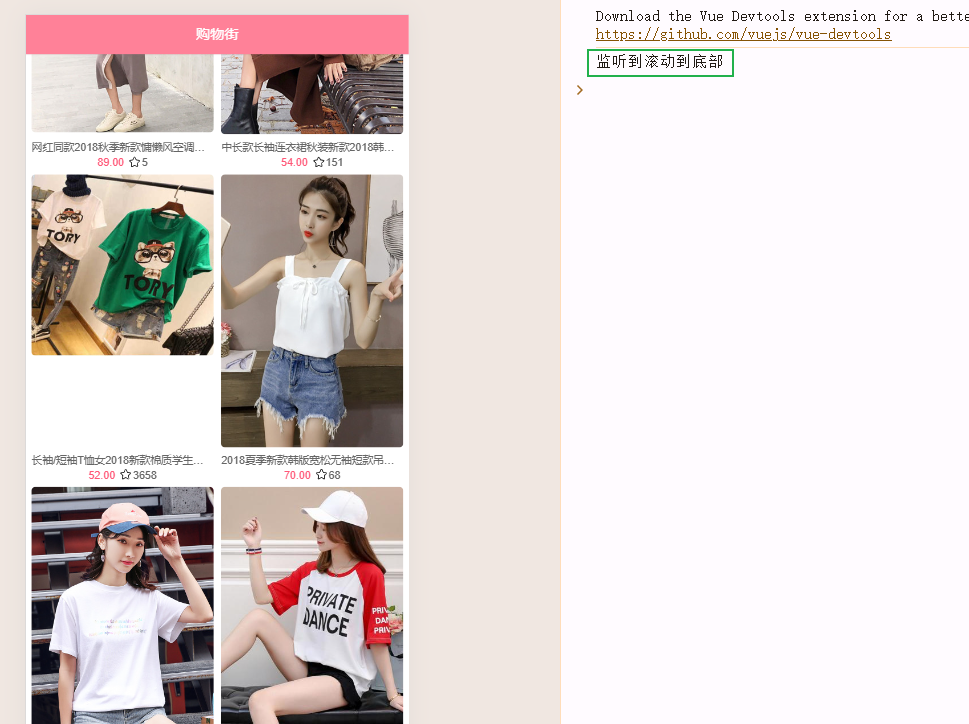
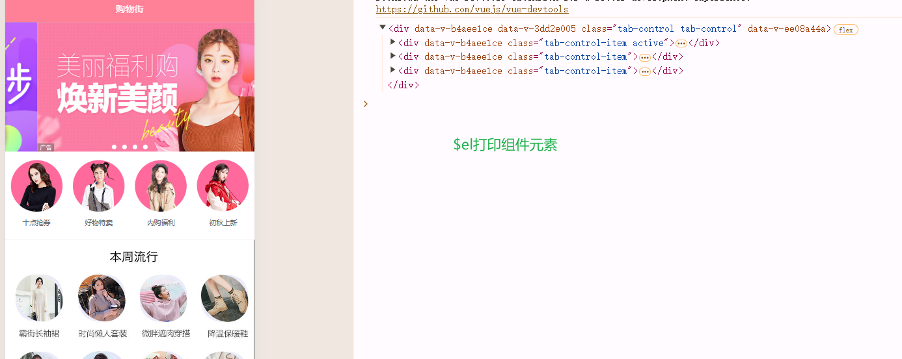

# 项目_06

## to-top

在滚动到一定的位置的时候，添加一个回到顶部的按钮

> 核心思路：
>
> - 将一个图片设置到一个固定位置
> - 当向上滚动到一定的位置的时候，显示；当向上没有滚动到一定的位置的时候，隐藏
> - 点击事件(回到顶部)

图片文件直接放在assets下面

不仅在首页中有应用，在详情页中也有应用，所以封装成一个组件

### 封装

在components/content中，创建一个`backTop`文件夹，定义`BackTop.vue`组件

```js
<template>
  <div class="back-top">
    
  </div>
</template>

<script>
  export default {
    name: "BackTop"
  }
</script>

<style scoped>
  .back-top {
    position: fixed;
    right: 8px;
    bottom: 55px;
  }

  .back-top img {
    width: 43px;
    height: 43px;
  }
</style>
```

在home.vue中进行导入

```js
// 导入
import BackTop from 'components/content/backTop/BackTop'

// 注册
components: {
  NavBar,
  HomeSwiper,
  RecommendView,
  FeatureView,
  TabControl,
  GoodList,
  Scroll,
  BackTop
},
    
// 使用
<back-top/>
```


### 回到顶部功能

> 我们为什么不在BackTop组件内部实现监听：
>
> - 因为我们要做的功能是回到顶部，我们在内部实现监听，其实对于home中scroll组件中的数据操作不是很方便，又是非父子组件间的通信
> - 直接在home中对backTop组件进行监听，我们能直接拿到scroll组件对象进行操作
>
> 监听组件：在组件的监听点击事件上添加.native即可
>
> <back-top @click.native = 'btnclick'/>  // 监听back-top组件的点击事件

在Scroll.vue中实现scrollTo

```js
props: {
  // 实时位置信息属性
  probeType: {
    type: Number,
    default: 0
  },
}

// 创建scroll对象的时候传入配置
this.scroll = new BScroll(this.$refs.wrapper, {
  click: true,
  probeType: this.probeType,
})

// 实时监听位置
if (this.probeType === 2 || this.probeType === 3) {
  this.scroll.on('scroll', (position) => {
    // console.log(position);
    this.$emit('scroll', position)
  })
}

methods: {
  // 在time事件内滚动指定位置
  scrollTo(x, y, time=300) {
    this.scroll && this.scroll.scrollTo(x, y, time)
  },
}
```

在home.vue组件中监听调用

```js
<back-top @click.native="backClick" v-show="isShowBackTop"/>

<scroll class="content"
        ref="scroll"
		// 在这个地方注意下:xxx = '3' 不带冒号传的是字符串，带冒号传的是数字
        :probe-type="3"
        @scroll="contentScroll">
    
// 定义back-top图片展示/隐藏参数
data() {
  return {
    isShowBackTop: false,
  }
},

backClick() {
    this.$refs.scroll.scrollTo(0, 0)
},
    
contentScroll(position) {
  // 1.判断BackTop是否显示
  this.isShowBackTop = (-position.y) > 1000
},
```

效果展示


## 加载更多

在scroll.vue中，

```js
// 增加一个属性，监听加载更多
props: {  
    pullUpLoad: {
        type: Boolean,
        default: false
    }
},
    
mounted() {
  // 1.创建BScroll对象
  this.scroll = new BScroll(this.$refs.wrapper, {
    // 新建scroll对象的时候，传递pullUpLoad参数
    pullUpLoad: this.pullUpLoad
  })
    
  // 3.监听scroll滚动到底部
  if (this.pullUpLoad) {
    this.scroll.on('pullingUp', () => {
      console.log('监听到滚动到底部');)
    })
  }
}
```

在home.vue中添加

```js
<scroll class="content"
            ref="scroll"
            :probe-type="3"
            @scroll="contentScroll"
            :pull-up-load="true">    // 新建scroll的配置参数
```



添加监听事件的处理

scroll.vue

```js
// 3.监听scroll滚动到底部
if (this.pullUpLoad) {
    this.scroll.on('pullingUp', () => {
        console.log('监听到滚动到底部');)
    })
}
```

home.vue

```js
<scroll class="content"
            ref="scroll"
            :probe-type="3"
            @scroll="contentScroll"
            :pull-up-load="true"    
            @pullingUp="loadMore">  // 监听事件

// 监听事件处理
loadMore() {
  this.getHomeGoods(this.currentType)
}, 
```

在执行完，我们发现只能加载一次，不能继续加载，其实是`PullUp`的监听搞得鬼，需要将其进行关闭，才能开启下一次正常监听

在scroll.vue定义`finishPullUp`函数

```js
methods: {
  finishPullUp() {
    this.scroll && this.scroll.finishPullUp()
  },
}
```

在home.vue中调用

```js
// 更新获取
getHomeGoods(type) {
  const page = this.goods[type].page + 1
  getHomeGoods(type, page).then(res => {
    this.goods[type].list.push(...res.data.list)
    this.goods[type].page += 1

    // 完成上拉加载更多
    this.$refs.scroll.finishPullUp()
  })
}
```

效果如下


## tabControl吸顶

### 获取offsetTop

> 实现思路：
>
> - 获取到tabControl 的 offsetTop属性
> - 使用轮播图加载完成作为所有图片加载完成的标志
> - 根据offsetTop属性判断，动态修改tabControl的样式(position:fixed)
> - 使用一个fake方案替代
>   - 两个tabControl，一个随着滚动，一个v-show固定位置展示
>
> 细节：
>
> - 组件是没有offsetTop属性的，所以我们需要先获取组件中的元素
>   - `this.$refs.tabControl.$el.offsetTop`  使用$el可以获取组件中的元素
>   - 
> - 不能将获取offsetTop属性写在mounted中，
>   - 因为mounted是挂载，挂载的时候图片不一定被加载完，所以得到的offsetTop属性不一定对
> - 使用轮播图加载完成作为所有图片加载完成的标志
>   - 因为图片越大加载时间越长，轮播图图片是最大的图片，轮播图加载完成，意味着图片加载完成
> - 为了不让HomeSwiper多次发出事件，可以使用isLoad的变量进行状态的记录

home.vue

```js
<tab-control :titles="['流行', '新款', '精选']"
                 @tabClick="tabClick"
                 ref="tabControl"
                 class="tab-control">
<home-swiper :banners="banners" @swiperImageLoad="swiperImageLoad">
              
data() {
  return {
    // 保留offsetTop属性
    tabOffsetTop: 0,
  }
},
    
swiperImageLoad() {
  this.tabOffsetTop = this.$refs.tabControl2.$el.offsetTop;
},
```

在HomeSwiper.vue中增加监听图片加载完成的代码

```js
// 又是图片加载完成load 加载完成调用imageLoad方法

    
// data中设置了isLoad属性，轮播图有多张，第一张轮播图加载完成，通知父组件可以计算offsetTop属性了
// 第二张轮播图加载完成，通知父组件可以计算offsetTop属性了，还有第三张、第四张……，属实多余了
// 第一张轮播图加载好了，组件的高度就有了，之后的就不用在通知了
// 设置一个标志位，只有第一个加载完成通知并反转标志位，当标志位反转后不在发生通知(isLoad就是标志位)
data() {
  return {
    isLoad: false
  }
},
    
imageLoad() {
  if (!this.isLoad) {
    this.$emit('swiperImageLoad')
    this.isLoad = true
  }
```

### 动态改变样式

home.vue

```js
<tab-control :titles="['流行', '新款', '精选']"
             ref="tabControl1"
             class="tab-control"
             @tabClick="tabClick" :class="{fixed:isTabFixed}"/>

data() {
  return {
    // 是否需要吸顶
    isTabFixed: false,
    saveY: 0
  }
},
    
contentScroll(position) {
  // 1.判断BackTop是否显示
  this.isShowBackTop = (-position.y) > 1000

  // 2.决定tabControl是否吸顶(position: fixed)
  this.isTabFixed = (-position.y) > this.tabOffsetTop
},
    

.fixed {
  position: fixed;
  left: 0;
  right:0;
  top:44px;
}
```

使用上面的动态绑定属性的方法，并没有实现功能，而且当tabControl接近导航栏的时候相被吸进去了一样


> 原因如下：
>
> - 我们使用position:fixed的方式使得tabControl脱离文档流，下面的东西自然向上填充，最终感觉向塌陷了一样
> - tabControl不见了：其实是和better-scroll的实现原理有关，是translate在改变，我们虽然设置了fixed属性，但是translate联同fixed也一起改变了，所以最终显示效果就是tabControl消失了，其实是跟随组件上去了
>   - 

### 改进方案

两个tabControl，一个随着滚动，一个v-show固定位置展示

home.vue

```js
<tab-control :titles="['流行', '新款', '精选']"
             @tabClick="tabClick"
             ref="tabControl1"
             class="tab-control" v-show="isTabFixed"/>
<scroll class="content"
        ref="scroll"
        :probe-type="3"
        @scroll="contentScroll"
        :pull-up-load="true"
        @pullingUp="loadMore">
  <home-swiper :banners="banners" @swiperImageLoad="swiperImageLoad"></home-swiper>
  <recommend-view :recommends="recommends"></recommend-view>
  <feature-view></feature-view>
  <tab-control :titles="['流行', '新款', '精选']"
               @tabClick="tabClick"
               ref="tabControl2"/>
  <good-list :goods="showGoods"/>
</scroll>

      
.home-nav {
  background-color: var(--color-tint);
  color: #fff;
  /*在使用浏览器原生滚动时, 为了让导航不跟随一起滚动*/
  /*position: fixed;*/
  /*left: 0;*/
  /*right: 0;*/
  /*top: 0;*/
  /*z-index: 9;*/
}

.tab-control {
  position: relative;
  z-index: 9;
}
```


效果展示


还存在一个问题，就是两个切换不一致的问题


解决方案：

- 点击事件发生后，将currentIndex的值进行手动统一

```js
tabClick(index) {
  switch (index) {
    case 0:
      this.currentType = 'pop'
      break
    case 1:
      this.currentType = 'new'
      break
    case 2:
      this.currentType = 'sell'
      break
  }
  this.$refs.tabControl1.currentIndex = index;
  this.$refs.tabControl2.currentIndex = index;
},
```

解决之后的效果图


## 离开首页保持


实际上离开保持使用`<keep-alive>`将`<router-view/>`包裹起来

- 小问题
  - 切换回来，需要回到原来的**位置**

解决方案：

- 在离开的时候会触发`deactivated`函数，记录当前浏览到的position信息
- 在回来的时候会触发`activated`函数，让首页快速滚动position即可

在App.vue中设置导航守卫

```js
<keep-alive>
  <router-view/>
</keep-alive>
```

在home.vue中记录离开是的位置，在回来时恢复位置

```js
data() {
  return {
    saveY: 0
  }
}

activated() {
  this.$refs.scroll.scrollTo(0, this.saveY, 0)
  this.$refs.scroll.refresh()
},
deactivated() {
  this.saveY = this.$refs.scroll.getScrollY()
},
```

在scroll组件中封装即可

```js
methods: {
  getScrollY() {
    return this.scroll ? this.scroll.y : 0
  }
}
```

效果展示


突然发现个问题

> TODO：切换tabControl的时候，不是从头开始，而是从一个奇怪的位置开始
>
> 